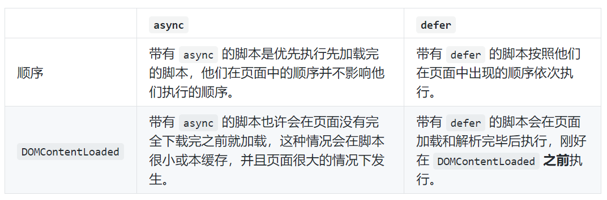

### HTML DOM
document对象的属性和方法的基本引用

addEventListener默认是冒泡 默认参数为false

捕抓事件和冒泡原理--DOM的两种事件流
冒泡：网上传  现代浏览器一般传到document->window
事件捕获:不太具体的节点应该更早接收到事件，而最具体的节点应该最后接收到事件  反方向
捕抓阶段->处于目标阶段->事件冒泡阶段

事件委托的优点：
- 做法：把这个点击事件绑定到他的父层，也就是 `ul` 上，然后在执行事件的时候再去匹配判断目标元素
- 减少内存消耗
- 动态绑定事件：绑定在父层的，和目标元素的增减是没有关系的

childNodes：返回指定元素的子元素集合，包括HTML节点，所有属性，文本。
当nodeType==1时才是元素节点，2是属性节点，3是文本节点

document.querySelector("p")-> 找到第一个`
` 元素
document.querySelector(".p")-> 找到第一个`class = 'p'` 元素
document.querySelector("#p")-> 找到第一个`id = 'p'` 元素

#### addEventListener()
- 第三个参数：
  - options 可选
  - 一个指定有关 listener 属性的可选参数对象。可用的选项如下：
    - capture:  Boolean，表示 listener 会在该类型的事件捕获阶段传播到该 EventTarget 时触发。
    - once:  Boolean，表示 listener 在添加之后最多只调用一次。如果是 true， listener 会在其被调用之后自动移除。
    - passive: Boolean，设置为true时，表示 listener 永远不会调用 preventDefault()。如果 listener 仍然调用了这个函数，客户端将会忽略它并抛出一个控制台警告。
  - usecapture：在不允许传对象的浏览器上，使用这个属性

#### 自定义事件
两种初始化事件的方法：
- let event = new Event(type[, options]);
  - type
- event = new CustomEvent(typeArg, customEventInit);
  - type：字符串
  - customEventInit(对象)：
    - "detail"：默认为null，可选值是任意类型
    - bubbles ：false/true
    - cancelable ：是否可以被取消
- 也可以创建一些奇怪的自定义事件
  - UIEvent
  - MouseEvent
  - KeyboardEvent 
- dispatchEvent：
  - event.isTrusted区分“真实”用户事件(true)和通过脚本生成的事件
  - event.preventDefault()会使事件处理程序可以发出一个信号，指出这些行为应该被取消
    - 此时elem.dispatchEvent(event) 的调用会返回 false，分派（dispatch）该事件的代码就会知道不应该再继续。
- 事件中的事件是同步的
  - 嵌套事件 nestEvent 会完全冒泡，并在 document 上被处理。嵌套事件的传播（propagation）和处理必须完全完成，然后处理过程才会返回到外部代码。
  - 如果不希望这样，放在setTimeout中就好

#### HTML页面的生命周期
- DOMContentLoaded：浏览器已经完全加载了 HTML，DOM 树已经构建完毕，但是像是 `` 和样式表等外部资源可能并没有下载完毕。
- onload：浏览器已经加载了所有的资源（图像，样式表等）
- beforeunload/unload ： 当用户离开页面的时候触发。

- 常见的用途：
  - DOMContentLoaded ——  DOM 已经准备好，因此事件处理器可以查找 DOM 节点，并初始化接口。
    - document监听
  - load —— 外部资源加载完成后，我们就可以应用样式表，获取图像大小等。
  - beforeunload —— 用户即将离开：我们可以检查用户是否保存了修改，并询问他是否真的要离开。
  - unload —— 用户几乎已经离开了，但是我们仍然可以启动一些操作，比如发送统计数据。
  - 异步脚本的加载：
    - 
- DOMContentLoaded:
  - 发生在document对象上，必须使用 addEventListener 来监听它
  - 可以访问到所有元素，但是它不会等待图像加载完成
  **这个过程中的相关操作**
  - DOMContentLoaded 脚本：
    - 当浏览器开始加载 HTML 文档并在文档中遇到 `<script>` 标签时，就会在继续构建 DOM 之前运行它
      - 是一个防范措施，因为脚本可能想要修改 DOM，甚至对其执行 document.write 操作
    - **具有 async, defer or type="module" 属性的脚本不会阻塞 DOMContentLoaded**
  - 浏览器的自动补全
    - Firefox, Chrome 和 Opera 会在 DOMContentLoaded 执行时自动补全表单。
  - document.readyState 属性为我们提供了一些关于当前加载状态的信息
    - “loading” —— 文档正在被加载。
    - “interactive” —— 文档被全部读取。
    - “complete” —— 文档被全部读取，并且所有的资源（图像之类的）都被加载。
  - 与之对应的是 readystatechange 事件
  - document.readyState 在 DOMContentLoaded 之前会立即变成了 interactive，这两个事件的意义几乎相同
 
**Script 标签属性**
- 同步标签`<script>`的两个问题：
  - 脚本不能访问到位于它们下面的 DOM 元素，因此，脚本不能给它们添加事件等。
  - 如果页面顶部有一个庞大的脚本，它会“阻塞页面”。在脚本下载并执行结束前，用户都不能看到页面内容：

- defer详解：
  - defer 属性告诉浏览器它应该继续处理页面，并在“后台”下载脚本，然后等页面处理完成后才开始执行此脚本。
  - 具有 defer 属性的脚本总是要等到 DOM 解析完毕，但在 DOMContentLoaded 事件之前执行。
  - Defer 脚本保持他们的相对顺序，就像常规脚本一样
  - defer 属性仅适用于外部脚本
- async
  - 脚本是完全独立的
  - 页面不会等待异步脚本，它会继续处理页面并显示内容。
  - DOMContentLoaded 和 async 脚本不会彼此等待：
  - DOMContentLoaded 可能发生在异步脚本之前（此时异步脚本在页面加载完成后才加载完成）
  - DOMContentLoaded 也可能发生在异步脚本之后（此时异步脚本可能很短或者是从 HTTP 缓存中加载的
  - 无序、加载优先
  - 独立第三方的页面/广告：async
- 使用js动态添加脚本：
  - 它们不会等待其他内容，其他的内容也不会等待它们。
  - 先加载完成的脚本先运行（“加载优先” 顺序）
- window.onunload
  - 点击关闭时，会被触发以进行额外的确认。

资源加载：onload 和 onerror
- script.onload，在脚本被加载和执行后才会触发。
- script.onerror：发生在脚本加载期间的错误可以在 error 事件上进行追踪。
load 和 error 事件也适用于几乎任何具有外部 src 的资源
