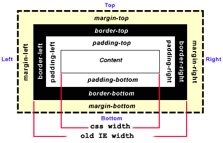

CSS 编码技巧
- 尽量减少代码重复
  - 将有关联的属性值有联系的写在一起：比如行高(用倍数)与字号，padding(用em)等
- currentColor
  - 被解析为 color的值
- 减少媒体查询：
  - 使用百分比长度来取代固定长度。如果实在做不到这一点，也应该 尝试使用与视口相关的单位（vw、vh、vmin 和 vmax），它们的值解 析为视口宽度或高度的百分比。
  - 当你需要在较大分辨率下得到固定宽度时，使用 max-width 而不是 width，因为它可以适应较小的分辨率，而无需使用媒体查询
  - 不要忘记为替换元素（比如 img、object、video、iframe 等）设 置一个 max-width，值为 100%
  -  假如背景图片需要完整地铺满一个容器，不管容器的尺寸如何变化， background-size: cover 这个属性都可以做到
  -  当图片（或其他元素）以行列式进行布局时，让视口的宽度来决定 列的数量。弹性盒布局（即 Flexbox）或者 display: inline-block 加上常规的文本折行行为，都可以实现这一点
  -  在使用多列文本时，指定 column-width（列宽）而不是指定 column-count（列数），这样它就可以在较小的屏幕上自动显示为单 列布局
  -  尽最大努力实现弹性可伸缩的布局，并在媒体 查询的各个断点区间内指定相应的尺寸
- 合理使用简写
  - 如果只为某个属性提供一个值，那 它就会扩散并应用到列表中的每一项
  - 主要语法，bg-size就要使用斜杠

**半透明边框**
- 因为background-clip:的默认值是border-box，因此背景颜色||图片会入侵到border中 
- 解决方案：改为padding-box

**多重边框**
- box-shadow方案
- box-shadow: X轴偏移 Y轴偏移 阴影模糊半径 阴影扩散半径 阴影颜色,...
- box-shadow:支持逗号分隔语法，我们 可以创建任意数量的投影
  - 投影的行为跟边框不完全一致，因为它不会影响布局，而且也不会 受到 box-sizing 属性的影响，需要用margin等行为为其模拟出空间
  - 默认是外圈，inset模拟内圈

- outline 方案
- 只需要两层边框时，那就可以先设置一层常规边 框，再加上 outline（描边）属性来产生外层的边框
- outline可以提供负值得到裁缝的效果，
- outline： 宽度 | **样式** | 颜色  轮廓不占空间

灵活的背景定位
- 图片和容器的边角之间能留出一定的空隙 

- background-position：
  - 使用right、top(默认0px)进行定位，默认下相对于padding-box

- background-origin 方案
  - 设置origin的值，配合right、top的默认值，改变块元素的padding

- calc() 方案
  - 以左上角偏移的思路来考虑，其实 就是希望它有一个 100% - 20px 的水平偏移量，以及 100% - 10px 
  - 100%代表元素在最右但又不超出bg-origin的位置

**边框内圆角**：
box-shadow，outline，“多重边框”
- 要一个容器，只在内侧有圆角，而边框或描边的四个角在外 部仍然保持直角的形状
- 注意事项：
  - outline不会跟着元素圆角走但 box-shadow 会
  - 因此：如果我们 把这两者叠加到一起，box-shadow 会刚好填补描边和容器圆角之间的空隙
  - 根据勾股定理：border-radius定义的是圆角的半径r，因此box-shadow设置为 (根号2-1)r

**条纹背景**
背景知识：CSS 线性渐变，background-size
- 难点：
- linear-gradient(#fb3 20%, #58a 80%);
  - 颜色1 颜色1出现的范围0-xxx；颜色2 颜色2出现的范围0-xxx
  - “如果某个色标的位置值比整个列表中在它之前的色标的位置值都要小，则该色标的位置值会被设置为它前面所有色标位置值的最大值。” 
  - 也就是说，如果第二个颜色的参数为0，那么就从上一个指定的位置开始
    - 三种颜色均等可以写为 0，66.6%，0
- 竖直条纹：指定line-gradient的第一个参数(默认to bottom)
- 斜向条纹：改第一个参数为旋转角度
  - 当条纹角度为45°时：
    - 要在一个块中指定4种颜色(前2=后2)，才能得到重复的条纹，条纹宽度为size/(2根号2)
- 更好的斜向条纹 
  - repeating-linear-gradient(deg,`[color,width]`+)
    - 创建双色条纹时要用到4个色标
    - 这里指定的宽度是直接在渐变轴上衡量的
    - 可以随意改变角度
- 灵活的同色系条纹
  - 当想要的条纹图案并不是由差异极大的几种颜色组成的，这些颜色往往属于同一色系，只是在明度方面有着轻微的差异
  - 把最深的颜色指定为背景色，同时把半透明白色的条纹叠加在背景色之上来 得到浅色条纹：
  - 同样是指定四色，一个是全透明，一个是通过叠加可得到目的色的中间色

**复杂的背景图案**

