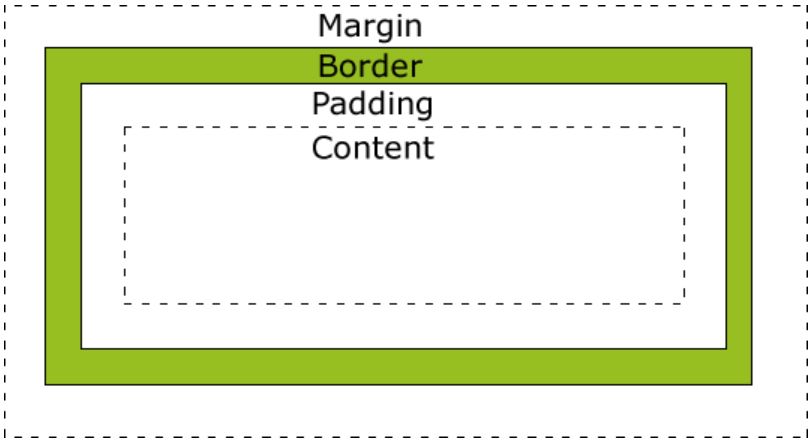
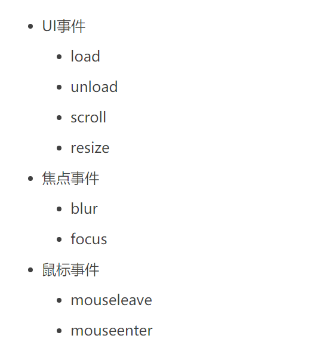

1. 什么是<!DOCTYPE>？
   - DOCTYPE是html5标准网页声明，且必须声明在HTML文档的第一行。来告知浏览器的解析器用什么文档标准解析这个文档。
   - 文档解析类型:
     - 怪异模式，采用更加宽松的、向后兼容的方式来渲染页面。不使用标签时默认
     - 标准模式，浏览器使用W3C的标准解析渲染页面。
2. meta标签:
   - 提供给页面的一些元信息（名称/值对），有助于SEO。search engine optimization
   - 属性值：
     - name：名称/值对中的名称。author、description、keywords、generator、revised、others。 把 content 属性关联到一个名称
     - http-equiv：没有name时，会采用这个属性的值。content-type、expires、refresh、set-cookie。把content属性关联到http头部
3. HTML5为什么只需要写 `<!DOCTYPE HTML>`：
   - HTML5不基于SGML。因此不需要对DTD（DTD 文档类型定义）进行引用，但是需要DOCTYPE来规范浏览器行为 
4. 行内元素有哪些？块级元素有哪些？ 空(void)元素有那些？
   - 行内元素：a span img input select 
     - 只占据它对应标签的边框所包含的空间。只能容纳文本或者其他内联元素
     - 高，行高及外边距和内边距不可改变
     - **宽度**就是它的文字和图片的宽度，不可改变；
     - padding 和 margin 只对左右有效  width height 都无效
   - 块级元素：div ul ol li dl dt dd h1 p
     - 占据其父元素（容器）的整个空间，因此创建了一个“块”
     - 块元素中高度，行高以及顶和底边距都可以控制
     - 总是在新行上开始 
     - 宽度默认是它容器的100%
     - 
   - display:block; (字面意思表现形式设为块级元素); display:inline; (字面意思表现形式设为行内元素)
   - 空元素：`  
 <link> <meta>`
5. 页面导入样式时，使用link和@import有什么区别
   - 相同的地方，都是外部引用CSS方式
   - `<link rel="stylesheet" href="style.css" type="text/css"/>`
   - ``
   - 区别：
     - link是xhtml标签，除了加载css外，还可以定义RSS等其他事务；@import属于CSS范畴，只能加载CSS 
       - XHTML：强制性的html
     - link引用CSS时候，页面载入时同时加载；@import需要在页面完全加载以后加载，而且@import被引用的CSS会等到引用它的CSS文件被加载完才加载
     - link是xhtml标签，无兼容问题；@import是在css2.1提出来的，低版本的浏览器不支持
     - link支持使用javascript控制去改变样式，而@import不支持
     - link方式的样式的权重高于@import的权重
     - import在html使用时候需要`<style type="text/css">`标签
   - 非模块化开发
     - @import 引入的样式在所在的 CSS 文件加载完成后再加载，不推荐使用。
   - 模块化开发
     - 如果css文件有互相依赖，也只能用@import，
     - 用 webpack 等工具开发时，会合并 CSS 文件。
6. 无样式内容闪烁
   - @import导入CSS文件会等到文档加载完后再加载CSS样式表。因此，在页面DOM加载完成到CSS导入完成之间会有一段时间页面上的内容是没有样式的。
   - 解决方法：使用link标签加载CSS样式文件。因为link是顺序加载的，这样页面会等到CSS下载完之后再下载HTML文件，这样先布局好，就不会出现FOUC问题
7. 浏览器内核的理解
   - 主要分两部分：渲染引擎(Layout Engine或Rendering Engine)和JS引擎。 
     - 渲染引擎：负责取得网页的内容（HTML、XML、图像等等）、整理讯息（例如加入CSS等），以及计算网页的显示方式，然后会输出至显示器或打印机。浏览器的内核的不同对于网页的语法解释会有不同，所以渲染的效果也不相同。
     - JS引擎：解析和执行javascript来实现网页的动态效果。
   - 后来JS引擎越来越独立，内核就倾向于只指渲染引擎。
8. 常见的浏览器内核有哪些
   - Webkit：Safari Chrome
   - Presto：Opera7及以上(Opera内核原为：Presto，现为：Blink)
   - Geckos：Netscape6及以上版本 FireFox Mozilla Suite/SeaMonkey 
9. HTML5有哪些新特性,移除了那些元素？如何处理HTML5新标签的浏览器兼容问题？如何区分HTML和HTML5
   - 新增加了图像、位置、存储、多任务等功能
     - canvas
     - 用于媒介回放的video和audio元素
     - 本地离线存储。localStorage长期存储数据，浏览器关闭后数据不丢失;sessionStorage的数据在浏览器关闭后自动删除
     - 语意化更好的内容元素，比如 article footer header nav section
     - 位置API：Geolocation
     - 表单控件，calendar date time email url search
     - 新的技术：web worker(web worker是运行在后台的 JavaScript，独立于其他脚本，不会影响页面的性能。您可以继续做任何愿意做的事情：点击、选取内容等等，而此时 web worker 在后台运行) web socket
     - 拖放API：drag、drop   
   - 移除的元素：
     - 纯表现的元素：basefont big center font s strike tt u
     - 能较差元素：frame frameset noframes
   - 区分：DOCTYPE声明的方式是区分重要因素
10. HTML语义化
    - 爬虫 SEO
    - 易开发、易阅读
    - 方便解析 
11. HTML5的文件离线储存怎么使用
    - 发现HTML有manifest属性时，会请求manifest文件，如果不存在，则根据manifest文件内容下载相应的资源。如果存在，会用离线的manifest文件资源加载页面。
    - 浏览器会对比，如果有改变，更新文件
12. cookies，sessionStorage和localStorage的区别
    - cookies：表示用户身份，保存在本地 在同源http请求中携带 在浏览器和服务器间来回传递，其余仅在本地保存
    - cookies 4k  其余能达到5m
    - ls 长期有效 ss窗口期(页面)有效 cookies设置的过期时间之前都有效
    - cookies和ls同源共享，ss在不同的浏览器不共享
    - **session和cookies的关系**
      - 因为http是无状态协议，不会保存数据，cookie和session弥补了不足
      - cookie的数据保存在客户端，session的数据保存在服务器端
      - cookie和session存在关系，session的id保存在cookie，每次发送请求都会通过cookie的sessionid传递到服务器
      - session的id保存在cookie，每次发送请求都会通过cookie的sessionid传递到服务器
13.  iframe框架有那些优缺点
    - 优点：
      - 是一个可复用其他组件的标签，统一风格、方便维护
    - 缺点：
      - 无法SEO，搜索引擎无法解读
      - 增加http请求 (时间和空间不可兼得)
      - 影响并行加载
14.  label的作用是什么? 是怎么用的?
    - 定义表单控件之间的关系。用户选择该标签时，浏览器会自动将焦点转到和标签相关的表单控件上
    - FOR 绑定 控件ID
    - ACCESSKEY 绑定控件的键盘输入
15. HTML5的form如何关闭自动完成功能
    - form的autocomplete 属性
16. 如何实现浏览器内多个标签页之间的通信
    - 监听localstorage，在无痕浏览中会抛出异常(safari)
    - WebSocket SharedWorker
17. webSocket如何兼容低浏览器
    -   
18. 页面可见性（Page Visibility）API 可以有哪些用途
    - 在页面被切换到其他后台进程时，自动暂停音乐或视频的播放 媒体播放的控制、轮询
    - 可以监听这个事件：visibilitychange 
19. 如何在页面上实现一个圆形的可点击区域
    - 新建一个css样式
      - cursor 光标
      - border-radius:50%
    - .class #id（独一无二）
    - 让一个块元素引用
20. 实现不使用 border 画出1px高的线，在不同浏览器的Quirks mode和CSS Compat模式下都能保持同一效果
    - `

`
    - strong、em标明重点内容，语气加强含义，不同浏览器有不同的实现；b、i是无意义的视觉表示，粗体
21. 网页验证码是干嘛的，是为了解决什么安全问题
    - 
22. title与h1的区别、b与strong的区别、i与em的区别
    - title属性没有明确意义，只表示标题；h1表示层次明确的标题，对页面信息的抓取也有很大的影响
23. 元素的alt和title有什么异同？
    - 在alt和title同时设置的时候，alt作为图片的替代文字出现，title是图片的解释文字。
CSS：
CSS盒子模型：

margin->Border->Padding->Content
Margin:清除边框外的区域，外边距是透明的。
Border:围绕在内边距和内容外的边框。
padding:清除内容周围的区域，内边距是透明的。
Content:盒子的内容
注意点：
  1. 当设置高度和宽度时，属于content
  2. 对于相邻的块级元素margin-bottom和margin-top：
     1. 正数时取最大，负数时取最小
css的优先级问题：
1. `
`类型选择器>.类选择器>#ID选择器  
  
- em&rem：leftRight
   - 1em等于当前元素的字号大小
   - 1.2em 继承父节点的fontsize再进行计算
   - 先进行第一条的计算，不成功则查看父节点有无继承的fontsize
- rem：
  - :root 选择器 始终是`<HTML>`元素
  - root-em 不管在那个节点使用都为 root em
- 如何使用？
  - 对font-size使用rem
  - 对border使用px
  - 对其他的度量方式如padding、margin、border-radius等使用em
  - 需要声明容器的宽度的话，使用百分比
  - @media(min-width: 1200px)：以屏幕像素来改变根节点大小，因为浏览器字体默认16px

css位置
- position：
  - static(默认值)
    - 每个块级元素占据自己的区块（block），元素与元素之间不产生重叠
    - top、bottom、left、right这四个属性无效。
  - relative，absolute，fixed 由基点定位
    - relative：
      - 相对于默认位置(static)
      - 它必须搭配top、bottom、left、right这四个属性一起使用，用来指定偏移的方向和距离。基于static
    - absolute 
      - 定位基点是父元素
      - 重要限制：定位基点不能是static定位，否则定位基点就会变HTML元素
      - 搭配top、bottom、left、right这四个属性一起使用，用来指定偏移的方向和距离。
      - 如果不提供数据，就漂浮在上方
    - fixed
      - 相对于(定位基点)浏览器窗口进行偏移。
      - 致元素的位置不随页面滚动而变化，好像固定在网页上一样
      - 搭配top、bottom、left、right这四个属性一起使用，表示元素的初始位置是基于视口计算的，否则初始位置就是元素的默认位置。
    - sticky:
      - Safari 浏览器需要加上浏览器前缀-webkit-
      - 生效的前提：必须搭配top、bottom、left、right这四个属性一起使用。否则等同于relative定位，不产生"动态固定"的效果（搭配其中一个？）
      - 具体规则如下： 当页面滚动，父元素开始脱离视口时（即部分不可见），只要与sticky元素的距离达到生效门槛，relative定位自动切换为fixed定位；等到父元素完全脱离视口时（即完全不可见），fixed定位自动切换回relative定位
      - 例子：
        - 堆叠效果
        - 表格的表头锁定
- 文档流：
  - 将窗体自上而下分成一行一行，并在每行中按从左至右依次排放元素(normal flow)
- 脱离文档流：
  - 元素脱离文档流之后，将不再在文档流中占据空间，而是处于浮动状态
  - 脱离文档流的元素的定位基于正常的文档流，当一个元素脱离文档流后，依然在文档流中的其他元素将忽略该元素并填补其原先的空间。
- 如何脱离？
  - float：其他盒子会无视这个元素，盒子内的文本依然会为这个元素让出位置，环绕在该元素的周围
- 脱离文字流？大概是指内容被遮挡

BFC：block formatting context
- 避免坍塌
- 阻止围绕
- 外边距塌陷

- css 一些标签：
  - overflow：visible 默认 不修剪，呈现在元素框之外
  - hidden：修剪，被剪的不可见
  - scroll：被剪，但显示滚动条（一定显示）
  - auto：若被剪 则显示
  - inherit：继承父

- table布局

- 如何清除浮动：
  - clear: left：意味着某个元素的左边有个浮动元素，我需要清除，于是自动换行
  - 在父级元素的末尾增加一个块级元素，将接下来出现的元素撑到下一行
  - 利用伪元素，在某个元素中引用选择器，并指明before还是after，即：在某个元素的前或后。伪元素可就以在元素的内容 前或后 面插入新内容--由选择器指定。
  - 生成BFC

- gird
  - 容器 项目 单元格
  - 容器属性
    - 容器 display:grid||inline-grid
    - 设为网格布局以后，容器子元素（项目）的float、display: inline-block、display: table-cell、vertical-align和column-*等设置都将失效
    - grid-template-columns&grid-template-rows： 
      - 列宽和行高 空格分开，可用repeat(times,...args)函数 times还可以为auto-fill
      - fr 描述比例 auto  minmax() 不小于不大于
      - 网格线的名称[xx] 100px 网格线的名称
    - row-gap行间距 column-gap列间距  gap： `<row-gap> <column-gap>`
    - grid-template-areas:由单个或多个单元格组成
    - grid-auto-flow row先行 column 先列 - dense 自动填满
  - 项目属性
    - 可以指定项目的区域grid-area(a,b,c)、
    - start end起始网格线、span跨越的网格线 z-index重叠内容、
    - row column1/3表示开始和结束
    - place-self
      - justify-self 内容在单元格水平位置
      - align-self 内容在单元格垂直位置

Flex布局：
- 任何一个容器、行内元素都可以指定为 Flex 布局。
- 设为 Flex 布局以后，子元素的float、clear和vertical-align属性将失效。
- 基本概念：
  - 容器：display :flex
  - 项目：容器的子元素
  - main axis水平轴和cross axis垂直轴 与边框的交点分别成为：main cross start end
  - 容器的属性：
      - flex-flow:`<flex-direction> || <flex-wrap>;`
        - flex-direction：确定主轴的方向
        - flex-wrap: 如何换行 no-wrap wrap wrap-reverse.
      - justify-content 项目在主轴上的对齐方式
      - align-items 项目在交叉轴上的对齐方式
      - align-content 多跟轴线的对齐方式
  - 项目的属性：
    - order：定义项目的排序顺序，数值越小，越靠前
    - flex-grow：定义项目的放大比例 default 0
    - flex-shrink：缩小比例 default 1
    - flex-basis：如果不使用box-sizing改变盒模型的话，那么这个属性就决定了flex元素的内容盒(content-box)的尺寸
    - flex：`flex: none | [ <'flex-grow'> <'flex-shrink'>? || <'flex-basis'> ]`
    - align-self 允许单个项目与其他项目有着不一样的 默认为auto，表示继承父元素的属性，如果无，等同于stretch（占满整个轴）

- css的优先性：
  - 行内样式 > id样式 > class样式 > 标签名样式

容器水平居中：
  - 为该容器设置一个明确宽度，然后将margin的水平值设为auto即可。
  - div#container {
　　　　width:760px;
　　　　margin:0 auto;
　　}

不冒泡的事件：

- css3 选择器：
  - :nth-last-child(n) 或an+b;
    -  选择器匹配属于其元素的第 N 个子元素的每个元素，不论元素的类型，从最后一个子元素开始计数。