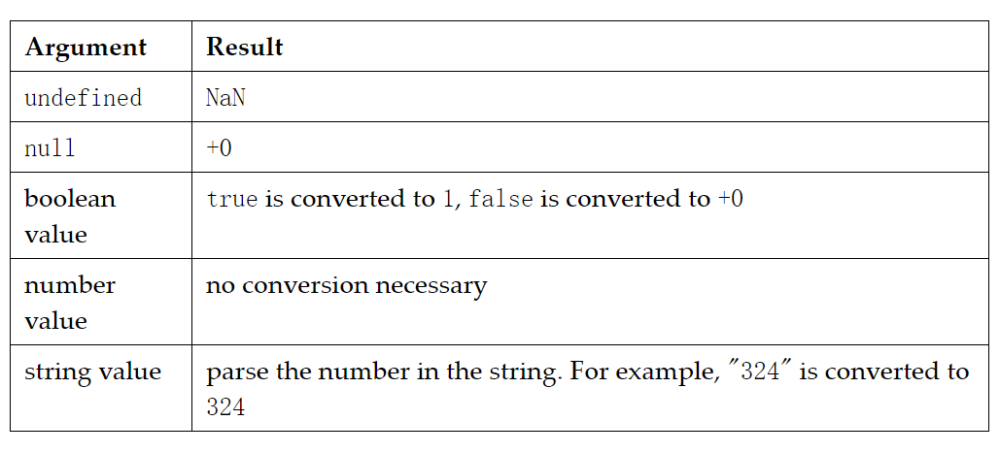
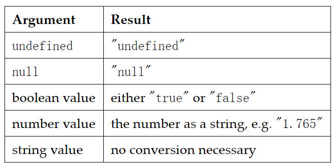

$$ 小黄的面试之路 $$
#### 在JavaScript中创建一个真正的private方法有什么缺点？
- 每个对象都会创建一个闭包，都会含有一个私有方法，非常影响性能

#### JavaScript中什么是闭包？
- 闭包是在一个函数里声明了另外一个函数，并且这个函数访问了父函数作用域里的变量。

#### JavaScript怎么清空数组
- arr.length = 0; arr = []; arrayList.splice(0, arrayList.length);

#### 怎么判断一个object是否是数组(array)
- `Object.prototype.toString.call( obj ) === '[object Array]';`
- `obj.__proto__ === Array.prototype;`
- `a instanceof b`是错的！因为Array.prototype指向Object.prototype

#### 下面代码输出什么？
```js
var x = 0;
var output = (function(){
    delete x;
    return x;
})();
  
console.log(output);
```
- 0，x并不是对象的属性，不能生效
### 
```js
var Employee = {
    company: 'xyz'
}
var emp1 = Object.create(Employee);
delete emp1.company
console.log(emp1.company);
```
xyz, delete不删除原型链上的属性

### 
```js
var trees = ["redwood","bay","cedar","oak","maple"];
delete trees[2];
console.log(trees.length)
console.log(trees[3]);
trees.map(console.log);
```
- 5 oak，redwood, bay, oak, maple被删除的元素变成了一个undefined占位符 输出的时候不会输出占位符

### 
```js
var bar = true;
console.log(bar + 0);   
console.log(bar + "xyz");  
console.log(bar + true);  
console.log(bar + false); 
```
- ans:1 truexyz 2 1
- 转换规则：
  - 如果输入是基本类型，不需转换
  - 如果输入是object，先调用obj.valueOf，如果返回值是基本类型，则返回
  - 否则调用.toString();
  - 否则抛出TypeError异常
- 特殊的数据：
  - 
  - 
- 加法转换规则：
  - 将运算符两边的都转换为基本类型
    - `PreferredType is omitted and thus Number for non-dates, String for dates.`
  - 如果arg1或arg2为字符串，则都转为字符串，返回字符串加法
  - 否则将两者转为number


#### 
```js
var z = 1, y = z = typeof y;
console.log(y);  
```
- 输出是 undefined。js中赋值操作结合律是右至左的 ，即从最右边开始计算值赋值给左边的变量。

#### 
```js
var foo = function bar(){ 
    // foo is visible here 
    // bar is visible here
    console.log(typeof bar()); // Work here :)
};
foo()
```
- 输出：function

#### 
var foo = ()=>{} 
- 这样的函数定义是运行时

### 
```js
function foo(){ 
  return foo; 
}

console.log(new foo() instanceof foo);
```
false 因为这里的new foo()为 foo

#### 
```js
const shape = {
  radius: 10,
  diameter() {
    return this.radius * 2;
  },
  perimeter: () => 2 * Math.PI * this.radius
};

shape.diameter();
shape.perimeter();
```
输出：20 NAN
- diameter是普通函数，而perimeter是箭头函数
- this关键字指向是它所在上下文（定义时的位置）的环境

#### 
```js
+true;
!"Lydia";
```
1 false，+号会尝试把boolean转为数字类型

#### 
```js
const bird = {
  size: "small"
};

const mouse = {
  name: "Mickey",
  small: true
};
mouse.bird.size
```
抛出Typeerror：
- 在JavaScript中，所有对象键都是字符串（除了Symbol）
- JavaScript解释语句。当我们使用方括号表示法时，他会对括号里的内容求值
- 当用.去访问时，不存在的属性会返回undefined，而undefined的属性是无法获取的
#### 
```js
let a = 3;
let b = new Number(3);
let c = 3;

console.log(a == b);
console.log(a === b);
console.log(b === c);
```
：t f f
- ==会引发隐式类型转换，右侧的对象类型会自动拆箱为Number类型。
- new Number（）是一个内置的函数构造函数 是一个对象
- ===操作符时，类型和值都需要相等，而new Number()是一个对象
#### 
```js
class Chameleon {
  static colorChange(newColor) {
    this.newColor = newColor;
  }

  constructor({ newColor = "green" } = {}) {
    this.newColor = newColor;
  }
}

const freddie = new Chameleon({ newColor: "purple" });
freddie.colorChange("orange");
```
- colorChange方法是静态的

#### 
```js
function Person(firstName, lastName) {
  this.firstName = firstName;
  this.lastName = lastName;
}

const member = new Person("Lydia", "Hallie");
Person.getFullName = () => this.firstName + this.lastName;

console.log(member.getFullName());
```
- 这种添加方法只向构造函数添加了方法，member无法获取
  - 更改为：
    ```js
    Person.prototype.getFullName = function () {
        return `${this.firstName} ${this.lastName}`;
    }
    ```

#### 
```js
function getPersonInfo(one, two, three) {
  console.log(one);
  console.log(two);
  console.log(three);
}

const person = "Lydia";
const age = 21;

getPersonInfo`${person} is ${age} years old`;
```
`["", "is", "years old"] Lydia 21`
如果使用标记的模板字符串，则第一个参数的值始终是字符串值的数组。 其余参数获取传递到模板字符串中的表达式的值！

#### 
```js
function checkAge(data) {
  if (data === { age: 18 }) {
    console.log("You are an adult!");
  } else if (data == { age: 18 }) {
    console.log("You are still an adult.");
  } else {
    console.log(`Hmm.. You don't have an age I guess`);
  }
}

checkAge({ age: 18 });
```

#### 
```js

```