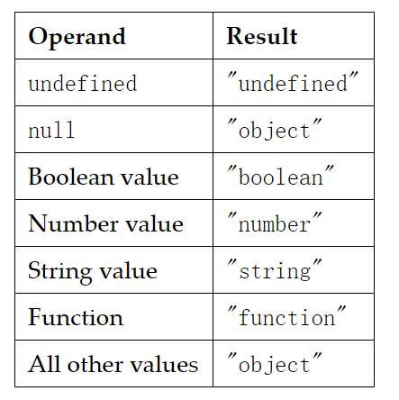

$$ 代码段 $$

* let命令，用来声明变量。它的用法类似于var，但是所声明的变量，只在let命令所在的代码块内有效
  * for的计数器
*  解构 `let [a, b = 5, c] = [1, 2, 3];`
   *  解构不成功，变量的值就等于undefined
   *  当1对1或一对多(不完全解构)，才算完成
   *  如果等号的右边不是可遍历的结构，那么将会报错
   *  解构赋值允许指定默认值。当数组成员严格(===)undefined时，才会使用默认值
   *  如果默认值是一个表达式，那么这个表达式是惰性求值的，即只有在用到的时候，才会求值。
```js
function f() {
  console.log('aaa');
}

let [x = f()] = [1];
```
   * 因为x能取到值，所以函数f根本不会执行
   * 对象的解构与数组有一个重要的不同。数组的元素是按次序排列的，变量的取值由它的位置决定；而对象的属性没有次序，变量必须与属性同名，才能取到正确的值。
   * `let { foo: foo, bar: bar } = { foo: 'aaa', bar: 'bbb' };` 
   * 上式左边的foo：foo，右边的foo可以省去
   * 
```js
let obj = {
  p: [
    'Hello',
    { y: 'World' }
  ]
};

let { p, p: [x, { y }] } = obj;
```
   * 如果解构模式是嵌套的对象，而且子对象所在的父属性不存在，那么将会报错。
   * `let {foo: {bar}} = {baz: 'baz'};`
   * 上面代码中，等号左边对象的foo属性，对应一个子对象。该子对象的bar属性，解构时会报错。原因很简单，因为foo这时等于undefined，再取子属性就会报错。foo匹配失败，子对象bar父并不存在
   * 对象的解构赋值可以取到继承的属性
   * 对象的解构也可以指定默认值。默认值生效的条件是，对象的属性值严格等于undefined。
* 注意点：
  * 如果要将一个已经声明的变量用于解构赋值，必须非常小心。
  * `let x;   |{x} = {x: 1};`
  * 上面代码的写法会报错，因为 JavaScript 引擎会将{x}理解成一个代码块，从而发生语法错误。只有不将大括号写在行首，避免 JavaScript 将其解释为代码块，才能解决这个问题。
  * 由于数组本质是特殊的对象，因此可以对数组进行对象属性的解构。key:value
  * 解构赋值时，如果等号右边是数值和布尔值，则会先转为对象。
  * 函数参数的默认解构的两个例子：
    * undefined就会触发函数参数的默认值。
    * `[1, undefined, 3].map((x = 'yes') => x);`
  * 以下三种解构赋值不得使用圆括号。
    * 变量声明语句
    * 函数参数 函数参数也属于变量声明，因此不能带有圆括号。
    * 赋值语句的模式
  * 用途
    * 交换变量的值  

    * 从函数返回多个值  

    * 构赋值可以方便地将一组参数与变量名对应起来。  

    * 解构赋值对提取 JSON 对象中的数据，尤其有用。  

    * 函数参数的默认值  
   
    * 遍历 Map 结构  
     
    * 输入模块的指定方法  
```js
function example() {
  return [1, 2, 3];
}
let [a, b, c] = example();
```

```js
function f({x, y, z}) { ... }
f({z: 3, y: 2, x: 1});
```

```js
let jsonData = {
  id: 42,
  status: "OK",
  data: [867, 5309]
};

let { id, status, data: number } = jsonData;
```

```js
let x = 1;
let y = 2;

[x, y] = [y, x];
```
```js
Query.ajax = function (url, {
  async = true,
  beforeSend = function () {},
  cache = true,
  complete = function () {},
  crossDomain = false,
  global = true,
  // ... more config
} = {}) {
  // ... do stuff
};
```

```js
for (let [key] of map) {
  // ...
}

// 获取键值
for (let [,value] of map) {
  // ...
}
```

```js
const { SourceMapConsumer, SourceNode } = require("source-map");
```
 * 字符串的扩展
  * ES6 加强了对 Unicode 的支持，允许采用\uxxxx形式表示一个字符，其中xxxx表示字符的 Unicode 码点
  * 这种表示法只限于码点在\u0000~\uFFFF之间的字符。超出这个范围的字符，必须用两个双字节的形式表示
  * ES6 为字符串添加了遍历器接口 `for (let codePoint of 'foo') {`
  * 这个遍历器最大的优点是可以识别大于0xFFFF的码点，传统的for循环无法识别这样的码点
  * 模板字符串（template string）是增强版的字符串，用反引号（`）标识。它可以当作普通字符串使用，也可以用来定义多行字符串，或者在字符串中嵌入变量。
    * 如果使用模板字符串表示多行字符串，所有的空格和缩进都会被保留在输出之中。
    * 模板字符串中嵌入变量，需要将变量名写在${}之中。
  * 标签模板
    * 但是，如果模板字符里面有变量，就不是简单的调用了，而是会将模板字符串先处理成多个参数，再调用函数。结合例子理解：
    * “标签模板”的一个重要应用，就是过滤 HTML 字符串，防止用户输入恶意内容。
```js
let a = 5;
let b = 10;

function tag(s, v1, v2) {
  console.log(s[0]);
  console.log(s[1]);
  console.log(s[2]);
  console.log(v1);
  console.log(v2);

  return "OK";
}

tag`Hello ${ a + b } world ${ a * b}`;
// "Hello "
// " world "
// ""
// 15
// 50
//
```
* string 新增函数
  * ES6 提供了String.fromCodePoint()方法，可以识别大于0xFFFF的字符，弥补了String.fromCharCode()方法的不足。
  * raw()方法：该方法返回一个斜杠都被转义（即斜杠前面再加一个斜杠）的字符串
    * String.raw()本质上是一个正常的函数，只是专用于模板字符串的标签函数。如果写成正常函数的形式，它的第一个参数，应该是一个具有raw属性的对象，且raw属性的值应该是一个数组，对应模板字符串解析后的值
函数的代码实现如下
```js
String.raw = function (strings, ...values) {
  let output = '';
  let index;
  for (index = 0; index < values.length; index++) {
    output += strings.raw[index] + values[index];
  }

  output += strings.raw[index]
  return output;
}
```
  * includes(), startsWith(), endsWith() 这三个方法都支持第二个参数，表示开始搜索的位置。
  * endsWith针对前n个字符，其他两个方法针对从第n个位置直到字符串结束
  * repeat方法返回一个新字符串，表示将原字符串重复n次。
  * padStart()用于头部补全，padEnd()用于尾部补全。
  * trimStart()消除字符串头部的空格，trimEnd()消除尾部的空格
  * matchAll()方法返回一个正则表达式在当前字符串的所有匹配
* 正则表达式的扩展：
  * 
***
函数闭包：
* 函数与对其状态即词法环境（lexical environment）的引用共同构成闭包（closure）。也就是说，**闭包可以让你从内部函数访问外部函数作用域**。在JavaScript，函数在每次创建时生成闭包。
* "链式作用域"结构（chain scope），子对象会一级一级地向上寻找所有父对象的变量。所以，父对象的所有变量，对子对象都是可见的，反之则不成立。
* JavaScript中的函数运行在他们被定义的作用域里，而不是他们被执行的作用域里。
* 由于闭包会使得函数中的变量都被保存在内存中，内存消耗很大，所以不能滥用闭包，否则会造成网页的性能问题
```js
function makeFunc() {
    var name = "Mozilla";
    function displayName() {
        alert(name);
    }
    return displayName;
}

var myFunc = makeFunc();
myFunc();
```
* 在一些编程语言中，函数中的局部变量仅在函数的执行期间可用。一旦 makeFunc() 执行完毕，我们会认为 name 变量将不能被访问。然而，因为代码运行得没问题，所以很显然在 JavaScript 中并不是这样的。
* JavaScript中的函数会形成闭包。闭包是由函数以及创建该函数的词法环境组合而成。这个环境包含了这个闭包创建时所能访问的所有局部变量
```js
示例二：
function makeAdder(x) {
  return function(y) {
    return x + y;
  };
}

var add5 = makeAdder(5);
var add10 = makeAdder(10);

console.log(add5(2));  // 7
console.log(add10(2)); // 12
```
* add5 和 add10 都是闭包。它们共享相同的函数定义，但是保存了不同的词法环境。
* 实用的闭包
  * 闭包很有用，因为它允许将函数与其所操作的某些数据（环境）关联起来
* 用闭包模拟私有方法： 模块模式（module pattern）
```js
var Counter = (function() {
  var privateCounter = 0;
  function changeBy(val) {
    privateCounter += val;
  }
  return {
    increment: function() {
      changeBy(1);
    },
    decrement: function() {
      changeBy(-1);
    },
    value: function() {
      return privateCounter;
    }
  }   
})();

console.log(Counter.value()); /* logs 0 */
Counter.increment();
Counter.increment();
console.log(Counter.value()); /* logs 2 */
Counter.decrement();
console.log(Counter.value()); /* logs 1 */
```
* 我们只创建了一个词法环境，为三个函数所共享：Counter.increment，Counter.decrement 和 Counter.value
* 该共享环境创建于一个立即执行的匿名函数体内。这个环境中包含两个私有项：名为 privateCounter 的变量和名为 changeBy 的函数。这两项都无法在这个匿名函数外部直接访问。必须通过匿名函数返回的三个公共函数访问。
* 你应该注意到我们定义了一个匿名函数，用于创建一个计数器。我们立即执行了这个匿名函数，并将他的值赋给了变量Counter。我们可以把这个函数储存在另外一个变量makeCounter中，并用他来创建多个计数器
```js
var makeCounter = function() {
  var privateCounter = 0;
  function changeBy(val) {
    privateCounter += val;
  }
  return {
    increment: function() {
      changeBy(1);
    },
    decrement: function() {
      changeBy(-1);
    },
    value: function() {
      return privateCounter;
    }
  }  
};

var Counter1 = makeCounter();
var Counter2 = makeCounter();
```
* 每次调用其中一个计数器时，通过改变这个变量的值，会改变这个闭包的词法环境。然而在一个闭包内对变量的修改，不会影响到另外一个闭包中的变量

***
  * 用 var 或 let 语句声明的变量，如果没有赋初始值，则其值为 undefined 。
  * 如果访问一个未声明的变量会导致抛出一个引用错误（ReferenceError）异常：
  * undefined 值在布尔类型环境中会被当作 false
  * 数值类型环境中 undefined 值会被转换为 NaN
  * 当你对一个 null 变量求值时，空值 null 在数值类型环境中会被当作0来对待，而布尔类型环境中会被当作 false
* 变量的作用域
  * 在函数之外声明的变量，叫做全局变量
  * 在函数内部声明的变量，叫做局部变量，因为它只能在当前函数的内部访问
  * 语句块中声明的变量将成为语句块所在函数（或全局作用域）的局部变量
  * hoisting：你可以先使用变量稍后再声明变量 先声明，后赋值便会变量提升
  * 函数来说，只有函数声明会被提升到顶部，而函数表达式不会被提升
  * 缺省的全局对象是 window。你可以用形如 window.variable 的语法来设置和访问全局变量。
  * 常量的作用域规则与 let 块级作用域变量相同
  * 在同一作用域中，不能使用与变量名或函数名相同的名字来命名常量。
  * 对象属性被赋值为常量是不受保护的
  * 数组的被定义为常量也是不受保护的
* JavaScript是一种动态类型语言(dynamically typed language)。这意味着你在声明变量时可以不必指定数据类型，而数据类型会在代码执行时会根据需要自动转换。
* 在包含的数字和字符串的表达式中使用加法运算符（+），JavaScript 会把数字转换成字符串
*  parseInt 方法只能返回整数，所以使用它会丢失小数部分。另外，调用 parseInt 时最好总是带上进制(radix) 参数，这个参数用于指定使用哪一种进制。
*  将字符串转换为数字的另一种方法是使用一元加法运算符。
*  `(+"1.1") + (+"1.1") = 2.2 `
***
* 12种JavaScript不宜使用的语法：
  * ==
  * with
  * eval
  * continue
  * 块语句加上大括号
  * 位运算符，因为JavaScript存的是Number
  * 定义函数时，全部采用Function表达式
* this的含义：
  * 纯粹的函数调用：属于全局性调用，this代表全局变量
  * 函数还可以作为某个对象的方法调用，这时this就指这个**上级对象**。
  * 作为构造函数调用时，在此函数类的this，就指这个新对象

```js
var obj = {
    name:"hello",
    showNme:function(){
        console.log(this.name)
    }
}
(function () {
    console.log("fn")
})()
```
js没有像python一样，解析时识别换行。
因此在这段代码解析时，解析完obj的赋值表达式后，因为没有分号，认为语句未结束，因此将后面的自调用匿名函数当作了函数调用
什么时候能省';' ；
* 一行的最后
* 整个代码文件的最后
* 在语法分隔符之前（如复合语句的大括号“}”）
* 复合语句的大括号“}”之后 复合语句：由运算符将多个单值表达式结合而成的表达式

* 表达式(expression)和语句(statement)

箭头函数的一些特点
- 箭头函数没有定义this绑定，this是定义时所在的对象
- 箭头函数不能用作构造器
- 箭头函数没有prototype属性。
- yield 关键字通常不能在箭头函数中使用（除非是嵌套在允许使用的函数内）。so 箭头函数不能用作函数生成器
- 函数体内{}用var定义的变量是局部变量  没有var则是全局
- 不能使用arguments
不该使用箭头函数的场合：
- 定义对象的方法，且该方法内部包括this
- 需要动态this的时候，也不应使用箭头函数。 addEventListener


### 装饰者模式：
- `func.call(context, arg1, arg2…)` —— 用给定的上下文和参数调用 func。
- `func.apply(context, args)`  调用 func 将 context 作为 this 和类数组的 args 传递给参数列表。
- 为了改变函数体内this的上下文的内容，
  ```js
  Function.prototype.myApply = function(context) {
    if (typeof this !== 'function') {
        throw new TypeError('Error')
    }
    context = context || this
    let tmp = Symbol();
    context[tmp] = this
    let result
    // 处理参数和 call 有区别
    //如果是call用...slice.call(arguments,1) ...
    if (arguments[1]) {
        result = context[tmp](arguments[1])
    } else {
        result = context[tmp]()
    }
    delete context[tmp]
    return result
  } 
  ```

- bind:
  - 实现要点：
  - bind是Functoin原型链中Function.prototype的一个属性

- typeof null === 'object'
- JavaScript 中的值是由一个表示类型的标签和实际数据值表示的。对象的类型标签是 0。由于 null 代表的是空 指针（大多数平台下值为 0x00），因此，null 的类型标签是 0，typeof null 也因此返回 "object"。\
  - 第一版本JavaScript：
    - 数据32位存储，包括一个small type tag 1-3bits
      - 000: object: 数据是指向对象的引用
      - 1  : 31位的符号型整数
      - 010: 一个浮点数的引用
      - 100：字符串引用
      - 110：值为布尔值
    - undefined (JSVAL_VOID)：integer −230(JSVAL_VOID) 超出了整型类型范围的一个数.
    - null：was the machine code NULL pointer
  - 判断数据类型的流程：
    1. 比较v===JSVAL_VOID
    2. 判断值是否为对象，如果是callable或者内部属性`[[Class]] `标志其为function；否则，其为对象
    3. 判断是否为number，string，布尔
    4. 竟然忘记了判断是否为null!

- typeof 返回字符串

- eval() 函数:
  - 将传入的字符串当做 JavaScript 代码进行执行
    - 返回字符串中代码的返回值。如果返回值为空，则返回 undefined
  - 如果 eval() 的参数不是字符串， eval() 会将参数原封不动地返回
- 不要使用eval
  - 它使用与调用者相同的权限执行代码！危险
  - 通常比其他替代方法更慢，因为它必须调用 JS 解释器，许多其他结构可以被现代js引擎优化
  - 现代JavaScript解释器将javascript转换为机器代码。 这意味着任何变量命名的概念都会被删除。 因此，任意一个eval的使用都会强制浏览器进行 *where the variable exists in the machine code and set its value*
    - 在没有eval的函数中，the object is being evaluated in the global scope, more fast
  - 如果要嵌套使用eval，可以用
- if(expression) expression的计算会使用eval表达式
  - 也就是说，当expreesion有返回值时，则if(ret)  比如赋值表达式，函数等
  - 当是一个声明表达式function时，let 和 var会报错，此时按照Boolean转换原则计算

### js的数值类型：
- 基本类型是immutable，不可加属性
  - 通过value比较
- 非基本类型都是对象，可变的
  - 通过引用进行比较
- 包装，每个基本类型都有其相应的包装类。
  - 它们是对象
  - 包装类很少直接使用，但他们的prototype对象定义了许多方法，这些方法能被基本类型直接使用
- 内部属性：
  - 不能直接获取，但影响着工作方式的对象
  - 以大写字母开头，以`[[]]`形式包围
    - eg. `[[Extensible]]`：标志这个对象的属性能否被扩展(加入)
      - Object.isExtensible():读
      - Object.preventExtensions()：写 置false，无回头路
  - prototypes versus prototype objects
    - 每一个obj都有一个内部属性`[[Prototype]]` 指向它的原型或null
    - 如果一个type是被constructor foo，这个constructor的prototype保存的内容也就是type’s prototype object.
  - prototypes的几个api
    - Object.getPrototypeOf(obj) returns the prototype of obj:
      - `Object.getPrototypeOf({}) === Object.prototype` true
    - Object.create(proto) creates an empty object whose prototype is proto
      - Object.create(Object.prototype) //{}
    - proto.isPrototypeOf(obj) returns true if proto is a prototype of obj 或原型链上的对象
  - The property “constructor”
    - Foo.prototype.constructor===Foo ，这个属性是在函数创建时被自动生成的
    - 因为每一个由construrtor创建的对象都会继承指向prototype对象的属性，因此能用obj.constructor是否指向Foo能判断此对象是谁的实例
- Categorizing values（用来分类的值）four ways
  - `[[Class]]` 是一个用string来标识是否为Object的属性
  - typeof可以分类基本类型和判断是否为object
  - instanceof 分类object 的方法
  - Array.isArray() 判断是否为数组的方法
-  `[[Class]]`
  -  一个内部属性，返回值为：
  -  `"Arguments", "Array", "Boolean", "Date", "Error", "Function", "JSON", "Math", "Number", "Object", "RegExp", "String"`
  -  只有一种方法获取`Object.prototype.toString().`，使用继承的方法：返回结果如下：
    -  "[object Undefined]" if this is undefined,
    -  "[object Null]" if this is null
    -  `"[object " + obj.[[Class]] + "]"` if this is an object obj.
    -  基本类型会转为一个对象，然后遵循上述规则
  - 因此可以用正则表达式获取这些值
- type of
  - 返回string 返回规则如图：
- instanceof()
  - value instanceof Type:
  - 这个运算符可以查看type的类型，检查它是否在value的原型链中
  - 对于基本类型会自动返回false
- Array.isArray()
  -  uses `[[Class]]` to determine whether a value is an array.
- Object.prototype 
  - 没有enumerable 的属性
  - 它是一个object，但并不是object的实例(因为避免循环)，但typeof或`[[Class]]`是一个对象，
- Function.prototype
  - 是个函数，返回值是undefined
  - 同样是一个函数，但并不是函数的实例，这是因为它的prototype为Object.prototype
- RegExp.prototype

### instanceof 和 isPrototypeOf()的区别：
A `instanceof` B 判断B的`[[prototype]]`是否在A的原型链上
B `isPrototypeOf` A 判断B是否在A的原型链上
箭头函数不能作为构造函数

### delete
- 用于删除对象的某个属性；delete操作只会在自身的属性上起作用
  - 任何使用 var 和任何用 let 或 const 声明的属性不能从全局作用域或函数的作用域中删除
  - 在对象(object)中的函数是能够用delete操作删除的。
  - 所有情况都是true，除非属性是一个自己不可配置的属性，在这种情况下，非严格模式返回 false。

### this
```js
var obj = {
  foo: function(){
    console.log(this)
  }
}

var bar = obj.foo
obj.foo() // 打印出的 this 是 obj
bar() // 打印出的 this 是 window
```
- js函数调用有3种形式：
  - func(p1, p2) 
  - obj.child.method(p1, p2)
  - func.call(context, p1, p2) 
- 实际上，前两种是第三种的语法糖
  - obj.child.method.call(obj,pa,p2);
  - 数组调foos[0]()也可以转换为foo.0.call(foo);
- 箭头函数内没有所谓的this，外面的this是什么，箭头函数的this就是什么
  
new 关键词的实现：
```js

```


