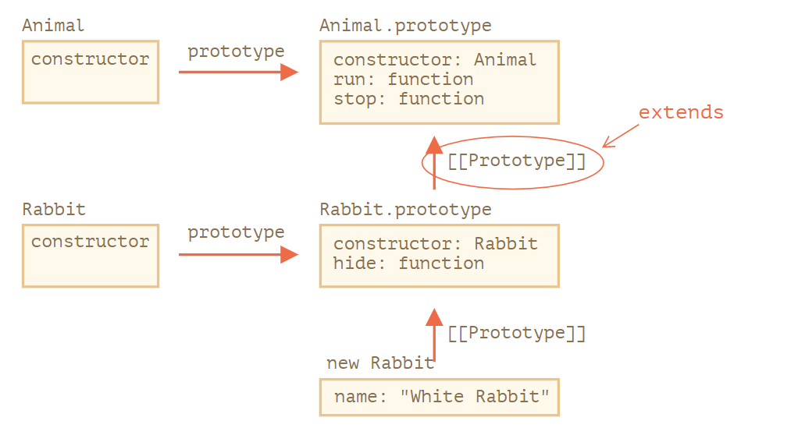
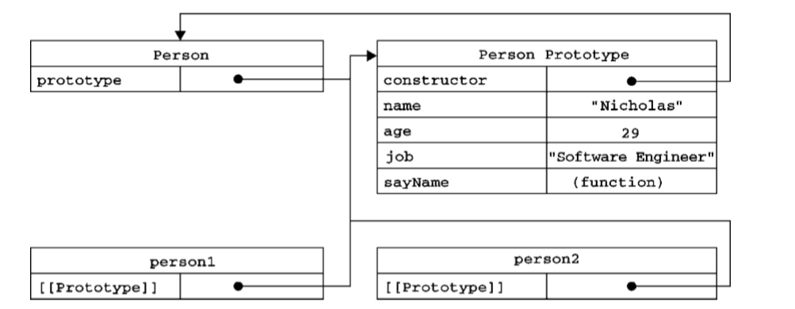
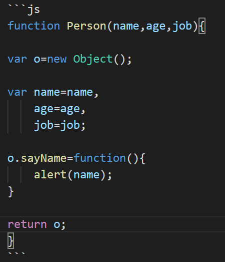
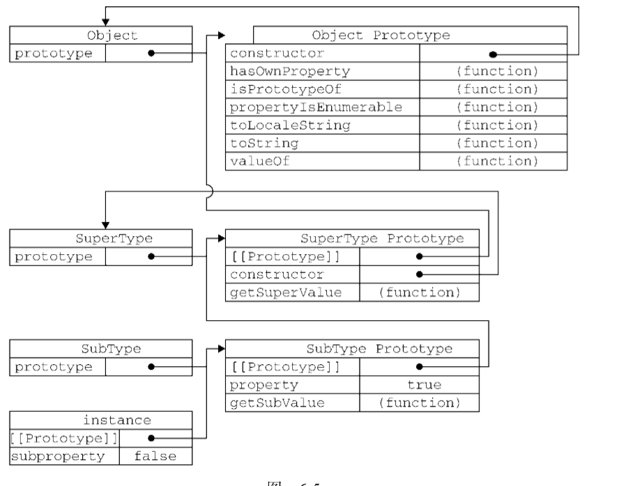

* js的call apply 
call() 方法接受的是一个参数列表，而 apply() 方法接受的是一个包含多个参数的数组  

call()详解：

function.call(thisArg, arg1, arg2, ...)
thisArg：可选的。arg1, arg2, ... 指定的参数列表。  
返回值：使用**调用者提供的 this 值**和参数调用该函数的返回值。若该方法(调用该方法的方法xxx.call)没有返回值，则返回 undefined。  

apply类似于call

bind 可以改变函数体类的this的指向
例子代码：
```js
var bar = function(){
    console.log(this.x);
}
var foo = {
    x:3
}
var sed = {
    x:4
}
var func = bar.bind(foo).bind(sed);
func(); //3
 
var fiv = {
    x:5
}
var func = bar.bind(foo).bind(sed).bind(fiv);
func(); //3
```
解释：3的缘故，bind(foo)，将bar执行时的this设置成了foo，因此为3。
不是3？：bind的函数实现相当于使用函数在内部包了一个 call / apply 
结论：
1. 可以看出 call 和 apply 是为了动态改变 this 而出现的
2. 不明确参数是用apply，否则用call
    * 例子： Array.prototype.slice.call 转换为真正的数组的带有 length 属性的对象
3. 三者区别：当你希望改变上下文环境之后并非立即执行，而是回调执行的时候，使用 bind() 方法。而 apply/call 则会立即执行函数。

代码如下：
```js
var obj = {
    x: 81,
};
 
var foo = {
    getX: function() {
        return this.x;
    }
}
 
console.log(foo.getX.bind(obj)());  //81 多了对括号
console.log(foo.getX.call(obj));    //81
console.log(foo.getX.apply(obj));   //81
```
btw 严格模式下，this的值为undefined

js 继承与原型链：
`__proto__` 是一种访问 [[Prototype]] 的方式，而不是 [[prototype]] 本身。
for in 循环也会遍历继承的值，只能枚举可以枚举的对象
- 通过 [[Prototype]] 引用的对象被称为“原型”。
- 继承： `x._proto_ = `
- 构造函数的使用方式：function F(){} F.prototype = super
  - 子类的生成：let x = new F()  --->  `x.__proto__  = F.prototype`

默认的 "prototype" 是一个只有属性 constructor 的对象，属性 constructor 指向函数自身。
F.prototype.constructor = F
可以使用 constructor 属性来创建一个新对象`let rabbit2 = new rabbit.constructor("Black Rabbit");`
只要不将F.prototype覆盖，就能保证 f.constructor指向创建它的构造函数
- F.prototype 在子类实例之后被覆盖，不会影响子类的内容，因为子类的内容通过_proto_获取
- 但改变F.prototype 引用，会改变子类的内容
- delete只会作用到对象，不会随着继承链往上传，若删除构造函数prototype的内容，会影响子类变成undefined

- 字面量的创建过程：
  -  ={} => = new Obejct()   
  -  `{}._proto_===Object.prototype`
- 基本数据类型:
  - 值 null 和 undefined 没有对象包装器，也没有原型
  - 字符串、数字和布尔值他们并不是对象，但如果我们访问他们的属性，，那么临时包装器对象将会通过内建的构造函数 String、Number 和 Boolean 被创建。它们提供给我们操作字符串、数字和布尔值的方法然后消失。
  - 原生的原型是可以被增加或删除一些方法的，这种方法的添加是全局的，尽量回避
  - 只有一种情况下允许修改原生原型。那就是 polyfilling，先判断有没有
  - 从原型中借用一些方法
- 直接用_proto_是不合适的，应该改为用
  - 创建一个以 animal 为原型的新对象：`let rabbit = Object.create(animal);`
  - 获取`_proto_` Object.getPrototypeOf(rabbit)
  - 修改原型：`Object.setPrototypeOf(rabbit, {});`
  - `Object.create(Object.getPrototypeOf(obj), Object.getOwnPropertyDescriptors(obj));` 完全相同的浅拷贝
  - Object.setPrototypeOf 或 `obj.__proto__= `“即时”更改原型是一个非常缓慢的操作，因为它破坏了对象属性访问操作的内部优化
  - 如果要将一个用户生成的键放入一个对象，那么内建的 __proto__ getter/setter 是不安全的

  - JavaScript的class语法：
    - `class MyClass { constructor(){} m1(){} }`
    - 当 new User("John") 被调用：
      - 一个新对象被创建
      - constructor 使用给定的参数运行，并为其分配 this.name。
    - class 并不是全新的语法：而是一个函数体
      - `class User {...}` 类的构造做了些啥：
        - 创建一个名为 User 的函数，该函数成为类声明的结果，代码来自于 constructor 方法
        - 存储类中的方法，例如 User.prototype 中的 sayHi。
      - class的声明与函数体的区别：
        - 创建的函数具有特殊的内部属性标记 `[[FunctionKind]]:"classConstructor"`
        - 调用类构造器时必须要用 new 关键词：
        - 类定义将 "prototype" 中的所有方法的 enumerable 标志设置为 false。
        - 类总是使用 use strict
    - 类表达式
      - 类可以在另外一个表达式中被定义，被传递，被返回，被赋值  `let User = class {}`
      - 可以动态地“按需”创建类
    - class的属性是创建在对象中的
  - extent关键字的实现：
    - 在 extends 后允许任意表达式
        ```js
        function f(phrase) {
        return class {
            sayHi() { alert(phrase) }
        }
        }

        class User extends f("Hello") {}

        new User().sayHi(); // Hello
        ```
    - 箭头函数没有 super，如果被访问，它会从外部函数获取。
    - 继承类的构造函数
      - new 执行一个常规函数时，它将创建一个空对象，并将这个空对象赋值给 this
      - 继承的 constructor 执行时，须调用 super 才能执行其父类（非派生的）的 constructor，否则 this 指向的那个对象将不会被创建

- 访问器属性 
  - ；它们包含一对儿 getter和 setter函数（不过，这两个函数都不是必需的）。 在读取访问器属性时，会调用 getter函数，这个函数负责返回有效的值；在写入访问器属性时，会调用 setter函数并传入新值，这个函数负责决定如何处理数据
    1. `[[Configurable]]`：表示能否通过 delete 删除属性从而重新定义属性，能否修改属性的特 性，或者能否把属性修改为数据属性。对于直接在对象上定义的属性，这个特性的默认值为 true 
    2. [[Enumerable]]：表示能否通过 for-in 循环返回属性。对于直接在对象上定义的属性，这 个特性的默认值为 true
    3. [[Get]]：在读取属性时调用的函数。默认值为 undefined
    4. [[Set]]：在写入属性时调用的函数。默认值为 undefined
  - Object.definePro- perties()方法
  - 创建自定义的构造函数意味着将来可以将它的实例标识为一种特定的类型；而这正是构造函数模式 胜过工厂模式的地方
  - 如果我们 在实例中添加了一个属性，而该属性与实例原型中的一个属性同名，那我们就在实例中创建该属性，该 属性将会屏蔽原型中的那个属性
  - hasOwnProperty和delete都是在对象属性上寻找
  - 如果你想要得到所有实例属性，无论它是否可枚举，都可以使用 Object.getOwnPropertyNames() 方法。 
  - 原型的动态性
    - 指针，后来在prototype上添加的属性，也能在之前声明的实例上引用
    - 如果覆盖了整个`[[prototype]]`属性指向的原型，将会读不到属性
***
$$ 正文开始 $$
### 创建对象的方法：
- 工厂模式：
  - createPerson()能够根据接受的参数来构建一个包含所有必要信息的 Person 对象
  - 没有解决对象试别的方法，只是产出了对象
- 构造函数模式
  - 不同之处：
    - 没有显式地创建对象
    - 直接将属性和方法赋给了 this 对象
    - 没有 return 语句
  - 这种方法必须使用new操作符
  - new操作符的过程如下
    - 创建一个新对象
    - 将构造函数的作用域赋给新对象（因此 this 就指向了这个新对象）
    - 执行构造函数中的代码（为这个新对象添加属性）
    - 返回新对象
  - 神奇的点：
    - 若将构造函数当作函数，会把属性添加到window对象（非严格）
    - 构造函数的问题 
      - 每个方法都会被重新创造一遍
- 原型模式：
  - 每个函数都有一个 prototype（原型）属性，这个属性是一个指针，指向一个对象，指向 调用构造函数 而创建的那个对象实例的原型对象
  - 工作原理：
    - 理解原型对象：
    - delete和hasOwnPrototype只作用在实例上，in作用在原型链上
    - 更简单的原型语法：覆盖原型
      - 会导致之前new的对象无法得到覆盖后的原型
      - 需要重置constructor
    - 原型的动态性：prototype通过指针保存在`[[prototype]]`，会动态更新改变
    - 原生对象的原型：所有原生引用类型（Object、Array、String，等等）都在其构造函数的原型上定义了方法
  - 存在的问题：
    - 引用类型会共享  
- 组合使用构造函数模式和原型模式
  - 实例属性都是在构造函数中定义的，而由所有实例共享的属性 constructor 和方 法 sayName()则是在原型中定义的
- 动态原型模式 
  - 可以通过 检查某个应该存在的方法是否有效，来决定是否需要初始化原型
    - if语句判断是否需要在原型上添加函数
      - 这部分代码只执行一次

**以下两种方法：创建的对象与构造函数之间也 没有什么关系，因此 instanceof 操作符对这种对象也没有意义**
- 寄生构造函数模式：
  - 创建一个函数，该函数的作用仅仅是封装创建对象的代码，然后再返回新创建的对象
    - 这个模式可以在特殊的情况下用来为对象创建构造函数。假设我们想创建一个具有额外方法的特殊 数组。由于不能直接修改 Array 构造函数，因此可以使用这个模式
  - 注意的点：
    - 首先，返回的对象与构造函数或者与构造函数的原型属性之间没有关系，也就是说，构造函数返回的对象与在构造函数外部创建的对象没有什么不同，为此， 不能依赖 instanceof 操作符来确定对象类型
- 稳妥构造函数模式
  - 谓稳妥对象，指的是没有公共属性，而且其方法也不引用 this 的对象
    - 通过闭包原理，将私有属性定义在构造函数内，提供对外的属性方法，代码例子
  - 适合在 一些安全的环境中（会禁止使用 this 和 new）

### 继承：
*ECMAScript只支持实现继承，而且其实现继承主要是依靠原型链来实现的*
- 原型链：较少使用
  - 基本思想是利用原型让一个引用类型继承另一个引用类型的属性和方法
  - 核心思想：让原型对象等于另一个类型的实例
    - 此时的原型对象将包含一个指向另一个原型的指针，相应地，另一个原型中也包含着一个指向另一个构造函数的指针
    - 实现的本质是重写原型对象
    - 
    - 这样的作法，使得不仅拥有父类实例的所有方法，其内部还有一个指针，指向父类的原型
  - 原型链的搜索方法：
    - 搜索实例
    - 搜索 SubType.prototype
    - 搜索 SuperType.prototype
    - 直到原型链末端才会停下来
  - 所有引用类型默认都继承了 Object，而 这个继承也是通过原型链实现的
  - 所有函数的默认原型都是 Object 的实例
  - 确定原型和实例的关系 ：
    -  instanceof 操作符：来测试实例与原型链中出现过的构造函数，结果就会返回 true
    -  使用 isPrototypeOf()方法：只要是原型链中出现过的原型，都可以说是该 原型链所派生的实例的原型
  - 谨慎地定义方法：在替换原型语句后再给原型添加方法
  - **原型链的问题**
    - 在原型替换的时候，会将原先的实例属性（安全，独占），变为原型属性（共享）
    - 在创建子类型的实例时，不能向超类型的构造函数中传递参数

- 借用构造函数：
  - 在子类型构造函数的内部调用超类型构造函数
    - `SuperType.call(this);`
  - 可传参：
    - 在调用超类型构造函数后，再添加应该在子类型中 定义的属性
  - 问题：
    - 函数复用就无从谈起，`SuperType.call(this);`这句话只是把相关属性附上去了
    - 即使拥有Super类的属性，但是是new的sub的构造函数，也无法获得超类型的原型方法

- 组合类型：
  - 思路：是使用原型链实现对原型属性和方法的继承，又借用构造函数来实现对实例属性的继承。
    - 既通过在原型上定义方法实现了函数 复用，又能够保证每个实例都有它自己的属性
  - 过程：
    - 在构造函数中call super的方法
    - 将sub的原型改为super的实例
    - 将原型的构造函数改为sub
  - 避免了原型链和借用构造函数的缺陷，融合了它们的优点，用instanceof 和 isPrototypeOf()也能够用于识别基于组合继承创建的对象
  - 调用了两次构造函数，对于父类的属性，获得了两份，第一次设置prototype时有了一份，第二次调用父类构造函数时又创造了一份。

```js
function SuperType(name){
 this.name = name;
 this.colors = ["red", "blue", "green"];
}
SuperType.prototype.sayName = function(){
 alert(this.name); 
};
function SubType(name, age){
 //继承属性
 SuperType.call(this, name);

 this.age = age;
}
 
SubType.prototype = new SuperType();
SubType.prototype.constructor = SubType
```

- 原型式继承
  - 借助原型可以基于已有的对象创建新对象，同时还不必因此创建自定义类型
    - 从本质上讲，object()对传入其中的对象执行了一次浅复制
  - Object.create():
  ```js
  function object(o){
    function F(){}     
    F.prototype = o;     
    return new F(); 
  }
  ``` 
    - 第一个参数是作新对象原型的对象
    - 第二个参数与Object.defineProperties()方法的第二个参数格式相 同：每个属性都是通过自己的描述符定义的，以这种方式指定的任何属性都会覆盖原型对象上的同名属性
  - 别忘了，引用类型的属性是共享的
   
- 寄生式继承
  - 创建一个仅用于封装继承过程的函数，该 函数在内部以某种方式来增强对象 
  - 缺点：使用寄生式继承来为对象添加函数，会由于不能做到函数复用而降低效率；这一 点与构造函数模式类似。 

- 寄生组合式继承 :ES6 class实现方式
  - 使用最多
  - 步骤如下：
    1. 创建超类型原型的一个副本。
    2. 为创建的副本添加 constructor 属性，弥补因重写原型而失去的默认的 constructor 属性
    3. 将新创建的对象（即副本）赋值给子类型的原型
  ```js
  function inheritPrototype(subType, superType){
    var prototype = Object(superType.prototype);    //创建对象    
    // var prototye = Object.create(superTypr.prototype)
    prototype.constructor = subType;              //增强对象     
    subType.prototype = prototype;               //指定对象 
  }
  ```
  - 我们需要的只是一个父类的原型的副本，因此只需要用原型式继承得到一个副本即可。与组合型少调用了一次构造函数
  - 有了父类的原型后，在子类的构造函数中调用父类的构造函数就可以得到父类的属性。！

简单对比寄生组合式继承和组合继承：
- 组合继承能做到父子各拥有一个同名方法，寄生组合式 父子类共享同一个prototype，无法做到，并且此时的父类的prototype指向子类的constructor
- 但是少调用了一次new方法，效率更高


1. 凡是通过 new Function() 创建的对象都是函数对象，其他的都是普通对象
2. 实例的构造函数属性（constructor）指向构造函数。
3. **每个对象都有` __proto__` 属性，但只有函数对象才有 prototype 属性**
4. 在默认情况下，所有的原型对象都会自动获得一个 constructor（构造函数）属性，这个属性（是一个指针）指向 prototype 属性所在的函数（Person）
5. 原型对象（Person.prototype）是 构造函数（Object）的一个实例。
6. 上文提到凡是通过 new Function( ) 产生的对象都是函数对象。因为 A 是函数对象，所以Function.prototype 是函数对象
7. 函数对象：Object\Function\Date\String\Boolean\Number

### ES6 class：
现有代码段：
  ```js
  class User {
  constructor(name) { this.name = name; }
  sayHi() { alert(this.name); }
  }
  ```
- 上面代码段做了下列的事：
  - 建一个名为 User 的函数，该函数成为类声明的结果该函数的代码来自于 constructor 方法
    - typeof User === 'function'
  - 存储类中的方法：将类中声明的函数加到User.prototype中
- 与普通函数的不同之处：
  - 使用时必须用new
  - 类方法不可枚举
    - 类定义将 "prototype" 中的所有方法的 enumerable 标志设置为 false。
  - 类总是使用 use strict
  - 类不会变量提升，且可以使用类表达式，因此可以动态的按需创造类 return class{}
  - 类声明创建getter和setter的方法：
    - Object.defineProperties(User.prototype, {name: {get set }});
  - 类方法函数可以使用计算属性的方式 `['say' + 'Hi']() {alert("Hello");}`

class继承: 寄生组合继承：
- extends 关键字
  - 继承类的new执行：先调用父类的构造函数
