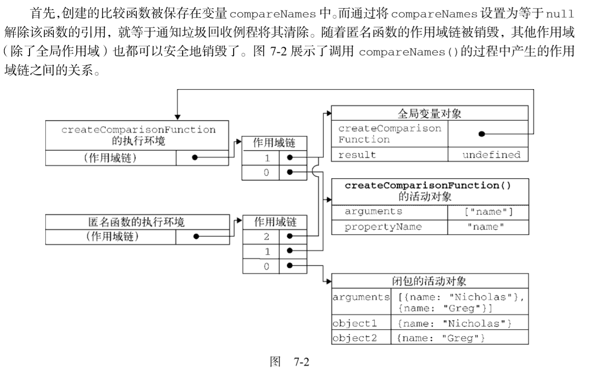
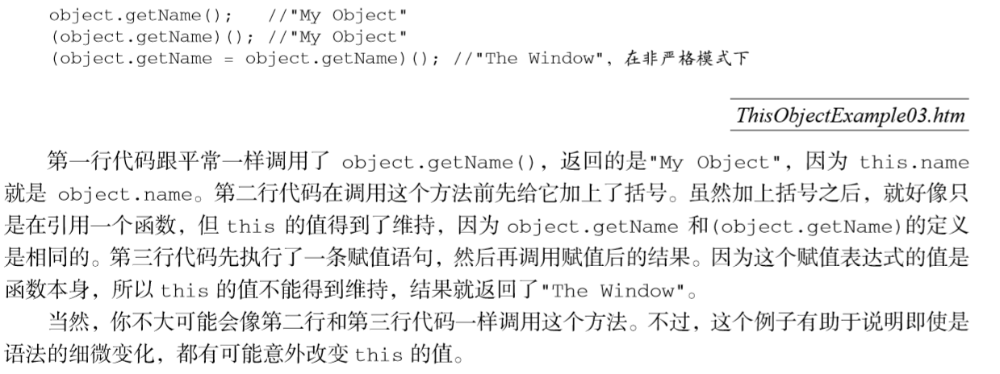

$$Closure$$
- 闭包是指有权访问另一个函数作用域中的变量的函数

#### 从作用域说起
- 基本类型和引用：
  - ECMAScript 中所有函数的参数都是按值传递的
- 执行环境及作用域
  - 每个函数都有自己的执行环境。当执行流进入一个函数时，函数的环境就会被推入一个环境栈中
    - 如果这个环境是函数，则将其活动对象（activation object）作为变量对象。活动对 象在最开始时只包含一个变量，即 arguments 对象
  - 当代码在一个环境中执行时，会创建变量对象的一个作用域链（scope chain）。作用域链的用途，是保证对执行环境有权访问的所有变量和函数的有序访问
    - 标识符解析是沿着作用域链一级一级地搜索标识符的过程
  -  函数参数也被当作变量来对待，因此其访问规则与执行环境中的其他变量相同。


1. 延长作用域链
2. 没有块级作用域
  - 声明变量：使用 var 声明的变量会自动被添加到最接近的环境中
  - *变量查询也不是没有代价的。很明显，访问局部变量要比访问全局变量更快，因 为不用向上搜索作用域链。JavaScript 引擎在优化标识符查询方面做得不错，因此这 个差别在将来恐怕就可以忽略不计了。*
3. 垃圾收集:
  - 垃圾收集器会按照固定的时间间隔（或代码执行中预定的收集时间）， 周期性地执行这一操作
  - 垃圾收集器必须跟踪哪个变量有用哪个变量没用，对于不再有用的变量打上标记，以备将来收回其占用的内存
    1. 标记清除
      - 最常用的垃圾收集方式
      - 当变量进入环境(例如声明变量)，就将这个变量标记为“进入环境”
      - 当变量离开环境时，则将其 标记为“离开环境”
      - 回收过程：
        - 垃圾收集器在运行的时候会给存储在内存中的所有变量都加上标记
        - 去掉环境中的变量以及被环境中的变量引用的变量的标记
        - 而在此之后再被加上标记的变量将被视为准备删除的变量
          - 原因是环境中的变量已经无法访问到这些变量了。
        - 完成内存清除工作，销毁那些带标记的值并回收它们所占用的内存空间
    2. 引用计数 
      - 不太常用
      - 引用计数的含义是跟踪记录每个值被引用的次数  
      - 当声明了一个变量并将一个引用类型值赋给该变量时，则这个值的引用次数就是 1。
      - 当这个值的引用次数变成 0时，则说明没有办法再访问这 个值了，因而就可以将其占用的内存空间回收回来
      - 垃圾收集器会释放那些引用次数为零的值所占用的内存。 
      - 出现的问题：**循环引用**
        - 使用 COM对象
         
    3. 性能问题
    4. 管理内存
      - 一旦数据不再有用，最好通过将其值设置为 null 来释放其引用——这个 做法叫做解除引用
        - 适用于大多数全局变量和全局对象的属性
      - 解除引用的真正作用是让值脱离 执行环境，以便垃圾收集器下次运行时将其回收
 - 小结：
   - 基本类型值在内存中占据固定大小的空间，因此被保存在栈内存中； 
   - 从一个变量向另一个变量复制基本类型的值，会创建这个值的一个副本；
   - 引用类型的值是对象，保存在堆内存中；
   - 包含引用类型值的变量实际上包含的并不是对象本身，而是一个指向该对象的指针；
   - 从一个变量向另一个变量复制引用类型的值，复制的其实是指针，因此两个变量最终都指向同一个对象； 
   - ....

#### 闭包：
*当某个函数被调用时，会创建一个执行环境（execution context）及相应的作用域链。 然后，使用 arguments 和其他命名参数的值来初始化函数的活动对象（activation object）。但在作用域链中，外部函数的活动对象始终处于第二位，外部函数的外部函数的活动对象处于第三位，……直至作为作用域链终点的全局执行环境*
- 活动对象: 使用 arguments 和其他命名参数的值来初始化函数
```js
function compare(value1, value2){     
  if (value1 < value2){         
    return -1;     
    } else if (value1 > value2){         
      return 1;     
      } else {         
        return 0;     
  }
}
 
var result = compare(5, 10);
```
- 在创建 compare()函数 时，会创建一个预先包含全局变量对象的作用域链，这个作用域链被保存在内部的`[[Scope]]`属性中。 
- 当调用 compare()函数时，会为函数创建一个执行环境，然后通过复制函数的`[[Scope]]`属性中的对象构建起执行环境的作用域链。
- **作用域链本质上是一个指向变量对象的指针列表，它只引用但不实际包含变量对象**
- 在另一个函数内部定义的函数会将包含函数（即外部函数）的活动对象添加到**它的作用域链中**。

示例函数：
```js
var compare = createComparisonFunction("name"); 
var result = compare({ name: "Nicholas" }, { name: "Greg" }); 
var compareNames = createComparisonFunction("name"); 
 //调用函数
var result = compareNames({ name: "Nicholas" }, { name: "Greg" }); 
//解除对匿名函数的引用（以便释放内存） 
compareNames = null;
```

> createComparisonFunction() 函数在执行完毕后，其活动对象也不会被销毁，因为匿名函数的作用域链仍然在引用这个活动对象。换句话说，当 createComparisonFunction()函数返回后，其执行环境的作用域链会被销毁，但它的活动对象仍然会留在内存中
*闭包会携带包含它的函数的作用域，因此会比其他函数占用更多的内存。过度使用闭包可能会导致内存占用过多，我们建议读者只在绝对必要时再考虑使用闭包。虽然像 V8 等优化后的 JavaScript 引擎会尝试回收被闭包占用的内存，但还是要慎重使用闭包。*

- 闭包与变量
  - 作用域链的这种配置机制引出了一个值得注意的副作用：
    - 即闭包只能取得包含函数中任何变量的后一个值
  - 解决方法：
    - 返回一个匿名函数，而不是直接赋值，并将外部函数设为立即调用函数，将i作为形参传入(自动复制)
- this对象：
  - 每个函数在被调用时都会自动取得两个特殊变量：this 和 arguments
  - **永远不可能直接访问外部函数中的这两个变量**
  - 解决方法：
    - 把外部作用域中的 this 对象保存在一个闭包能够访问到的变量里，就可以让闭包访问该对象了(that)
  - 想访问arguments时同理
  - 一个误区：
    - 判断(this=object)的值是否得到了维持
- 内存泄露：
  - 如果闭包的作用域链中保存着一个 HTML元素，那么就意味着该元素将无法被销毁
  ```js
  function assignHandler(){     
      var element = document.getElementById("someElement");     
      element.onclick = function(){         
          alert(element.id);     
      }; 
  }
  ``` 
  - 因为element.onclick中保存了这个函数，也保存了它的上下文环境`[[scope]]`，他的上下文环境又保存了外层函数的活动对象，而且这个活动对象中有element变量，因此构成循环--个人心得
  - 以上代码创建了一个作为 element 元素事件处理程序的闭包，而这个闭包则又创建了一个循环引用，由于匿名函数保存了一个对 assignHandler()的活动对象的引用，因此 就会导致无法减少 element 的引用数
  解决方法：
  ```js
    function assignHandler(){     
      var element = document.getElementById("someElement");     
      var id = element.id;    //element的引用计数-1      
      element.onclick = function(){         
          alert(id);     
      };          
      element = null;  //element的引用计数-1
    } 
  ```
- 模仿块级作用域
  - JavaScript从来不会告诉你是否多次声明了同一个变量；遇到这种情况，它只会对后续的**声明**视而不见
  - 匿名函数可以用来模仿块级作用域并避免这个问题：
  - 立即调用函数： JavaScript将 function 关键字当作一个函数声明的开始，而函数声明后面不能跟圆括号，但函数表达式后面可以跟括号。因此 (函数声明)();===函数表达式;
  - 这种技术经常在全局作用域中被用在函数外部，从而限制向全局作用域中添加过多的变量和函数。 
- 私有变量
  - 任何在函数中定义的变量，都可以认为是私有变量
  - 将私有变量以var的方式声明，内部函数可以通过闭包访问，外部函数无法访问
  - 把有权访问私有变量和私有函数的公有方法称为特权方法：this.func
  - 函数中定义特权方法也有一个缺点，那就是你必须使用构造函数模式来达到这个目的。缺点：针对每一个私有的实例都会创建一组新的方法。
- 静态私有变量 
  - 将函数声明改为函数表达式
  - 区别，就在于私有变量和函数是由实例共享的。由于 特权方法是在原型上定义的，因此所有实例都使用同一个函数，而这个特权方法，作为一个闭包，总是保存着对包含作用域的引用
  ```js
    (function(){          
        var name = "";          
        Person = function(value){         
            name = value;     
        };          
        Person.prototype.getName = function(){         
            return name;     
        };          
        Person.prototype.setName = function (value){
            name = value;     
        }; 
    })();
  ``` 
  - 解析：
    - 这个例子中的Person构造函数与getName()和setName()方法一样，都有权访问私有变量name。 在这种模式下，变量 name 就变成了一个静态的、由所有实例共享的属性(static)
  - 以这种方式创建静态私有变量会因为使用原型而增进代码复用，但每个实例都没有自己的私有变量。
*多查找作用域链中的一个层次，就会在一定程度上影响查找速度。而这正是使用闭包和私有变量的一个明显的不足之处* 
- 模块模式 
  - 单例创建私有变量和特权方法
    ```js
    var singleton = function(){             
        var privateVariable = 10;          
        function privateFunction(){         
            return false;     
    } 
    return { 
        publicProperty: true, 
 
        publicMethod : function(){             
            privateVariable++;             
            return privateFunction();         
        }}; 
    }();
    ```
  - 以上模块模式使用了一个返回对象的匿名函数。在这个匿名函数内部，首先定义了私有变量和函数。 然后，将一个对象字面量作为函数的值返回
- 增强的模块模式 
  - 此方法将返回的字面量变成一个xxx的实例，并new出来之后，添加了属性和公有方法(增强)

- seTimeout或DOM处理时间时的this丢失
  - 根本原因：把函数传到参数中，相当于`argument[0] `= obj.func; 该赋值语句使得丢失了this指针
  - 解决方法：
    - 用箭头函数或者函数表达式将obj.func包进去，避免赋值语句使其丢失了this
      - 也可以说是创建了闭包，将obj.func保存完整.
    - 使用bind，与方法一本质相同


 