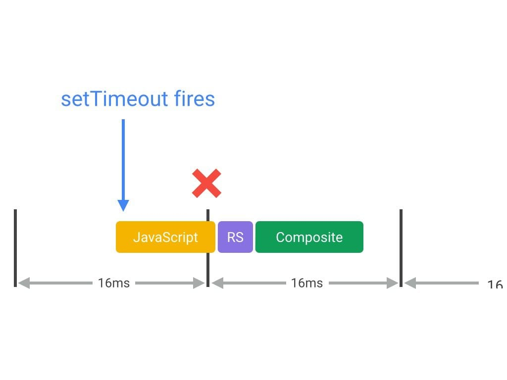

1. 对于动画效果的实现，避免使用 setTimeout 或 setInterval，请使用 requestAnimationFrame。
   - 保证 JavaScript 在帧开始时运行的唯一方式是使用 requestAnimationFrame
   - setTimeout 或 setInterval 来执行动画之类的视觉变化，回调在帧末尾进行，导致丢帧
3. 将长时间运行的 JavaScript 从主线程移到 Web Worker。
   - 降低复杂性或使用 Web Worker
     -  在滚动之类的动画中，最好是想办法使 JavaScript 保持在 3-4 毫秒的范围内
     -  将纯计算工作移到 Web Worker
4. 使用微任务来执行对多个帧的 DOM 更改。
     - 对于一定要在主线程执行的，请考虑一种批量方法，将大型任务分割为微任务，每个微任务所占时间不超过几毫秒，并且在每帧的 requestAnimationFrame 处理程序内运行
     - 该方法需要配合使用进度或活动指示器来确保用户知道任务正在被处理
6. 使用 Chrome DevTools 的 Timeline 和 JavaScript 分析器来评估 JavaScript 的影响。
     -  了解 JavaScript 的“帧税”，发现有长时间运行的 JavaScript，则可以在 DevTools 用户界面的顶部启用 JavaScript 分析器
**原文链接`https://developers.google.com/web/fundamentals/performance/rendering/optimize-javascript-execution`**

## 缩小样式计算的范围并降低其复杂性
- 计算样式
  1. 创建一组匹配选择器，这实质上是浏览器计算出给指定元素应用哪些类、伪选择器和 ID。
  2. 从匹配选择器中获取所有样式规则，并计算出此元素的最终样式。
  > 用于计算某元素计算样式的时间中大约有 50% 用来匹配选择器，而另一半时间用于从匹配的规则中构建 RenderStyle（计算样式的表示）
- 优化方法：
  - 降低选择器的复杂性
  - 减少要计算样式的元素数量
  - 使用 Chrome DevTools 的 Timeline 模式 
  - 使用块、元素、修饰符（BEM）的命名方式
    - 之类的编码方法实际上纳入了上述选择器匹配的性能优势，因为它建议所有元素都有单个类，并且在需要层次结构时也纳入了类的名称

### web worker:

**相关限制**：
  - workers 运行在另一个全局上下文中,不同于当前的window. 因此，使用 window快捷方式获取当前全局的范围 (而不是self) 在一个 Worker 内将返回错误。
  - 不能直接操作DOM节点
  - 无法直接通讯
  - Worker 线程无法读取本地文件
  - 只要运行在同源的父页面中，workers可以依次生成新的workers；并且可以使用XMLHttpRequest 进行网络I/O
  - 可以使用WebSockets，IndexedDB以及FireFox OS专用的Data Store API等数据存储机制

**通信方法**
- 主线程的通讯：
  - 主线程调用worker.postMessage()方法，向 Worker 发消息。
  - 主线程通过worker.onmessage指定监听函数，接收子线程发回来的消息。event参数可以通过.data获取数据
  - Worker 完成任务以后，主线程就可以把它关掉。
- Worker 线程内：
  - Worker 线程内部需要有一个监听函数，监听message事件。也可以直接用onmessage监听
    ```js
    self.addEventListener('message', function (e) {
    self.postMessage('You said: ' + e.data);
    }, false);
    ``` 这里的self是子线程本身，可以忽略也可以用this来代替

**其他主要方法**：
- Worker 加载脚本：`importScripts('script1.js',....);`
- 错误处理：如果发生错误，Worker 会触发主线程的error事件 `'error||.onerror'`
- 关闭 Worker: 主线程: `.terminate()`，子线程：`self.close()`

**数据通信**
- 主线程与 Worker 之间的通信是拷贝关系，传值，内部的运行机制是，先将通信内容串行化，然后把串行化后的字符串发给 Worker ` structured clone algorithm`
- 当需要传很大文件的时候，可以传Transferable Objects ` File, Blob, ArrayBuffer, and JSON objects`
  - `Blob`表示一个不可变、原始数据的类文件对象
  - `worker.postMessage(arrayBuffer, [arrayBuffer]);`
  - Transferable 接口代表一个能在不同可执行上下文中相互传递的对象，列如主线程和 Worker 间。有点像传指针，但是一旦传过去，原来的context中就不存在这个对象了。

**相关例子**：
  - 生成一个专用worker ` = new worker(uri)`  这里的uri必须为网络资源，不可以是本机
      - 该构造函数指定一个执行的URL脚本，这个脚本遵守同源策略
      - > 如果 此URL有一个无效的语句，或者违反同源策略，一个 SECURITY_ERR 类型的DOMException被抛出。
