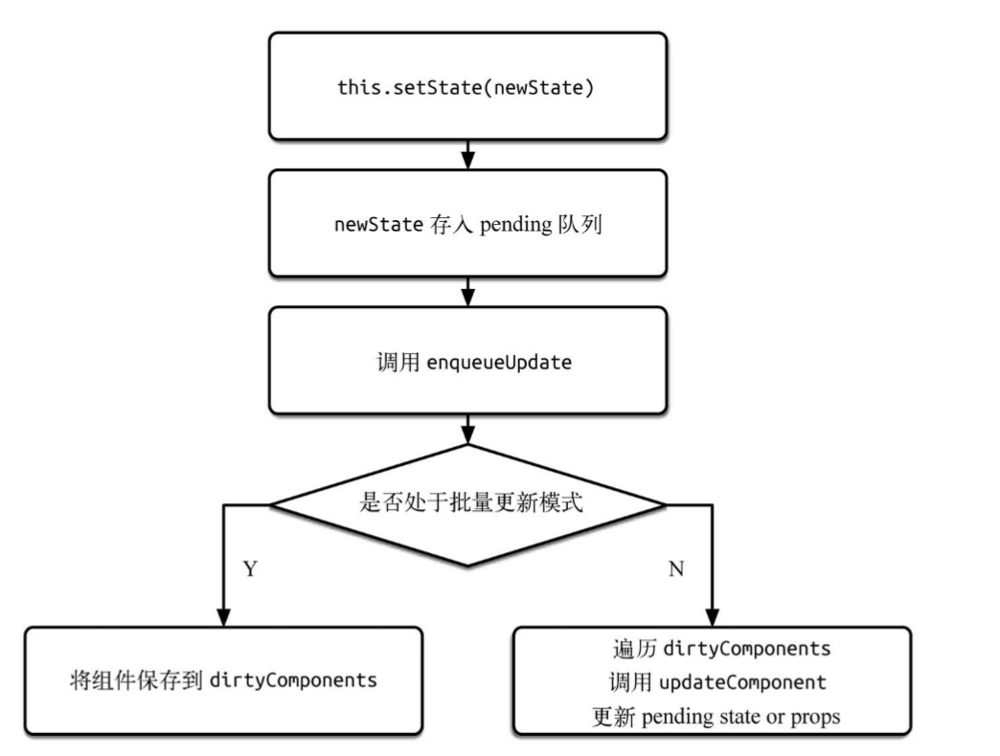
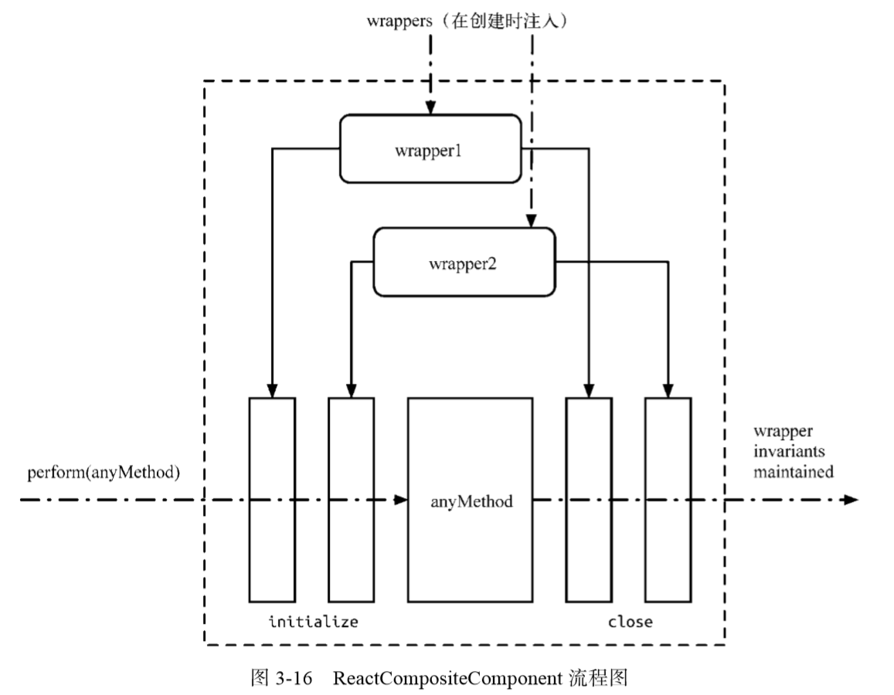

### JSX
> 实际上，JSX 仅仅只是 React.createElement(component, props, ...children) 函数的语法糖
    ```jsx
    <MyButton color="blue" shadowSize={2}>
    Click Me
    </MyButton>
    ---
    React.createElement(
    MyButton,
    {color: 'blue', shadowSize: 2},
    'Click Me'
    )
    ```
- JSX 标签的第一部分指定了 React 元素的类型。
  - 大写字母开头的 JSX 标签意味着它们是 React 组件
    - *这些标签会被编译为对命名变量的直接引用，所以，当你使用 JSX `<Foo />`表达式时，Foo 必须包含在作用域内。*
- 由于 JSX 会编译为 React.createElement 调用形式，所以 React 库也必须包含在 JSX 代码作用域内
- JSX 类型中使用点语法 {c:...}
- 用户定义的组件必须以大写字母开头
  - 以小写字母开头的元素代表一个 HTML 内置组件，比如 `<div>` 或者 `<span>` 会生成相应的字符串 'div' 或者 'span' 传递给 React.createElement（作为参数）。大写字母开头的元素则对应着在 JavaScript 引入或自定义的组件，如 `<Foo />` 会编译为 React.createElement(Foo)。
- 在运行时选择类型:
  - 通过通用表达式来（动态）决定元素类型，你需要首先将它赋值给大写字母开头的变量。这通常用于根据 prop 来渲染不同组件的情况下
- JSX 中的 Props
- 属性展开：选择性的传递props
- JavaScript、函数、字符串字面量、等 作为子元素

**Children API**
props.children||()
React.Children.map||forEach 望能
this.props.children.map //只适用于class组件
React.Children.count 返回子组件个数
React.Children.toArray() 转换children to array

`render prop `
- 通过一个函数将class组件的state作为props传递给纯函数组件
- 组件通过render方法将自己的state暴露给了外部组件
- 解决面向横切面问题  {this.props.render(this.state)}
  - 需要什么props还能自己使用解构的语法获取
  - render prop 是一个用于告知组件需要渲染什么内容的函数 prop
  - *任何被用于告知组件需要渲染什么内容的函数 prop 在技术上都可以被称为 “render prop”.*
- 注意事项：
  - 用 render prop 会抵消使用 React.PureComponent 带来的优势。因为浅比较 props 的时候总会得到 false
    - 把内联函数改为声明函数

`Mixins`：
- 是一种通过扩展收集功能的方式，它本质上是将一个对象的属性拷贝到另一个对象上面
- 有害的原因：
  - 引入了隐式的依赖关系
    - 因为在mixins中，可能存在函数之间的调用，而且一个组件能有几个不同功能的mixins
  - Mixins 引起名称冲突
    - 因为JavaScript是动态的，mixins中带来的函数有可能和组件本身/库函数冲突
  - 导致滚雪球式的复杂性
    - mixins之间的逻辑很可能会冗杂在一起

`Higher Order Component`：


函数组件和类组件：
- 函数式组件捕获了渲染所使用的值。
  - 源于this.props.xxx的细小区别，使用函数式组件时，会创建闭包（独立props or xxx变量）
  - 无法使用State，也无法使用组件的生命周期方法
  - 更容易理解，不执行与UI无关的逻辑处理

- 无状态组件：
  - 

**pure component**
- shouldComponentUpdate() 作对象的浅层比较

**React.memo**
- 用于函数组件，但不适用于 class 组件。
- > 如果你的函数组件在给定相同 props 的情况下渲染相同的结果，那么你可以通过将其包装在 React.memo 中调用，以此通过记忆组件渲染结果的方式来提高组件的性能表现。这意味着在这种情况下，React 将跳过渲染组件的操作并直接复用最近一次渲染的结果。类似于purecomponent
- props的比较也是浅层比较

### 受控组件和非受控组件：
- 受控组件：
  - > 在 HTML 中，表单元素（如`<input>、 <textarea> 和 <select>`）之类的表单元素通常自己维护 state，并根据用户输入进行更新。而在 React 中，可变状态（mutable state）通常保存在组件的 state 属性中，并且只能通过使用 setState()来更新。
  - 把两者结合起来，使 React 的 state 成为“唯一数据源”。渲染表单的 React 组件还控制着用户输入过程中表单发生的操作，被 React 以这种方式控制取值的表单输入元素就叫做“受控组件”。
  - onchange->state->render

- 非受控组件：
  - 表单数据将交由 DOM 节点来处理。
  - 非受控组件将真实数据储存在 DOM 节点中，所以在使用非受控组件时，有时候反而更容易同时集成 React 和非 React 代码。--->影响美观性和减少数据量

非受控和受控的简单比较：
- 非受控：
  - 使用Refs，取值.value，或者设置回调
- 受控的：
  - 受控输入框接收它的当前值作为一个属性，并且有一个回调来修改它的值（react）
  - 数据（ state ）和 UI（输入框）总是同步的，state 提供值给输入框，输入框通过回调函数修改当前值。
  - 这种受控组件的优势：(做更多的前端交互设计)
    - 立刻反馈，比如校验
    - 禁用按钮除非所有表单域都有合法值
    - 强制具体的输入格式，如信用卡号

- 区别：
  - 如果通过一个 prop 来设置一个表单元素的 value ，它变为“受控的”
  - 如果你的表单在 UI 反馈方面特别简单，非受控的使用 refs 完全可以

### Refs
- Refs 提供了一种方式，允许我们访问 DOM 节点或在 render 方法中创建的 React 元素
> *在典型的 React 数据流中，props 是父组件与子组件交互的唯一方式。要修改一个子组件，你需要使用新的 props 来重新渲染它。但是，在某些情况下，你需要在典型数据流之外强制修改子组件。被修改的子组件可能是一个 React 组件的实例，也可能是一个 DOM 元素*
- 何时使用 Refs
  - 管理焦点，文本选择或媒体播放。
  - 触发强制动画。
  - 集成第三方 DOM 库。
- *勿过度使用 Refs*

- 创建 Refs
  - Refs 是使用 React.createRef() 创建的，并通过 ref 属性附加到 React 元素

- 访问 Refs
  - ref 被传递给 render 中的元素时，对该节点的引用可以在 ref 的 current 属性中被访问。
  - ref 的值根据节点的类型而有所不同
    - 当 ref 属性用于 HTML 元素时，构造函数中使用 React.createRef() 创建的 ref 接收底层 DOM 元素作为其 current 属性
    - 当 ref 属性用于自定义 class 组件时，ref 对象接收组件的挂载实例作为其 current 属性。
    - 不能在函数组件上使用 ref 属性，因为他们没有实例

- Refs转发：
  - 一项将 ref 自动地通过组件传递到其一子组件的技巧
  - Ref 转发是一个可选特性，其允许某些组件接收 ref，并将其向下传递（换句话说，“转发”它）给子组件。
    - 也就是说  要传refs，你必须这样做
  ```js 实例代码
  const FancyButton = React.forwardRef((props, ref) => (
  <button ref={ref} className="FancyButton">
    {props.children}
  </button>
  ));
  ```
  上述代码的解释：
  - 我们通过调用 React.createRef 创建了一个 React ref 并将其赋值给 ref 变量。
  - 我们通过指定 ref 为 JSX 属性，将其向下传递给 `<FancyButton ref={ref}>`。
  - React 传递 ref 给 forwardRef 内函数 (props, ref) => ...，作为其第二个参数。
  - 我们向下转发该 ref 参数到 `<button ref={ref}>`，将其指定为 JSX 属性。
  - 当 ref 挂载完成，ref.current 将指向 `<button>` DOM 节点。

- 在高阶组件中转发 refs
  - 以上的例子，将`<button>`改为一个类，再包装成函数，就是HOC；

#### 例子：
- 为 DOM 元素添加 ref：
  - `<input type="text" ref={this.textInput} />`
  - 在组件挂载时给 current 属性传入 DOM 元素
  - ref 会在 componentDidMount 或 componentDidUpdate 生命周期钩子触发前更新
  - 在组件卸载时传入 null 值

- 为 class 组件添加 Ref
  - 模拟它挂载之后立即被点击的操作:
    - 可以使用 ref 来获取这个自定义的 input 组件并手动调用它的 focusTextInput 方法
    - ` this.textInput.current.focusTextInput();`

- Refs 与函数组件
  - 不能在函数组件上使用 ref 属性
  - 但可以在函数组件内部使用 ref 属性，只要它指向一个 DOM 元素或 class 组件

- 将 DOM Refs 暴露给父组件
  - Ref 转发使组件可以像暴露自己的 ref 一样暴露子组件的 ref

- 回调 Refs：
  - “回调 refs”：能助你更精细地控制何时 refs 被设置和解除。
  - 传递一个函数。这个函数中接受 React 组件实例或 HTML DOM 元素作为参数，以使它们能在其他地方被存储和访问
  - 同样，这种方式也能保证refs的最新
  - 如果 ref 回调函数是以内联函数的方式定义的，在更新过程中它会被执行两次
    - 第一次传入参数 null
    - 第二次会传入参数 DOM 元素
  - 因为在每次渲染时会创建一个新的函数实例，所以 React 清空旧的 ref 并且设置新的
    - 将 ref 的回调函数定义成 class 的绑定函数的方式可以避免上述问题

### Portals
- Portal 提供了一种将子节点渲染到存在于父组件以外的 DOM 节点的优秀的方案。
- ReactDOM.createPortal(child, container)
  - 第一个参数（child）是任何可渲染的 React 子元素，例如一个元素，字符串或 fragment。第二个参数（container）是一个 DOM 元素。
- 通过Portal渲染出去的DOM，事件是会冒泡从传送门的入口端冒出来的，上面的onDialogClick也就会被调用到了。


### SetState
- 是利用状态队列机制实现了 setState 的异步更新，避免频繁地重复更新 state

setState 循环调用风险 
setState 调用栈
- 

react事务：
- 
- 事务就是将需要执行的方法使用 wrapper 封装起来，再通过事务提供的 perform 方法执行
- 在 perform 之前，先执行所有 wrapper 中的 initialize 方法，执行完 perform 之后（即执行 method 方法后）再执行所有的 close 方法。一组 initialize 及 close 方法称为一个 wrapper。从 图3-16中可以看出，事务支持多个 wrapper 叠加
