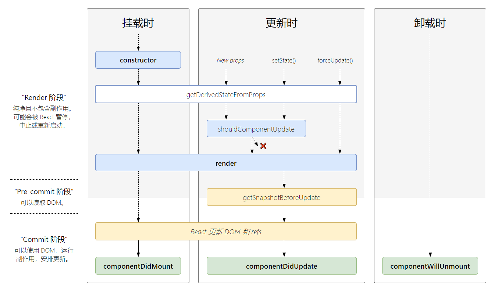

### 组件
-  组件名称必须以大写字母开头，小写的是原生的DOM
-  强烈建议你不要创建自己的组件基类。组合>继承

- 状态提升：
  - 如果一个父组件有多个子组件需要同步地维护，这时，最好将子组件的state转移到父组件中维护，再使用props传递到子组件中

**挂载**：斜体用得较少
- 组件的初始化阶段，就是将我们的组件插入到DOM中，只会发生一次
- `constructor()`
  - 第一个被执行，如果没有显示定义，会有默认的函数，如果定义了，必须在第一行super(props)
  - 一般做两件事
    - 初始化state对象(直接赋值)
    - 给自定义方法绑定this

- *`static getDerivedStateFromProps(nextProps, prevState)`*
  - 不能在这个函数里面使用this(静态方法)
  - 参数props和state，分别指接收到的新参数和当前的state对象
  - 返回一个对象用来更新当前的state对象，如果不需要更新可以返回null
  - 调用时机：
    1. 挂载时(第一次渲染)
    2. 接收到新的props
    3. 调用了setState
    4. 调用了forceUpdate时
  - 使用场景：
    - 当我们接收到新的props想去修改我们state，可以使用getDerivedStateFromProps 

- `render()`
  - React中最核心的方法，一个组件中必须要有这个方法
  - render返回类型：
    - 原生的DOM，如div
    - React组件
    - Fragment（片段）
    - Portals（插槽）
    - 字符串和数字，被渲染成text节点
    - Boolean和null，不会渲染任何东西
  - render函数是纯函数，里面只做一件事，就是返回需要渲染的东西，不应该包含其它的业务逻辑，如数据请求，对于这些业务逻辑请移到`componentDidMount`和`componentDidUpdate`中
 
- `componentDidMount()`
  - 组件装载之后调用，此时我们可以获取到DOM节点并操作，比如对canvas，svg的操作，服务器请求，订阅
  - 避免在`componentDidMount`中调用setstate，会额外触发一次渲染，多调用了一次render函数。应在constructor中初始化我们的state对象

**更新**：
- ~~`componentWillReceiveProps`~~
  - 当父组件重新渲染时，也会导致子组件调用这个函数，即使props没有变化，所以当前后不一致的时候才去使用setState
  - 装载阶段、在组件内部调用了setState和forceUpdate都不会触发这个函数

- *`static getDerivedStateFromProps()`*

- *`shouldComponentUpdate()`*
  - 表示新的属性和变化之后的state，返回一个布尔值，true表示会触发重新渲染，false表示不会触发重新渲染，默认返回true
  - **当我们调用forceUpdate并不会触发此方法**
  - 官方提倡我们使用PureComponent来减少重新渲染的次数，而不是重写该函数
  - 在未来的版本，shouldComponentUpdate返回false，仍然可能导致组件重新的渲染

- ~~`componentWillUpdate`~~
  - 此方法中不能调用setState，因为这个方法位于shouldComponentUpdate返回true之后，此时下一个state状态已经被确定，马上就要执行render重新渲染了，如果贸然更改会导致整个生命周期的混乱
  - 不能请求网络数据，因为在异步渲染中，可能会导致网络请求多次，引起性能问题 ****
  - *如果非要获取滚动位置的话，请在getSnapshotBeforeUpdate调用*

- `render()`
 
- *`getSnapshotBeforeUpdate(prevProps, prevState)`*
  - 在render之后，componentDidUpdate之前调用
  - 该函数返回值会作为第三个参数传给componentDidUpdate，如果不想要返回值，请返回null，否则控制台会有警告
  - 这个方法一定要和componentDidUpdate一起使用，否则控制台也会有警告

- `componentDidUpdate(prevProps, prevState, snapshot)`
  - 在getSnapshotBeforeUpdate方法之后被调用
  - 在这个函数里我们可以操作DOM，和发起服务器请求，还可以setState，但是注意一定要用if语句控制，**否则会导致无限循环**
  - 还可以配合`getDerivedStateFromProps()`一起使用，判断状态的改变进行回调

#### 卸载阶段：
**卸载阶段，当我们的组件被卸载或者销毁了**
- componentWillUnmount()：
  - 在组件卸载及销毁之前直接调用
    - 在此方法中执行必要的清理操作，例如，清除 timer，取消网络请求或清除在 componentDidMount() 中创建的订阅
    - 不应调用 setState()，该组件将永远不会重新渲染



#### 捕抓错误阶段:
- static getDerivedStateFromError() 
  - 此生命周期会在后代组件抛出错误后被调用。它将抛出的错误作为参数，并返回一个值以更新 state
  - 在渲染阶段调用，因此不允许出现副作用
  
- componentDidCatch()
  - 此生命周期在后代组件抛出错误后被调用
  - 接收两个参数
    - error —— 抛出的错误。
    - info —— 带有 componentStack key 的对象，包含引发错误的栈信息
  - 允许执行副作用。 它应该用于记录错误之类的情况：

***

### 之前添加的笔记
- render：
  -  class 组件中唯一必须实现的方法。
  -  被调用时，会检查this.props 和 this.state 的变化并返回以下类型之一：
     -  React 元素： DOM 节点`<div/>` 或 自定义组件`<MyComponent />`
     -  数组或 fragments
  - 为纯函数，意味着在不修改组件 state 的情况下，每次调用时都返回相同的结果，并且它不会直接与浏览器交互

- `constructor`:
  - 如果不初始化 state 或不进行方法绑定，则不需要为 React 组件实现构造函数
  - 在为 React.Component 子类实现构造函数时，应在其他语句之前前调用 super(props)
  - 仅用于：
    - 初始化state，不需要用setstate
    - 为事件处理函数绑定实例--为了在回调函数中使用this，往往.bind(this)是不可少的
  - **避免将 props 的值复制给 state**

- componentDidMount()
  - 在组件挂载后（插入 DOM 树中）立即调用
    - 依赖于 DOM 节点的初始化应该放在这里。如需通过网络请求获取数据，此处是实例化请求的好地方。
    - 在DidMount||WillMount订阅和取消
  - 避免在函数内部使用setState

- componentDidUpdate：
  - 会在更新后会被立即调用。首次渲染不会执行此方法
  - 组件更新后，可以在此处对 DOM 进行操作。如果你对更新前后的 props 进行了比较，也可以选择在此处进行网络请求
  - 可以在 componentDidUpdate() 中直接调用 setState()，但请注意它必须被包裹在一个条件语句里，正如上述的例子那样进行处理，否则会导致死循环和额外的重新渲染


  
#### 不常用的生命周期方法：
- shouldComponentUpdate()
  - 根据 shouldComponentUpdate() 的返回值，判断 React 组件的输出是否受当前 state 或 props 更改的影响
  - 默认为true，首次渲染或使用 forceUpdate() 时不会调用该方法
  - 误区和改善建议：
    - 此方法仅作为性能优化的方式而存在。
    - 不要企图依靠此方法来“阻止”渲染，因为这可能会产生 bug
    - 考虑使用内置的 PureComponent 组件，而不是手动编写 shouldComponentUpdate()
      - PureComponent 会对 props 和 state 进行浅层比较，并减少了跳过必要更新的可能性。
    - 不建议使用深比较

- static getDerivedStateFromProps()：
  - 在调用 render 方法之前调用，并且在初始挂载及后续更新时都会被调用
  - 此方法适用于罕见的用例

- getSnapshotBeforeUpdate
  - 最近一次渲染输出（提交到 DOM 节点）之前调用。它使得组件能在发生更改之前从 DOM 中捕获一些信息


**被删除的生命周期函数的分析：**
- componentWillMount
  - 许多开发者为了避免第一次渲染时页面因为没有获取到异步数据导致的白屏，而将数据请求部分的代码放在了 componentWillMount 中，希望可以提早异步请求的时间
    - 事实上：组件在首次渲染时总是会处于没有异步数据的状态，无法解决，react提倡将数据请求的代码放到组件的constructor中。
  - 另一个常见的 componentWillMount 的用例是在服务端渲染时获取数据
  - 事件订阅：在 componentWillMount 中订阅事件，并在 componentWillUnmount 中取消掉相应的事件订阅
    - 但实际上React 并不能够保证在 componentWillMount 被调用后，同一组件的 componentWillUnmount 也一定会被调用
    - 升级方案：componentDidMount 被调用后，componentWillUnmount 一定会随后被调用到
- componentWillReceiveProps：
  - 更新由 props 决定的 state 及处理特定情况下的回调
    - *在老版本的 React 中，如果组件自身的某个 state 跟其 props 密切相关的话，一直都没有一种很优雅的处理方式去更新 state*
  - 不良影响：会破坏 state 数据的单一数据源，导致组件状态变得不可预测。
  - 增加组件的重绘次数
  - 解决方案：
    - static getDerivedStateFromProps(nextProps, prevState)
    - 将现有 componentWillReceiveProps 中的代码根据更新 state 或回调，分别在 getDerivedStateFromProps 及 componentDidUpdate 中进行相应的重写
  ```js
  componentWillReceiveProps(nextProps) {
    if (nextProps.isLogin !== this.props.isLogin) {
      this.setState({ 
        isLogin: nextProps.isLogin,   
      });
    }
    if (nextProps.isLogin) {
      this.handleClose();
    }
  }

  // after
  static getDerivedStateFromProps(nextProps, prevState) {
    if (nextProps.isLogin !== prevState.isLogin) {
      return {
        isLogin: nextProps.isLogin,
      };
    }
    return null;
  }

  componentDidUpdate(prevProps, prevState) {
    if (!prevState.isLogin && this.props.isLogin) {
      this.handleClose();
    }
  }
  ``` 
- componentWillUpdate
  - 处理因为 props 改变而带来的副作用
    - 有可能在一次更新中被调用多次
    - 解决方法：
      - componentDidUpdate 只会被调用一次(同didmount)、
      - 将回调函数从willUpdate迁移至DidUpdate
  - 在组件更新前读取 DOM 元素状态
    - componentWillUpdate 的用例是在组件更新前，读取当前某个 DOM 元素的状态，并在 componentDidUpdate中进行相应的处理。但在 React 开启异步渲染模式后，render 阶段和 commit 阶段之间并不是无缝衔接的，也就是说在 render 阶段读取到的 DOM 元素状态并不总是和 commit 阶段相同，这就导致在componentDidUpdate 中使用 componentWillUpdate 中读取到的 DOM 元素状态是不安全的，因为这时的值很有可能已经失效了。
    - `getSnapshotBeforeUpdate(prevProps, prevState)`：在最终的 render 之前被调用
    - 在 getSnapshotBeforeUpdate 中读取到的 DOM 元素状态是可以保证与 componentDidUpdate 中一致的
    - 升级方案：
      - 


- setState：
  - setState() 将对组件 state 的更改排入队列，并通知 React 需要使用更新后的 state 重新渲染此组件及其子组件
  - react会延迟调用该函数，然后通过一次传递更新多个组件。无法保证立即被运行
  - 在调用 setState() 后立即读取 this.state 是个隐患，推荐使用方法
    - 使用 componentDidUpdate
    - setState 的回调函数（setState(updater, callback)）
  - 函数里的更新如依赖于上一个状态的话，需要接受一个函数
  - setState() 的第二个参数为可选的回调函数，它将在 setState 完成合并并重新渲染组件后执行。通常，我们建议使用 componentDidUpdate() 来代替此方式。
  - 如果后续状态取决于当前状态，我们建议使用 updater 函数的形式代替：回调函数
- setState的处理是：
  - 当同步事件触发时，会被合并的
  - 若是异步请求，会一步一步执行

**卸载**：当组件从 DOM 中移除时会调用如下方法：
  - componentDidUpdate()

**错误处理**：当渲染过程，生命周期，或子组件的构造函数中抛出错误
  - *static getDerivedStateFromError()*
  - *componentDidCatch()*

*其他api*：
  - setState()
  - forceUpdate()


**fragment**：
  - 一个组件返回多个元素。Fragments 允许你将子列表分组，而无需向 DOM 添加额外节点，以前是额外加div
    - 15之前，每个render返回的元素都要有一个根节点，现在可以用fragment包起来
  - key 唯一属性

**Portals**：
- Portal 提供了一种将子节点渲染到存在于父组件以外的 DOM 节点
- `ReactDOM.createPortal(child, container)`，第一个参数（child）是任何可渲染的 React 子元素，例如一个元素，字符串或 fragment。第二个参数（container）是一个 DOM 元素。