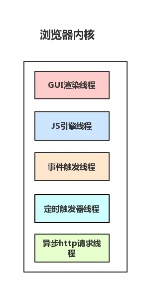
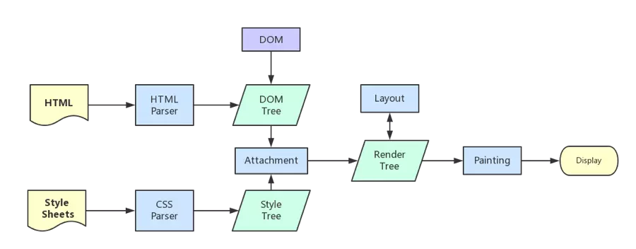
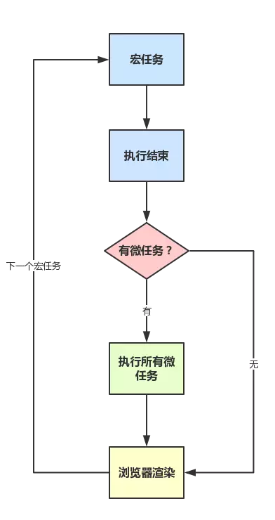
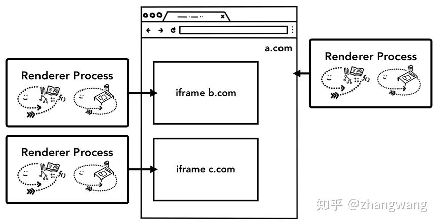

- 浏览器内核 是多线程，在内核控制下各线程相互配合以保持同步，一个浏览器通常由以下常驻线程组成
# GUI 渲染线程
  - 负责渲染浏览器界面HTML元素，当界面需要重绘(Repaint)或由于某种操作引发回流(reflow)时,该线程就会执行。在Javascript引擎运行脚本期间,GUI渲染线程都是处于挂起状态的,也就是说被”冻结”了.
# Javascript引擎线程 也称js内核
  - 负责处理Javascript脚本程序，例如V8引擎。
    - JavaScript为什么是单线程：
      - JavaScript为处理页面中用户的交互，以及操作DOM树、CSS样式树来给用户呈现一份动态而丰富的交互体验和服务器逻辑的交互处理，因为网页的DOM树只有一份，多线程的引入会带来更大的复杂性
  - **GUI 渲染线程 与 JavaScript引擎线程互斥！**
# 定时触发器线程
  - 因为JavaScript引擎是单线程的, 如果处于阻塞线程状态就会影响记计时的准确, 因此通过单独线程来计时并触发定时
# 事件触发线程
  - 当一个事件被触发时该线程会把事件添加到待处理队列的队尾，等待JS引擎的处理。
# 异步http请求线程
  - XMLHttpRequest在连接后是通过浏览器新开一个线程请求， 
  - 将检测到状态变更时，如果设置有回调函数，异步线程就产生状态变更事件放到 JavaScript引擎的处理队列中等待处理。

- webworker:  
  - 创建Worker时，JS引擎向浏览器申请开一个子线程（子线程是浏览器开的，完全受主线程控制，而且不能操作DOM）
  - JS引擎线程与worker线程间通过特定的方式通信（postMessage API，需要通过序列化对象来与线程交互特定的数据）
- SharedWorker由独立的进程管理
  - 共享进程对象
  - SharedWorker()
    - 创建一个执行指定url脚本的共享的web进程。
    - 如果要使共享进程可以连接到多个不同的页面，这些页面必须属于相同的域（相同的协议，主机以及端口）
    - `myWorker.port.start();` 启动端口
    - `SharedWorker.port`: 返回一个`MessagePort`对象，该对象可以用来进行通信和对共享进程进行控制。
    - 使用`port.postMessage()`和`port.onmessage`处理从worker发送而来的消息:
- 渲染过程的简化流程：
  - 
  - 两个渲染时间的对比：`load`和`DOMContentLoaded`
    - DOMContentLoaded 事件触发时，仅当DOM加载完成，不包括样式表，图片。 (譬如如果有async加载的脚本就不一定完成)
    -  onload 事件触发时，页面上所有的DOM，样式表，脚本，图片都已经加载完成了。 （渲染完毕了）
    -  出发顺序：`DOMContentLoaded -> load`
 - 普通图层和复合图层
   - 浏览器渲染的图层一般包含两大类：普通图层以及复合图层
   - 普通文档流内可以理解为一个复合图层(默认复合图层)
     - 可以通过硬件加速的方式，声明一个新的复合图层，它会单独分配资源 （当然也会脱离普通文档流，这样一来，不管这个复合图层中怎么变化，也不会影响默认复合层里的回流重绘）硬件加速快
  - 变成复合图层的方法：
    - 最常用的方式：translate3d、translateZ
    - opacity属性/过渡动画（动画执行中创建合成合成层，动画没有开始或结束后元素还会回到之前的状态）
    - `<video><iframe><canvas><webgl>`等元素  `<canvas> ` ：画布
  - 不要创建过多的图层！
  - 使用硬件加速时，尽可能的使用index，防止浏览器默认给后续的元素创建复合层渲染
    - 原理：webkit CSS3中，如果这个元素添加了硬件加速，并且index层级比较低， 那么在这个元素的后面其它元素（层级比这个元素高的，或者相同的，并且releative或absolute属性相同的）， 会默认变为复合层渲染，如果处理不当会极大的影响性能。`url(https://www.cnblogs.com/qiqi715/p/10207568.html);`
- EventLoop 到 js运行机制：
- 计时器线程：
  - 当使用setTimeout或setInterval时，它需要定时器线程计时，计时完成后就会将特定的事件推入事件队列中
  - 事件触发机制，一个事件的点击被认为是一个宏任务: task;
- 运行机制如下：
  - 执行一个宏任务（栈中没有就从事件队列中获取）
    - > If the stack of script settings objects is now empty, perform a microtask checkpoint
    - > Execution of a Job can be initiated only when there is no running execution context and the execution context stack is empty…
  - 执行过程中如果遇到微任务，就将它添加到微任务的任务队列中
  - 宏任务执行完毕后，立即执行当前微任务队列中的所有微任务（依次执行）
  - 当前宏任务执行完毕，开始检查渲染，然后GUI线程接管渲染
  - 渲染完毕后，JS线程继续接管，开始下一个宏任务（从事件队列中获取）

  - 
### 微任务：
  - **所有的微任务在任何其他的事件处理或者渲染或者任何其他的宏任务发生之前完成调用。**
  - `<script>`->render->microtask**s**->task(宏任务)
  - 创建微任务但不引入其他负担的方法：
    - `queueMicrotask()` 微任务函数本身没有参数，也不返回值。
      - 应用例子：
        - > 当一个处理缓存的分支，else处理promise(无缓存时异步发送请求)，if处理有缓存时，最佳的处理方式是使用一个`queueMicrotask(() => {xxx}` 包住有缓存的同步处理，使得if-else分支的回调函数的处理都被当作为微任务进行，用户不会发现差别 
- 微任务和宏任务的区别，官方文档：
  > 1. 每当一个任务存在，事件循环都会检查该任务是否正把控制权交给其他 JavaScript 代码。如若不然，事件循环就会运行微任务队列中的所有微任务。接下来微任务循环会在事件循环的每次迭代中被处理多次，包括处理完事件和其他回调之后。
  > 2. 如果一个微任务通过调用  queueMicrotask(), 向队列中加入了更多的微任务，则那些新加入的微任务 会早于下一个任务运行 。这是因为事件循环会持续调用微任务直至队列中没有留存的，即使是在有更多微任务持续被加入的情况下。
  - **不能将微任务设置为执行时间长、量多的任务，这时候要注意将微任务递归成小任务执行依次入队执行**
  - 最好的代替微任务过长的方法是web worker
- 进阶文章：about task job and other webBrowser. 
  - 事件触发是一个宏任务，但脚本触发事件是当作一个脚本执行
  - 外层事件的触发在冒泡阶段执行
  - 各个浏览器底层对task jobs的实现是有差别的
  - job：`MutationObserver`，`promise`
  - url(https://jakearchibald.com/2015/tasks-microtasks-queues-and-schedules/).

***
- web browser：
  - 
Chrome：多进程架构
- 顶层存在一个 Browser process 用以协调浏览器的其它进程
  - Chrome 的主要进程及其职责如下
    - Browser Process
      - 负责包括地址栏，书签栏，前进后退按钮等部分的工作
      - 负责各个页面的管理，创建和销毁其他进程
      - 负责处理浏览器的一些不可见的底层操作，比如网络请求和文件访问；
    - Renderer Process
      - 负责一个 tab 内关于网页呈现的所有事情
    - Plugin Process
      - 负责控制一个网页用到的所有插件，如 flash
    - GPU Process
      - 负责处理 GPU 相关的任务
  - 多进程架构的优缺点：
    优点：
    - 某一渲染进程出问题不会影响其他进程 page、plugin crash 
    - 更为安全，在系统层面上限定了不同进程的权限  沙盒模型隔离插件等进程，提高浏览器稳定性
    缺点：
    - 由于不同进程间的内存不共享，不同进程的内存常常需要包含相同的内容。
    - 为了节省内存，Chrome 限制了最多的进程数，最大进程数量由设备的内存和 CPU 能力决定，当达到这一限制时，新打开的 Tab 会共用之前同一个站点的渲染进程。
  - Chrome 的服务化
    - Chrome 把浏览器不同程序的功能看做服务，这些服务可以方便的分割为不同的进程或者合并为一个进程
    - 以 Broswer Process 为例，如果 Chrome 运行在强大的硬件上，它会分割不同的服务到不同的进程，这样 Chrome 整体的运行会更加稳定，但是如果 Chrome 运行在资源贫瘠的设备上，这些服务又会合并到同一个进程中运行，这样可以节省内存
  - iframe 的渲染--Site Isolation
    - 这种机制允许在同一个 Tab 下的跨站 iframe 使用单独的进程来渲染，这样会更为安全
- 导航过程发生了什么:
  - Browser Process 对这些工作(Tab 外的工作)进一步划分，使用不同线程进行处理：
    - UI thread ： 控制浏览器上的按钮及输入框；
    - network thread: 处理网络请求，从网上获取数据；
    - storage thread: 控制文件等的访问；
  - 实例：当我们在浏览器地址栏中输入文字，并点击回车获得页面内容的过程
    - 处理输入：UI thread 需要判断用户输入的是 URL 还是 query；
    - 开始导航
      - 当用户点击回车键，`UI thread` 通知 **network thread** 获取网页内容，并控制 tab 上的 spinner 展现，表示正在加载中。
      - `network thread` 会执行 DNS 查询，随后为请求建立 TLS 连接
      - 如果 `network thread` 接收到了重定向请求头如 301，network thread 会通知 UI thread 服务器要求重定向，之后，另外一个 URL 请求会被触发
    - 读取响应
      - 请求响应返回的时候，`network thread` 会依据 `Content-Type` 及 `MIME Type sniffing` 判断响应内容的格式
      - 响应内容的格式是 HTML -> renderer process，zip 文件或者其它文件->相关数据传输给下载管理器。
        - Safe Browsing 检查也会在此时触发，如果域名或者请求内容匹配到已知的恶意站点，network thread 会展示一个警告页。此外 CORB 检测也会触发确保敏感数据不会被传递给渲染进程。
    - 查找渲染进程
      - `network thread` 确信浏览器可以导航到请求网页, 通知 `UI thread` 数据已经准备好
      - `UI thread` 会查找到一个 `renderer process` 进行网页的渲染
      - 加速方案 UIT通知NT时，会直接开启一个RUI进程
    - 确认导航
      -  `Browser Process` 会给 `renderer process` 发送 IPC 消息来确认导航，一旦 `Browser Process` 收到 `renderer process` 的渲染确认消息，导航过程结束，页面加载过程开始。
      -  地址栏会更新，展示出新页面的网页信息。`history tab` 会更新，可通过返回键返回导航来的页面，为了让关闭 tab 或者窗口后便于恢复，这些信息会存放在硬盘中。
    - 额外的步骤
      -  renderer process 渲染结束（渲染结束意味着该页面内的所有的页面，包括所有 iframe 都触发了 onload 时），会发送 IPC 信号到 Browser process， UI thread 会停止展示 tab 中的 spinner
      -  老的UIP处理unload事件，新的进行渲染
  - 渲染进程是如何工作的：
    - 主线程 Main thread
    - 工作线程 Worker thread
    - 排版线程 Compositor thread
    - 光栅线程 Raster thread
    - RUI的核心工作：turn HTML, CSS, and JavaScript into a web page
    - Parsing
      - 构造DOM树：
        - 当开始接收数据时，主线程开始解析html to dom 这期间 no error，浏览器会优雅的处理掉
        - `preload scanner` 和主线程仪器运行，提前发送请求和下载网络资源文件
      - JavaScript：
        - 当出现`<script>`的时候，停止渲染，等待js运行完毕 
        - 如果`<script>`没有动态更改DOM树，可以加上defer 或 async 这样就不会停止渲染，异步进行
        - `<link rel="preload">` 告诉浏览器想尽快下载
    - 样式计算
      - 仅仅渲染 DOM 还不足以获知页面的具体样式，主进程还会基于 CSS 选择器解析 CSS 获取每一个节点的最终的计算样式值。即使不提供任何 CSS，浏览器对每个元素也会有一个默认的样式。
    - 布局
      - 布局树和 DOM 树类似，但是其中只包含页面可见的元素，如果一个元素设置了 `display:none` ，这个元素不会出现在布局树上，伪元素虽然在 DOM 树上不可见，但是在布局树上是可见的。
    - 绘制各元素
      - 主线程会遍历布局树以创建绘制记录。绘制记录可以看做是记录各元素绘制先后顺序的笔记
    - 更新渲染的成本很高
      - 设置动画元素，浏览器必须在每帧之间运行这些操作
      - animation misses the frames in between, then the page will appear "janky".
      - 即使渲染的操作能跟上屏幕刷新率，但这些计算(js)仍在主线程上运行，意味渲染可能停止一段时间
      - 解决方法：
        - 可以将js操作分块，并计划好他们在每一帧运行`requestAnimationFrame()`
      - 
    - 合成：绘制页面
      - 将页面的各个部分分成若干层，分别对其进行栅格化
      - 如果发生滚动，则因为图层已经被光栅化，所以要做的就是合成一个新的帧。可以通过移动图层并合成新的帧来以相同的方式实现动画。
      - 分层：
        - 主线程遍历了布局树以创建图层树。如果页面的某些部分应该是单独的层（例如，滑入式侧边菜单）没有显示，则可以使用`will-changeCSS`中的属性向浏览器提示
        - 确定层的绘制顺序，便发给合成线程，合成线程将其栅格化，并分成图块，将分好的图块发送给栅格线程
        - 栅格线程栅格化每个图块并将其存储在GPU内存中。
        - 合成器线程可以优先处理不同的栅格线程，以便可以首先对视口（或附近）中的事物进行栅格化
        - 一旦磁贴被光栅化，合成器线程会收集称为绘制四边形的磁贴信息以创建合成帧。
      - 合成的好处：可以不再主线程完成。因此构建只有动画的网页被认为是最平滑的表现。如果此时图层或则绘制需要被重新计算，则需要主线程
- 浏览器对事件的处理
  - 事件发生时：`Browser process`会发送事件类型及相应的坐标给`Render process`，渲染进程随后找到事件对象并执行所有绑定在其上的相关事件处理函数。
  - 上面说到：合成器可以独立于主线程之外通过合成栅格化层平滑的处理滚动，但如果页面绑定了相关事件处理器，主线程就需要出来工作了。
    - 优化：合成器线程会标记页面中绑定有事件处理器的区域为 `non-fast scrollable region`，如果存在这个标注，合成器线程会把发生在此处的事件发送给主线程，否则将直接合成帧
    - web 开发中常用的事件处理模式是事件委托，基于事件冒泡，我们常常在最顶层绑定事件，但在最顶层绑定会导致整个页面都不可用合成线程去优化
      - 解决：为了防止这种情况，我们可以为事件处理器传递 `passive: true` 做为参数，这样写就能让浏览器即监听相关事件，又让组合器线程在等等主线程响应前构建新的组合帧
        - 假设某个区域你只想要水平滚动，使用 `passive: true` 可以实现平滑滚动，但是垂直方向的滚动可能会先于`event.preventDefault()`发生，此时可以通过 `event.cancelable` 来防止这种情况
    - 查找到事件对象：
      - 如何寻找到事件对象?
        - 先进行命中测试的寻找，命中测试会基于渲染过程中生成的绘制记录（ paint records ）查找事件发生坐标下存在的元素。
      - 事件的优化
        - 一般我们屏幕的刷新速率为 60fps，但是某些事件的触发量会不止这个值，出于优化的目的，Chrome 会合并连续的事件(如 wheel, mousewheel, mousemove, pointermove, touchmove )，并延迟到下一帧渲染时候执行 。
        - 而如 keydown, keyup, mouseup, mousedown, touchstart, 和 touchend 等非连续性事件则会立即被触发。
          - 而应用是画画时，很难划出一条直线，开始时要使用特定的`apigetCoalescedEvents`
**原文链接：`https://developers.google.com/web/updates/2018/09/inside-browser-part4`**