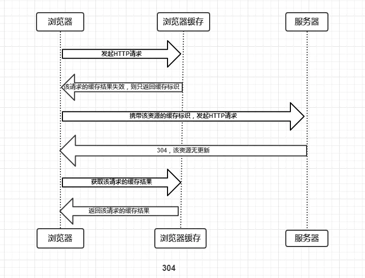
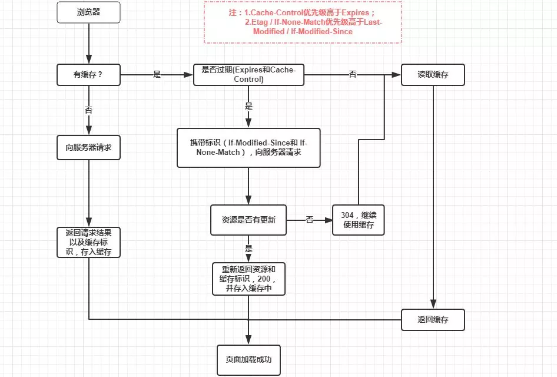

# HTTP

HTTP是Hyper Text Transfer Protocol（超文本传输协议）的缩写。它是一个应用层协议，由请求和响应构成，是一个标准的客户端服务器模型。HTTP是一个无状态的协议。  

### HTTP 协议的特点

- 无连接
  - 限制每次连接只处理一个请求
- 无状态
  - 协议对于事务处理没有记忆能力。
- 简单快速
  - 客户向服务器请求服务时，只需传送请求方法和路径。
- 灵活
  - HTTP允许传输任意类型的数据对象。正在传输的类型由Content-Type加以标记。  

### 请求报文
 - 请求行：由以下三个字段组成
   - 请求方法   
   - URL
   - HTTP协议版本号
 - 请求头部
   - 组成格式：关键字/值对组成，每行一对，关键字和值用英文冒号“:”分隔
   - 用来通知服务器有关于客户端请求的信息（一些键值对）
   - 例如：User-Agent、 Accept、Content-Type、Connection、Host
 - 空行
   - 分割请求头与请求体
 - 请求体
   - 请求数据不在GET方法中使用，而是在POST方法中使用
   - 可以添加任意请求的数据

### 响应报文
 - 状态行
   - 状态码
   - 状态消息 
   - HTTP协议版本号
 - 消息报头
   - 说明客户端要使用的一些附加信息
   - 如：Content-Type、charset、响应的时间
 - 响应正文
   - 返回给客户端的文本信息 

### HTTP请求方法
* Get：指定的资源请求数据。  
  * 请求的数据会附在URL之后
* HEAD：HEAD方法跟GET方法相同，只不过服务器响应时不会返回消息体。
  * 一个HEAD请求的响应中，HTTP头中包含的元信息应该和一个GET请求的响应消息相同。
  * 这种方法可以用来获取请求中隐含的元信息，而不用传输实体本身
  * 经常用来测试超链接的有效性、可用性和最近的修改
* POST：向指定的资源提交要被处理的数据
* PUT：更新资源
* Delete：用于删除指定的资源。
* Options

- post和get方法的区别：
  - 提交数据：
    - GET：请求的数据会附在URL之后，以?分割URL和传输数据，多个参数用&连接; `<request line>`
    - 把提交的数据放置在是HTTP包的包体`<request-body>`中， 并且地址栏不会变化
  - 传输数据的大小
    - 首先：HTTP协议没有对传输的数据大小进行限制，HTTP协议规范也没有对URL长度进行限制
    - GET:特定浏览器和服务器对URL长度有限制
    - POST：理论不受限制，但实际各个WEB服务器会规定对post提交数据大小进行限制
  - 安全性：
    - POST的安全性要比GET的安全性高（数据不被修改）
    - GET的数据容易倍其他人看到(但post也能被抓包)
  - 幂等&缓存：
    - Get会主动被浏览器cache，而post需要自己设置
    - Get幂等，POST非
  - 产生的TCP包
    - POST先发送一个数据包(HEADER)，收到100，再发送data
    - get只发送一个

- 同源问题：
  - 协议、域名、端口相同
  - 为了保护隐私，保护cookies
  - 非同源时：
    -  Cookie、LocalStorage 和 IndexDB 无法读取。
    -  DOM 无法获得。
    -  AJAX 请求不能发送。
       - cookies可以通过设置一级域名解决
       - 两个网页不同源，就无法拿到对方的DOM
    - 三种方法解决跨域窗口的通信问题
      - 片段识别符 #
      - window.name 只要在同一个窗口中(前一个网页设置了这个属性)，后一个可以读取window.name
      - 跨文档通信API
  - **待补充**

方法幂等：
- 指的是同样的请求被执行一次与连续执行多次的效果是一样的，服务器的状态也是一样的。（不该有副作用）
即使状态码不同，如delete，也仍然是幂等的
- 除了post，皆幂等

HTTP响应代码：
* 1开头的条件码，意味着临时响应消息
  * HTTP 100 Continue ：
    * 在客户端发送 Request Message 之前，HTTP/1.1 协议允许客户端先判定服务器是否愿意接受客户端发来的消息主体
    * Client 和 Server 在 Post （较大）数据之前，允许双方“握手”，如果匹配上了，Client 才开始发送（较大）数据。
    * 如果直接发送较大数据的话，会造成资源浪费
    * 但是不是所有的web server都能接受，而且减轻延迟也是相对的
    * 可以用一定方法去，禁止expect 100 continue
  * 101 Switching Protocol
    * 表示服务器应客户端升级协议的请求对协议进行切换。
    * 始终由客户端发起，服务器接受或拒绝升级 
  * 102 Processing
    * 此代码表示服务器已收到并正在处理该请求，但没有响应可用
  * 103 Early Hints 
    * 在头部信息到达之前，用户可以开始预加载CSS和JavaScript文件，这是一个很好的优化

* 2开头的条件码，成功响应：
  * 200：请求成功。成功的含义取决于HTTP方法：
    * GET 资源已被提取并在消息正文中传输。
    * HEAD 实体标头位于消息正文中。
    * POST 描述动作结果的资源在消息体中传输。
    * TRACE 消息正文包含服务器收到的请求消息
  * 201 Create：
    * 该请求已成功，并因此创建了一个新的资源。这通常是在POST请求，或是某些PUT请求之后返回的响应。
  * 202 Accepted：
    * 请求已经接收到，但还未响应，没有结果
  * 204 No content：
    * 表示请求已成功处理，但是没有内容返回(没有报文主体)
  * 206 Partial Content
    * 表示服务器已经完成了部分GET请求（客户端进行了范围请求）
* 3xx: 重定向
  * 301 Moved Permanently
    * 永久重定向，表示请求的资源已经永久的搬到了其他位置。分配的新的URL
  * 302 Found
    * 表示请求的资源临时搬到了其他位置
  * 以上两种：新的临时URI应该提示在响应报文的Location首部字段。只要不是HEAD请求，响应实体应该包含新URI的超链接和简短的说明
  * 303 See Other
    * 表示请求资源存在另一个URI，应使用GET定向获取请求资源
  * 304 Not Modified
    * 表示客户端发送附带条件的请求时，条件不满足，不包含任何响应主体(与重定向没有关系)
  * 307 Temporary Redirect
    * 临时重定向，应保持不变的请求方法发送
* 4xx：客户端请求错误：请求包含语法错误或无法完成请求
  * 400 Bad Request
    * 请求报文存在语法错误或参数错误，服务器不理解
  * 401 Unauthorized
    * 表示发送的请求需要有HTTP认证信息或者是认证失败了
  * 403 Forbidden
    * 表示对请求资源的访问被服务器拒绝了。服务器可以对此作出解释（Response-body），也可以不解释
  * 404 Not Found
    * 表示服务器找不到你请求的资源
* 5xx或6xx：服务端响应
  * 500 Internal Server Error
    * 表示服务器执行请求的时候出错了，服务器youbug
  * 503 Service Unavailable
    * 表示服务器超负载或正停机维护，无法处理请求

### HTTP访问控制
HTML内联框架元素 `<iframe>` 表示嵌套的browsing context。它能够将另一个HTML页面嵌入到当前页面中。

### TCP
- 三次是为了解决在不可靠信道上可靠地传输信息的最小值
- 一种面向连接的、可靠的、基于字节流的传输层通信协议。
- TCP工作在第四层，传输层，IP在第三层 网络层
- TCP协议头部的格式
  - Source Port和Destination Port:分别占用16位，表示源端口号和目的端口号
    - 源端口号和目的端口号配合上IP首部中的源IP地址和目的IP地址就能唯一的确定一个TCP连接
  - Sequence Number:
    - 标识从TCP发端向TCP收端发送的数据字节流
    - 表示在这个报文段中的的第一个数据字节在数据流中的序号；主要用来解决网络报乱序的问题
  - Acknowledgment Number
    - 32位确认序列号包含发送确认的一端所期望收到的下一个序号
    - 确认序号是上次已成功收到数据字节序号加1 用来解决不丢包的问题；
  - Offset
  - TCP Flags
    - 6个标志比特：多个可同时被设置为1，用于操控TCP的状态机的，依次为URG，ACK，PSH，RST，SYN，FIN
      - URG：表示TCP包的紧急指针域有效，用来保证TCP连接不被中断，并且督促中间层设备要尽快处理这些数据
      - ACK：表示应答域有效，就是说前面所说的TCP应答号将会包含在TCP数据包中
      - PSH：Push操作，Push操作就是指在数据包到达接收端以后，立即传送给应用程序，而不是在缓冲区中排队
      - RST：连接复位请求，用来复位那些产生错误的连接，也被用来拒绝错误和非法的数据包；
      - SYN，SYN标志位和ACK标志位搭配使用
        - 连接请求：SYN=1，ACK=0
        - 连接被响应：SYN=1，ACK=1
      - FIN：发送端已经达到数据末尾，发送FIN标志位的TCP数据包后，连接将被断开
    - **TCP协议规定，只有ACK=1时有效，也规定连接建立后所有发送的报文的ACK必须为1**
    - **SYN 在连接建立时用来同步序号**
    - **FIN**用来释放一个连接。当 FIN = 1 时，表明此报文段的发送方的数据已经发送完毕，并要求释放连接
  - **第一次握手**:
    - 客户端发送连接请求报文段，将`SYN`位置为1，`Sequence Number`为x；然后，客户端进入`SYN_SEND`状态，等待服务器的确认
      - SYN=1, seq=x
  - **第二次握手**:
    - 服务器收到SYN报文段。服务器收到客户端的SYN报文段，需要对这个SYN报文段进行确认，设置`Acknowledgment Number`为`x+1`(Sequence Number+1)；同时，自己自己还要发送SYN请求信息，将`SYN位置为1`，`Sequence Number为y`；服务器端将上述所有信息放到一个报文段（即SYN+ACK报文段）中，一并发送给客户端，此时服务器进入SYN_RECV状态
    - SYN=1, ACK=1, seq=y, ACKnum=x+1
  - **第三次握手**
    - 客户端收到服务器的SYN+ACK报文段。然后将Acknowledgment Number设置为`y+1`，向服务器发送ACK报文段，这个报文段发送完毕以后，客户端和服务器端都进入ESTABLISHED状态，完成TCP三次握手。
  - 客户端和服务器端就可以开始传送数据
  - ACK=1，ACKnum=y+1
#### 四次分手：
  - **第一次分手**：主机1（可以使客户端，也可以是服务器端），设置`Sequence Number`和`Acknowledgment Number`，向主机2发送一个FIN报文段；此时，主机1进入FIN_WAIT_1状态；表示主机1没有数据要发送给主机2了；
    - FIN=1，seq=x
  - **第二次分手**：主机2收到了主机1发送的FIN报文段，向主机1回一个`ACK`报文段，`Acknowledgment Number`为Sequence Number加1；主机1进入FIN_WAIT_2状态；主机2告诉主机1，我“同意”你的关闭请求；
    - ACK=1，ACKnum=x+1
  - **第三次分手**：主机2向主机1发送FIN报文段，请求关闭连接，同时主机2进入LAST_ACK状态
    - FIN=1，seq=y
  - **第四次** 主机1收到主机2发送的FIN报文段，向主机2发送ACK报文段，然后主机1进入TIME_WAIT状态；主机2收到主机1的ACK报文段以后，就关闭连接；此时，主机1等待2MSL后依然没有收到回复，则证明Server端已正常关闭，那好，主机1也可以关闭连接了。
    - ACK=1，ACKnum=y+1 
- 握手三次的一个原因：
  - 为了防止已失效的连接请求报文段突然又传送到了服务端，因而产生错误，浪费服务端的资源
- 为什么要四次分手：
  - FIN_WAIT_1: FIN_WAIT_1状态实际上是当SOCKET在ESTABLISHED状态时，它想主动关闭连接，向对方发送了FIN报文，此时该SOCKET即进入到FIN_WAIT_1状态，但因为对方(一定会)会立马传回一个ACK，之后就变为FIN_WAIT_2状态
  - FIN_WAIT_2：表示半连接，还可以接受消息
  - CLOSE_WAIT：对方close一个SOCKET后发送FIN报文给自己，你系统毫无疑问地会回应一个ACK报文给对方，此时则进入到CLOSE_WAIT状态。在CLOSE_WAIT状态下，需要完成的事情是等待你去关闭连接。（查看是否还有需要传输的数据包）
  - LAST_ACK：被动(主机二)关闭一方在发送FIN报文后，最后等待对方的ACK报文。当收到ACK报文后，也即可以进入到CLOSED可用状态了
  - TIME_WAIT：收到了对方的FIN报文，并发送出了ACK报文，就等2MSL后即可回到CLOSED可用状态了
  - 如果FINWAIT1状态下，收到了对方**同时**带FIN标志和ACK标志的报文时，可以直接进入到TIME_WAIT状态，而无须经过FIN_WAIT_2状态。
- UDP协议：
  - 快 小 面向非连接 不可靠
  - UDP报头4个部分组成，两个可选
    - 各16bit的来源端口和目的端口用来标记发送和接受的应用进程。因为UDP不需要应答，所以来源端口是可选的，如果来源端口不用，那么置为零。
    - 在目的端口后面是长度固定的以字节为单位的报文长度域，用来指定UDP数据报包括数据部分的长度，长度最小值为8byte
    - 剩下的16bit是用来对首部和数据部分一起做校验和（Checksum）的，这部分是可选的
  - UDP 支持多播和广播。

- http缓存详解：
  - (私有)浏览器缓存
  - 简单的http报文格式：
    - 请求报文：请求行 – HTTP头(通用信息头，请求头，实体头) – 请求报文主体(只有POST才有报文主体)
    - HTTP响应(Response)报文：状态行 – HTTP头(通用信息头，响应头，实体头) – 响应报文主体
  - 缓存过程分析：
    - 浏览器第一次向服务器发起该请求后拿到请求结果，会根据响应报文中HTTP头的缓存标识，决定是否缓存结果。是则将请求结果和缓存标识存入浏览器缓存中
    - 强制缓存和协商缓存
    - 强制缓存：
      - 不存在该结果和标识，向服务器发起请求，与上图同
      - 存在该缓存结果和缓存标识，但该结果已失效，强制缓存失效，则使用协商缓存
      - 存在该缓存结果和缓存标识，且该结果尚未失效，强制缓存生效，直接返回该结果
    - 缓存规则是怎么定的？
      - 服务器会将缓存规则放入HTTP响应报文的HTTP头中和请求结果一起返回给浏览器。
      - 控制强制缓存的字段分别是Expires和Cache-Control，其中Cache-Control优先级比Expires高。
        - Expires：HTTP/1.0控制网页缓存的字段 （HTTP/1.1，Expire已经被Cache-Control替代）
          - 值为服务器返回该请求结果缓存的到期时间
          - 可能会由于时间的问题失效
        - Cache-Control：优先级比expires高
          - 字段的主要取值：
            - public：所有内容都将被缓存
            - private：所有内容只有客户端可以缓存，Cache-Control的默认取值
            - no-cache：客户端缓存内容，但是是否使用缓存则需要经过协商缓存来验证决定
            - no-store：所有内容都不会被缓存，即不使用强制缓存，也不使用协商缓存
            - max-age=xxx (xxx is numeric)：缓存内容将在xxx秒后失效
        - 浏览器会在js和图片等文件解析执行后直接存入内存缓存中，那么当刷新页面时只需直接从内存缓存中读取(from memory cache)；而css文件则会存入硬盘文件中，所以每次渲染页面都需要从硬盘读取缓存(from disk cache)。
      - 协商缓存：
        - 浏览器携带缓存标识向服务器发起请求，由服务器根据缓存标识决定是否使用缓存的过程
          - 返回值304：协商缓存生效，虽过期但无变化
          - 返回值200：失效，已有变化，返回更新后的页面
        - 控制协商缓存的其他字段：
          - `Etag` / `If-None-Match`的优先级比`Last-Modified` / `If-Modified-Since`高
            - Last-Modified是服务器响应请求时，返回该资源文件在服务器最后被修改的时间
            - If-Modified-Since则是客户端再次发起该请求时，携带上次请求返回的Last-Modified值，通过此字段值告诉服务器该资源上次请求返回的最后被修改时间，ims值与服务器最后被修改的时间做对比，判断是否被更新
            - Etag是服务器响应请求时，返回当前资源文件的一个唯一标识(由服务器生成)，可以节省带宽
            - If-None-Match是客户端再次发起该请求时，携带上次请求返回的唯一标识Etag值
              - 根据If-None-Match的字段值与该资源在服务器的Etag值做对比，返回304或200
    - 缓存图：

- CDN：内容分发网络
  - 将源站内容分发至最接近用户的节点，使用户可就近取得所需内容，提高用户访问的响应速度和成功率。解决因分布、带宽、服务器性能带来的访问延迟问题，适用于站点加速、点播、直播等场景。
  - 基本思路：尽可能避开互联网上有可能影响数据传输速度和稳定性的瓶颈和环节，使内容传输的更快、更稳定。通过在网络各处放置节点服务器所构成的在现有的互联网基础之上的一层智能虚拟网络，CDN系统能够实时地根据网络流量和各节点的连接、负载状况以及到用户的距离和响应时间等综合信息将用户的请求重新导向离用户最近的服务节点上。
  - 缓存 调度 协议优化

### WebSocket:
- 当服务器想直接和客户端对话时，客户端只能使用轮询，这种方式获取资源非常浪费
  - *HTTP/2 只能推送静态资源，无法推送指定的信息。*
- 特点：
  1. 服务器可以主动向客户端推送信息，客户端也可以主动向服务器发送信息
  2. 建立在 TCP 协议之上，服务器端的实现比较容易。
  3. *没有同源限制，客户端可以与任意服务器通信。*
  4. 与 HTTP 协议有着良好的兼容性。默认端口也是80和443，并且握手阶段采用 HTTP 协议
  5. 数据格式比较轻量，性能开销小，通信高效。
  6. 可以发送文本，也可以发送二进制数据。
  7. 协议标识符是ws（如果加密，则为wss），服务器网址就是 URL。
- 客户端API简介：
  - WebSocket 构造函数：`var ws = new WebSocket('ws://localhost:8080')`;
  - `webSocket.readyState`:
    - 四种状态：
      1. CONNECTING：值为0，表示正在连接。
      2. OPEN：值为1，表示连接成功，可以通信了。
      3. CLOSING：值为2，表示连接正在关闭。
      4. CLOSED：值为3，表示连接已经关闭，或者打开连接失败。
  - `webSocket.onopen`：连接成功后的回调函数。  
  - `webSocket.onclose`：连接关闭后的回调函数
  - `webSocket.onmessage`：收到服务器数据后的回调函数。文本或二进制数据
  - `webSocket.send()`：向服务器发送数据。文本或二进制数据
  - `webSocket.bufferedAmount`：还有多少字节的二进制数据没有发送出去。判断发送是否结束。
  - `webSocket.onerror`：指定报错时的回调函数。
- 服务端：...

### websocket与ajax的异同：
- Ajax：
  - 优点在于它在浏览器与web服务器之间使用异步数据传输（HTTP请求），不阻塞用户，核心对象是XMLHTTPRequest。通过这个对象，js可在不重新加载页面的情况下与web服务器交换数据。
    - Ajax轮询这种方式，在不断地建立HTTP连接，然后等待服务端处理，服务端不会主动联系客户端，只有客户端发起。
  - 使用场景：
    - 表单验证+防抖
    - Ajax 展示数据的树形结构
- websocket：
  - 服务器和浏览器可以在给定的时间范围内的任意时刻，互相推送消息。在建立连接之后，服务器可以主动传送数据给浏览器。
    - 建立websocket连接后，可以直接跟信使建立持久的连接，有信息的时候客服想办法通知信使，然后信使在统一转交给客户
  - 使用场景：
    - 社交
    - 数据实时型应用：股票、天气

