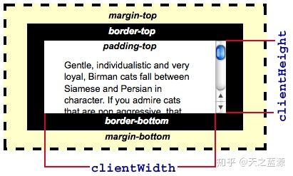
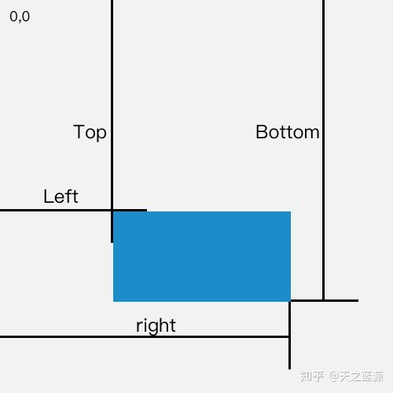

缘由
- 全部加载的话会影响用户体验
- 浪费用户的流量，有些用户并不像全部看完，全部加载会耗费大量流量。

懒加载的原理：
- 一般实施懒加载都是对图片资源而言的。
- 图片是``标签，来源主要是src属性。浏览器是否发起亲求就是根据是否有src属性决定的
- 在未进入可见区域，不给src赋值，进入再赋值

相关api：
- `document.documentElement.clientHeight` //获取屏幕可视区域的高度 
  - clientHeight 可以通过 CSS height + CSS padding - 水平滚动条高度 
- `element.offsetTop` //获取元素相对于文档顶部的高度   offsetTop是相对于父元素的\
  - 返回当前元素相对于其 `offsetParent` 元素的顶部内边距(padding)的距离。
  - `offsetParent`：返回一个指向最近的（指包含层级上的最近）包含该元素的定位元素或者最近的 table,td,th,body元素
    - 元素自身有fixed定位，offsetParent的结果为null，因为fixed定位为视口，无父级
    - 元素自身无fixed定位，且父级元素(static)都未经过定位，offsetParent的结果为`<body>`
    - 元素自身无fixed定位，且父级元素存在经过定位的元素，offsetParent的结果为离自身元素最近的经过定位的父级元素
    - 当元素的 style.display 设置为 "none" 时，offsetParent 返回 null
  - 因此offsetTop需要递归计算
- `document.documentElement.scrollTop` //获取浏览器窗口顶部与文档顶部之间的距离，也就是滚动条滚动的距离 
  - 该计算方式===window.scrollY？
公式：`offsetTop-scrollTop < clientHeight`

简化版api：
- getBoundingClientRect()// 返回元素大小和相对于视口的位置，一个Rect对象 
- bound.top<=clientHeight时，图片是在可视区域内的