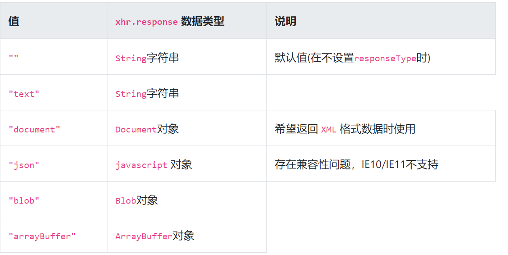
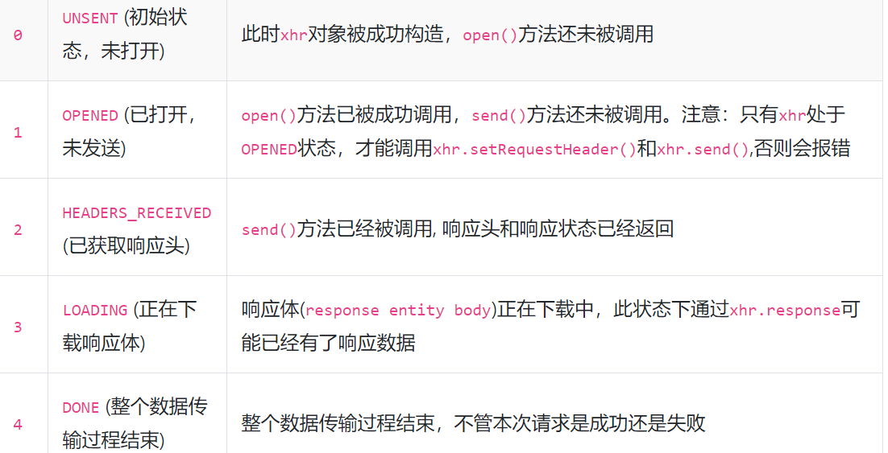

$$Ajax$$
- ajax是一种技术方案，但并不是一种新技术，核心依赖是浏览器提供的XMLHttpRequest对象

#### 发展历程
- XHR-1的缺点：
  - 不能发送跨域请求；
  - 不能发送二进制文件（如图片、视频、音频等），只能是纯文本
  - 无法实时获取进度信息，只能判断是否完成
- XHR-2的优点
  - 可以发送跨域请求，在服务端允许的情况下
  - 支持发送和接收二进制数据
  - 新增formData对象，支持发送表单数据
  - 发送和获取数据时，可以获取进度信息
  - 可以设置请求的超时时间

    ```js 一段简单的发送表单数据的方法：
    function sendAjax() {
    //构造表单数据
    var formData = new FormData();
    formData.append('username', 'johndoe');
    formData.append('id', 123456);
    //创建xhr对象 
    var xhr = new XMLHttpRequest();
    //设置xhr请求的超时时间
    xhr.timeout = 3000;
    //设置响应返回的数据格式
    xhr.responseType = "text";
    //创建一个 post 请求，采用异步
    xhr.open('POST', '/server', true);
    //注册相关事件回调处理函数
    xhr.onload = function(e) { 
        if(this.status == 200||this.status == 304){
            alert(this.responseText);
        }
    };
    xhr.ontimeout = function(e) { ... };
    xhr.onerror = function(e) { ... };
    xhr.upload.onprogress = function(e) { ... };
    
    //发送数据
    xhr.send(formData);
    }
    ```

**设置request header**
- 设置一些请求头部信息（HTTP请求）
- `void setRequestHeader(DOMString header, DOMString value);`
  - 第一个参数 header 大小写不敏感
  - Content-Type的默认值与具体发送的数据类型有关
  - 必须在open()方法之后，send()方法之前调用，即state===1
  - 可以调用多次，最终的值不会采用覆盖override的方式，而是采用追加append的方式

**获取response header**
- getAllResponseHeaders() && getResponseHeader(DOMString header)
- 获取所有header和某个header(不分大小写)
- 只能拿到限制之外的字段
- 限制：
  - 使用getAllResponseHeaders()看到的所有response header与实际在控制台 Network 中看到的 response header 不一样
    - 规定客户端无法获取 response 中的 Set-Cookie、Set-Cookie2这2个字段，无论是同域还是跨域请求
  - 使用getResponseHeader()获取某个 header 的值时，浏览器抛错Refused to get unsafe header "XXX"
    - 对于跨域请求，客户端允许获取的response header字段只限于“simple response header”和“Access-Control-Expose-Headers” 

**如何指定xhr.response的数据类型**
- level 1就提供的overrideMimeType()方法，level 2才提供的xhr.responseType属性
- overrideMimeType()：
  - 用来重写response的content-type，可以“改变”xhr.response的类型
  - 实例：转化二进制文件(https://segmentfault.com/a/1190000004322487)
- xhr.responseType
  - 接受对象和兼容性: 
  - 要在state===1时设置即可

### 如何获取response数据
- 3个用来获取请求返回的数据的属性  默认值均为空字符串""
  - xhr.response
    - 当请求完成时，此属性才有正确的值
    - 请求未完成时，此属性的值可能是""(responseType为""或"text")或者 null
  - xhr.responseText
    - 只有当 responseType 为"text"、""时，xhr对象上才有此属性，此时才能调用
    - 只有当请求成功时，才能拿到正确值; 请求未完成和请求失败都获得空字符串
  - xhr.responseXML
    - 当 responseType 为"text"、""、"document"时，xhr对象上才有此属性
    - 只有当请求成功且返回数据被正确解析时，才能拿到正确值
    - 请求未完成、请求失败、请求成功但返回数据无法被正确解析时，值为null

### 如何追踪ajax请求的当前状态
- xhr.readyState
  - 

### 设置请求的超时时间
- ontimeout事件:
  - 从请求开始算起，若超过 timeout 时间请求还没有结束（包括成功/失败），则会触发
    - 请求开始：xhr.send()
    - 即使在send之后设置timeout事件，计时起始点实际为调用xhr.send()方法的时刻
    - 当xhr为一个sync同步请求时，xhr.timeout必须置为0，否则会抛错
  - 请求结束： xhr.loadend事件触发的时候
### 发一个同步请求
- `open(method, url [, async = true [, username = null [, password = null]]])`
  - 由xhr.open（）传入的async参数决定
  - async: 默认值为true，即为异步请求，若async=false，则为同步请求
    - 这个参数如果要置为false，有如下请求
      - xhr.timeout必须为0
      - xhr.withCredentials必须为 false
      - xhr.responseType必须为""（注意置为"text"也不允许）
    - 若三个之一不满足，抛出：InvalidAccessError

### 如何获取上传、下载的进度
- 可以通过onprogress事件来实时显示进度，默认情况下这个事件每50ms触发一次
- 上传过程和下载过程触发的是不同对象的onprogress事件
  - 上传触发的是xhr.upload对象的 onprogress事件
  - 下载触发的是xhr对象的onprogress事件
  
### 可以发送什么类型的数据
- void send(data);
- xhr.send(data)的参数data可以是以下几种类型
  - ArrayBuffer
  - Blob
  - Document
  - DOMString
  - FormData
  - null
- 对于GET/HEAD请求，send()方法一般不传参或置null
- data参数的数据类型会影响请求头部content-type的默认值
  - 是HTML Document类型，则content-type默认值为text/html; 
  - 是 Document 类型charset=UTF-8;否则为application/xml;charset=UTF-8；
  -  DOMString 类型，content-type默认值为text/plain;charset=UTF-8；
  -  FormData 类型，content-type默认值为multipart/form-data; boundary=[xxx]
  -  其他类型，则不会设置content-type的默认值
- 断网状态send会抛错：Uncaught NetworkError: Failed to execute 'send' on 'XMLHttpRequest'，如果不处理(catch)，后面的代码将无法运行

### xhr.withCredentials与 CORS 什么关系
- > 浏览器在发送跨域请求时，不能发送任何认证信息（credentials）如"cookies"和"HTTP authentication schemes"。除非xhr.withCredentials为true。这样浏览器才会自动将cookie加在request header中。
- > 特别注意一点，一旦跨域request能够携带认证信息，server端一定不能将Access-Control-Allow-Origin设置为*，而必须设置为请求页面的域名

### xhr相关事件
1. XMLHttpRequestEventTarget接口定义了7个事件：
   - onloadstart
   - onprogress
   - onabort
   - ontimeout
   - onerror
   - onload
   - onloadend
2. 每一个XMLHttpRequest里面都有一个upload属性，而upload是一个XMLHttpRequestUpload对象
3. XMLHttpRequest和XMLHttpRequestUpload都继承了同一个XMLHttpRequestEventTarget接口，所以xhr和xhr.upload都有第一条列举的7个事件
4. onreadystatechange是XMLHttpRequest独有的事件 
**因此：xhr一共有8个相关事件，xhr.upload七个**

#### 相关事件
#### 事件触发条件
- onreadystatechange
  - 每当xhr.readyState改变时触发；但xhr.readyState由非0值变为0时不触发。
- onloadstart
  - 调用xhr.send()方法后立即触发，若xhr.send()未被调用则不会触发此事件。
- onprogress
  - xhr.upload.onprogress在上传阶段(即xhr.send()之后，xhr.readystate=2之前)触发，每50ms触发一次；
  - xhr.onprogress在下载阶段（即xhr.readystate=3时）触发，每50ms触发一次。
- onload
  - 当请求成功完成时触发，此时xhr.readystate=4
- onloadend
  - 当请求结束（包括请求成功和请求失败）时触发
- onabort
  - 当调用xhr.abort()后触发
- ontimeout
  - xhr.timeout不等于0，由请求开始即onloadstart开始算起，当到达xhr.timeout所设置时间请求还未结束即onloadend，则触发此事件。
- onerror
  - 在请求过程中，若发生Network error则会触发此事件
    - （若发生Network error时，上传还没有结束，则会先触发xhr.upload.onerror，再触发xhr.onerror；若发生Network error时，上传已经结束，则只会触发xhr.onerror
  
#### 事件触发顺序
1. 触发xhr.onreadystatechange(之后每次readyState变化时，都会触发一次)

2. 触发xhr.onloadstart

//上传阶段开始：
1. 触发xhr.upload.onloadstart

2. 触发xhr.upload.onprogress

3. 触发xhr.upload.onload

4. 触发xhr.upload.onloadend
 
//上传结束，下载阶段开始：
1. 触发xhr.onprogress

2. 触发xhr.onload

3. 触发xhr.onloadend

#### 发生abort/timeout/error异常的处理
1. 一旦发生abort或timeout或error异常，先立即中止当前请求

2. 将 readystate 置为4，并触发 xhr.onreadystatechange事件

3. 如果上传阶段还没有结束，则依次触发以下事件：
- xhr.upload.onprogress
- `xhr.upload.[onabort或ontimeout或onerror]`
- xhr.upload.onloadend

4. 触发 `xhr.onprogress`事件

5. 触发 `xhr.[onabort或ontimeout或onerror]`事件

6. 触发xhr.onloadend 事件

- 在 xhr.onload中注册成功事件
- 请求码逻辑：`xhr.status >= 200 && xhr.status < 300) || xhr.status == 304`

### fetch(url, init)
- fetch只有遇到网络错误或服务端cors未配置的时候才会reject
- fetch() 不会接受跨域 cookies；你也不能使用 fetch() 建立起跨域会话。其他网站的 Set-Cookie 头部字段将会被无视。
- 默认不带cookie，自己加；`credentials:'include'`
- 是用response.ok判断是否请求成功
  - Response 接口的只读属性  ok 包含一个布尔值，表明响应是否成功（状态码在200-299范围内）.

init对象：
- method: 请求使用的方法，如 GET、POST。
- headers: 请求的头信息，形式为 Headers 的对象或包含 ByteString 值的对象字面量。
- body: 请求的 body 信息：可能是一个 Blob、BufferSource、FormData、URLSearchParams 或者 USVString 对象。注意 GET 或 HEAD 方法的请求不能包含 body 信息。
- mode: 请求的模式，如 cors、 no-cors 或者 same-origin。
- credentials: 请求的 credentials。为了在当前域名内自动发送 cookie ， 必须提供这个选项
- cache:  请求的 cache 模式: default 、 no-store 、 reload 、 no-cache 、 force-cache 或者 only-if-cached 
- redirect
- referrer
- referrerPolicy
- integrity

- 不支持同步  无法查看请求进度
- 新api支持取消，将signal放入fetch的第二个参数当中.
  - 当 abort 事件触发时，即当信号正在与之通信的DOM请求被中止时调用。