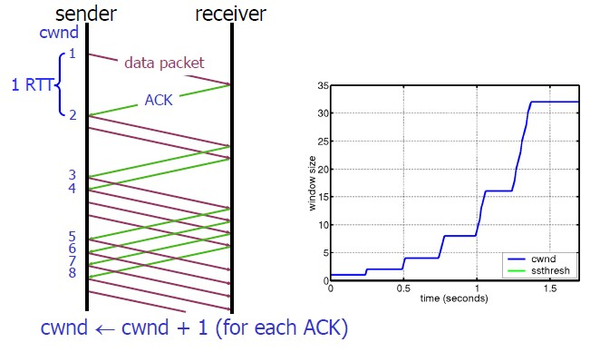

### TCP

- 三次是为了解决在不可靠信道上可靠地传输信息的最小值
- 一种面向连接的、可靠的、基于字节流的传输层通信协议。
- TCP工作在第四层，传输层，IP在第三层 网络层
- TCP协议头部的格式
  - Source Port和Destination Port:分别占用16位，表示源端口号和目的端口号
    - 源端口号和目的端口号配合上IP首部中的源IP地址和目的IP地址就能唯一的确定一个TCP连接
  - Sequence Number:
    - 标识从TCP发端向TCP收端发送的数据字节流
    - 表示在这个报文段中的的第一个数据字节在数据流中的序号；主要用来解决网络报乱序的问题
  - Acknowledgment Number
    - 32位确认序列号包含发送确认的一端所期望收到的下一个序号
    - 确认序号是上次已成功收到数据字节序号加1 用来解决不丢包的问题；
***
新加知识点：
### ACK
1. 一是期望接收到的下一字节的序号n，该n代表接收方已经接收到了前n-1字节数据，此时如果接收方收到第n+1字节数据而不是第n字节数据，接收方是不会发送序号为n+2的ACK的

- window：Advertised-Window，也就是著名的滑动窗口（Sliding Window），用于解决流控的。
### tcp状态图：
- 对于建链接的3次握手:
  - 主要是要初始化Sequence Number 的初始值,这个号要作为以后的数据通信的序号，以保证应用层接收到的数据不会因为网络上的传输的问题而乱序，（TCP会用这个序号来拼接数据）
- 对于4次挥手：
  - 因为TCP是全双工的，所以，发送方和接收方都需要Fin和Ack，其实仔细看是两次
  - 如果两边同时断连接，那就会就进入到CLOSING状态，然后到达TIME_WAIT状态
  - 

  - 关于建连接时SYN超时：
    - erver端接到了clien发的SYN后回了SYN-ACK后client掉线了，server端没有收到client回来的ACK，那么，这个连接处于一个中间状态，即没成功，也没失败。于是，server端如果在一定时间内没有收到的TCP会重发SYN-ACK
    - 在Linux下，默认重试次数为5次，重试的间隔时间从1s开始每次都翻售，5次的重试时间间隔为1s, 2s, 4s, 8s, 16s，总共31s，第5次发出后还要等32s都知道第5次也超时了，所以，总共需要 1s + 2s + 4s+ 8s+ 16s + 32s = 2^6 -1 = 63s，TCP才会把断开这个连接。
  - SYN flood攻击：
    - 一些恶意的人就为此制造了SYN Flood攻击：给服务器发了一个SYN后，就下线了，于是服务器需要默认等63s才会断开连接，这样，攻击者就可以把服务器的syn连接的队列耗尽，让正常的连接请求不能处理
    - 应对:
      - Linux下给了一个叫tcp_syncookies的参数来应对这个事——当SYN队列满了后，TCP会通过源地址端口、目标地址端口和时间戳打造出一个特别的Sequence Number发回去（又叫cookie)
      - 然后服务端可以通过cookie建连接（即使你不在SYN队列中）
      - **千万别用tcp_syncookies来处理正常的大负载的连接的情况**
        - synccookies是妥协版的TCP协议，并不严谨
      - 对于正常的请求，你应该调整三个TCP参数可供你选择，第一个是：tcp_synack_retries 可以用他来减少重试次数；第二个是：tcp_max_syn_backlog，可以增大SYN连接数；第三个是：tcp_abort_on_overflow 处理不过来干脆就直接拒绝连接了。
  - 关于ISN的初始化
      - RFC793中：ISN会和一个假的时钟绑在一起，这个时钟会在每4微秒对ISN做加一操作，直到超过2^32，又从0开始。这样，一个ISN的周期大约是4.55个小时
        - 因此，假设我们的TCP Segment在网络上的存活时间不会超过Maximum Segment Lifetime，只要MSL的值小于4.55小时，那么，我们就不会重用到ISN。
  - TIME_WAIT状态到CLOSED状态：
    - 超时设定： 2*MSL（linux是30s）
    - 原因：
      - TIME_WAIT确保有足够的时间让对端收到了ACK，如果被动关闭的那方没有收到Ack，就会触发被动端重发Fin，一来一去正好2个MSL
      - 有足够的时间让这个连接不会跟后面的连接混在一起
  - 关于TIME_WAIT数量太多：
    - 在大并发的短链接下，TIME_WAIT 就会太多，这也会消耗很多系统资源
    - 关于tcp_max_tw_buckets
      - 这个是控制并发的TIME_WAIT的数量，默认值是180000，如果超限，那么，系统会把多的给destory掉，然后在日志里打一个警告，对抗Doss攻击
- 数据传输中的Sequence Number：
  - SeqNum的增加是和传输的字节数相关的
- TCP重传机制
  - TCP要保证所有的数据包都可以到达，所以，必需要有重传机制。
  - SeqNum和Ack是以字节数为单位，所以ack的时候，不能跳着确认，只能确认最大的连续收到的包
  - 超时重传机制
    - 一种是不回ack，死等3，当发送方发现收不到3的ack超时后，会重传3。一旦接收方收到3后，会ack 回 4——意味着3和4都收到了。
      - 因为要死等3，所以会导致4和5即便已经收到了，而发送方也完全不知道发生了什么事，因为没有收到Ack，所以，发送方可能会悲观地认为也丢了，所以有可能也会导致4和5的重传。
      - 对此有两种选择：
        1. 仅重传timeout的包。也就是第3份数据--节省带宽，但是慢
        2. 重传timeout后所有的数据，也就是第3，4，5这三份数据。--会快一点，但是会浪费带宽，也可能会有无用功
  - 快速重传机制
    - Fast Retransmit 算法，不以时间驱动，而以数据驱动重传 
      - 如果，包没有连续到达，就ack最后那个可能被丢了的包，如果发送方连续收到3次相同的ack，就重传。
      - 缺点：
    - SACK 方法：
      - TCP头里加一个SACK的东西，ACK还是Fast Retransmit的ACK，SACK则是汇报收到的数据碎版。
      - 发送端就可以根据回传的SACK来知道哪些数据到了，哪些没有到。于是就优化了Fast Retransmit的算法
    - Duplicate SACK – 重复收到数据的问题：
      - 其主要使用了SACK来告诉发送方有哪些数据被重复接收了。
        - 如果SACK的第一个段的范围被ACK所覆盖，那么就是D-SACK
        - 如果SACK的第一个段的范围被SACK的第二个段覆盖，那么就是D-SACK
      - 示例一：ACK丢包
        - 接收端发过去的包丢了，以为没收到，就再发一次，通过试别SACK和ACK辨别是否重复
      - 示例二：网络延误（ACK的接受被延误了）
        - 因为网络延误触发的重传
      - 可以让发送方知道，是发出去的包丢了，还是回来的ACK包丢了。
      - 是不是自己的timeout太小了，导致重传
      - 网络上出现了先发的包后到的情况（又称reordering）
      - 网络上是不是把我的数据包给复制了。
- TCP的RTT算法
  - Timeout的设置
    - 设长了，重发就慢，丢了老半天才重发，没有效率，性能差
    - 设短了，会导致可能并没有丢就重发。于是重发的就快，会增加网络拥塞，导致更多的超时，更多的超时导致更多的重发。
  - RTO--Retransmission TimeOut
  - 需要动态的设置：
   
### TCP滑动窗口：
- 接收方通过通告发送方自己的窗口大小，从而控制发送方的发送速度，从而达到防止发送方发送速度过快而导致自己被淹没的目的。
- TCP必需要解决的可靠传输以及包乱序（reordering）的问题。因此，TCP必需要知道网络实际的数据处理带宽或是数据处理速度，这样才不会引起网络拥塞，导致丢包
- 
  - 接收端在给发送端回ACK中会汇报自己的AdvertisedWindow = MaxRcvBuffer – LastByteRcvd – 1;
  - 而发送方会根据这个窗口来控制发送数据的大小，以保证接收方可以处理。
- 
- 上图分为了四个部分：
  - #1已收到ack确认的数据。
  - #2发还没收到ack的。
  - #3在窗口中还没有发出的（接收方还有空间）。
  - #4窗口以外的数据（接收方没空间）
- 
  - 上图可以看到一个处理缓慢的Server（接收端）是怎么把Client（发送端）的TCP Sliding Window给降成0的
  - 如果发送端不发数据了，接收方一会儿Window size 可用了，怎么通知发送端呢？
    - 发送端在窗口变成0后，会发ZWP的包给接收方，让接收方来ack他的Window尺寸，一般这个值会设置成3次，每次大约30-60秒（不同的实现可能会不一样）。如果3次过后还是0的话，有的TCP实现就会发RST把链接断了。
    - >注意：只要有等待的地方都可能出现DDoS攻击，Zero Window也不例外，一些攻击者会在和HTTP建好链发完GET请求后，就把Window设置为0，然后服务端就只能等待进行ZWP，于是攻击者会并发大量的这样的请求，把服务器端的资源耗尽。
- 糊涂窗口综合症：Silly Window Syndrome
### TCP的拥塞处理：
*最大化利用网络上瓶颈链路的带宽。*
cwnd：congestion window：拥塞窗口
- 四个算法：慢启动，拥塞避免，拥塞发生，快速恢复
  - 慢热启动算法：刚刚加入网络的连接，一点一点地提速 
    - 连接建好的开始先初始化cwnd = 1，表明可以传一个MSS大小的数据。
    - 每当收到一个ACK，cwnd++; 呈线性上升
    - 每当过了一个RTT，cwnd = cwnd*2; 呈指数让升
    - 还有一个ssthresh（slow start threshold），是一个上限，当cwnd >= ssthresh时，就会进入“拥塞避免算法”
  - 拥塞避免算法：
    - ssthresh（slow start threshold），是一个上限，当cwnd >= ssthresh时，就会进入“拥塞避免算法”。一般来说ssthresh的值是65535，单位是字节，当cwnd达到这个值时后，算法如下
    1. 收到一个ACK时，cwnd = cwnd + 1/cwnd
    2. 当每过一个RTT时，cwnd = cwnd + 1
    - 这样就可以避免增长过快导致网络拥塞，慢慢的增加调整到网络的最佳值。很明显，是一个线性上升的算法。  
    - 当丢包的时候，会有两种情况：
      - 等到RTO超时，重传数据包。(不使用快重传)
        - sshthresh =  cwnd /2
        - cwnd 重置为 1
        - 进入慢启动过程
  - Fast Retransmit算法，也就是在收到3个duplicate ACK时就开启重传，而不用等到RTO超时。
    - TCP Tahoe的实现和RTO超时一样。
    - TCP Reno的实现是：
      - cwnd = cwnd /2
      - sshthresh = cwnd  //预防网络发生拥塞
      - 进入快速恢复算法——Fast Recovery
  - 快速恢复算法
    - 快速重传和快速恢复算法一般同时使用
    - 速恢复算法是认为，你还有3个Duplicated Acks说明网络也不那么糟糕，所以没有必要像RTO超时那么强烈--进入Fast Recovery之前，cwnd 和 sshthresh已被更新
    - 算法过程：
      - cwnd = sshthresh  + 3 * MSS 
      - 重传Duplicated ACKs指定的数据包
      - 如果再收到 duplicated Acks，那么cwnd = cwnd +1
      - 如果收到了新的Ack，那么，cwnd = sshthresh ，然后就进入了拥塞避免的算法了。

### DDos：
- 分布式拒绝服务攻击

*** 
  - Offset
  - TCP Flags
    - 6个标志比特：多个可同时被设置为1，用于操控TCP的状态机的，依次为URG，ACK，PSH，RST，SYN，FIN
      - URG：表示TCP包的紧急指针域有效，用来保证TCP连接不被中断，并且督促中间层设备要尽快处理这些数据
      - ACK：表示应答域有效，就是说前面所说的TCP应答号将会包含在TCP数据包中
      - PSH：Push操作，Push操作就是指在数据包到达接收端以后，立即传送给应用程序，而不是在缓冲区中排队
      - RST：连接复位请求，用来复位那些产生错误的连接，也被用来拒绝错误和非法的数据包；
      - SYN，SYN标志位和ACK标志位搭配使用
        - 连接请求：SYN=1，ACK=0
        - 连接被响应：SYN=1，ACK=1
      - FIN：发送端已经达到数据末尾，发送FIN标志位的TCP数据包后，连接将被断开
    - **TCP协议规定，只有ACK=1时有效，也规定连接建立后所有发送的报文的ACK必须为1**
    - **SYN 在连接建立时用来同步序号**
    - **FIN**用来释放一个连接。当 FIN = 1 时，表明此报文段的发送方的数据已经发送完毕，并要求释放连接
  - **第一次握手**:
    - 客户端发送连接请求报文段，将`SYN`位置为1，`Sequence Number`为x；然后，客户端进入`SYN_SEND`状态，等待服务器的确认
      - SYN=1, seq=x
  - **第二次握手**:
    - 服务器收到SYN报文段。服务器收到客户端的SYN报文段，需要对这个SYN报文段进行确认，设置`Acknowledgment Number`为`x+1`(Sequence Number+1)；同时，自己自己还要发送SYN请求信息，将`SYN位置为1`，`Sequence Number为y`；服务器端将上述所有信息放到一个报文段（即SYN+ACK报文段）中，一并发送给客户端，此时服务器进入`SYN_RECV`状态
    - SYN=1, ACK=1, seq=y, ACKnum=x+1
  - **第三次握手**
    - 客户端收到服务器的SYN+ACK报文段。然后将Acknowledgment Number设置为`y+1`，向服务器发送ACK报文段，这个报文段发送完毕以后，客户端和服务器端都进入`ESTABLISHED`状态，完成TCP三次握手。
  - 客户端和服务器端就可以开始传送数据
  - ACK=1，ACKnum=y+1
#### 四次分手：
  - **第一次分手**：主机1（可以使客户端，也可以是服务器端），设置`Sequence Number`和`Acknowledgment Number`，向主机2发送一个FIN报文段；此时，主机1进入`FIN_WAIT_1`状态；表示主机1没有数据要发送给主机2了；
    - FIN=1，seq=x
  - **第二次分手**：主机2收到了主机1发送的FIN报文段，向主机1回一个`ACK`报文段，`Acknowledgment Number`为Sequence Number加1；主机1进入`FIN_WAIT_2`状态；主机2告诉主机1，我“同意”你的关闭请求；
    - ACK=1，ACKnum=x+1
  - **第三次分手**：主机2向主机1发送FIN报文段，请求关闭连接，同时主机2进入`LAST_ACK`状态
    - FIN=1，seq=y
  - **第四次** 主机1收到主机2发送的FIN报文段，向主机2发送ACK报文段，然后主机1进入`TIME_WAIT`状态；主机2收到主机1的ACK报文段以后，就关闭连接；此时，主机1等待2MSL后依然没有收到回复，则证明Server端已正常关闭，那好，主机1也可以关闭连接了。
    - ACK=1，ACKnum=y+1 
- 握手三次的一个原因：
  - 为了防止已失效的连接请求报文段突然又传送到了服务端，因而产生错误，浪费服务端的资源
- 为什么要四次分手：
  - FIN_WAIT_1: FIN_WAIT_1状态实际上是当SOCKET在ESTABLISHED状态时，它想主动关闭连接，向对方发送了FIN报文，此时该SOCKET即进入到FIN_WAIT_1状态，但因为对方(一定会)会立马传回一个ACK，之后就变为FIN_WAIT_2状态
  - FIN_WAIT_2：表示半连接，还可以接受消息
  - CLOSE_WAIT：对方close一个SOCKET后发送FIN报文给自己，你系统毫无疑问地会回应一个ACK报文给对方，此时则进入到CLOSE_WAIT状态。在CLOSE_WAIT状态下，需要完成的事情是等待你去关闭连接。（查看是否还有需要传输的数据包）
  - LAST_ACK：被动(主机二)关闭一方在发送FIN报文后，最后等待对方的ACK报文。当收到ACK报文后，也即可以进入到CLOSED可用状态了
  - TIME_WAIT：收到了对方的FIN报文，并发送出了ACK报文，就等2MSL后即可回到CLOSED可用状态了
  - 如果FINWAIT1状态下，收到了对方**同时**带FIN标志和ACK标志的报文时，可以直接进入到TIME_WAIT状态，而无须经过FIN_WAIT_2状态。

  - 拥塞控制：
    - 
  
  - 流量控制
    - *如果发送者发送数据过快，接收者来不及接收，那么就会有分组丢失*
    - 概念：为了避免分组丢失，控制发送者的发送速度，使得接收者来得及接收
    - 目的：防止分组丢失，它是构成TCP可靠性的一方面。

