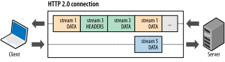
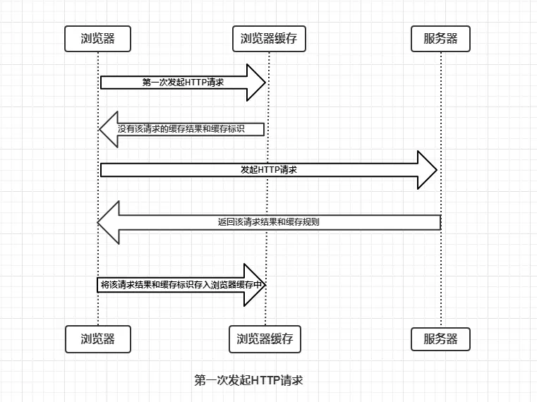

# HTTP

HTTP是Hyper Text Transfer Protocol（超文本传输协议）的缩写。它是一个应用层协议，由请求和响应构成，是一个标准的客户端服务器模型。HTTP是一个无状态的协议。  

### HTTP 协议的特点
- 构建于 TCP/IP 协议之上，是一个应用层协议，默认端口号是 80

- 无连接
  - 限制每次连接只处理一个请求
- 无状态
  - 协议对于事务处理没有记忆能力。
- 简单快速
  - 客户向服务器请求服务时，只需传送请求方法和路径。
- 灵活
  - HTTP允许传输任意类型的数据对象。正在传输的类型由Content-Type加以标记。  

### 请求报文
 - 请求行：由以下三个字段组成
  - 以 ASCII 码传输，建立在 TCP/IP 协议之上的应用层规范
   - 请求方法   
   - URL
   - HTTP协议版本号
 - 请求头部
   - 组成格式：关键字/值对组成，每行一对，关键字和值用英文冒号“:”分隔
   - 用来通知服务器有关于客户端请求的信息（一些键值对）
   - 例如：User-Agent、 Accept、Content-Type、Connection、Host
 - 空行
   - 分割请求头与请求体
 - 请求体
   - 请求数据不在GET方法中使用，而是在POST方法中使用
   - 可以添加任意请求的数据

### 响应报文
 - 状态行
   - 状态码
   - 状态消息 
   - HTTP协议版本号
 - 消息报头
   - 说明客户端要使用的一些附加信息
   - 如：Content-Type、charset、响应的时间
 - 响应正文
   - 返回给客户端的文本信息 

### HTTP请求方法
* Get：指定的资源请求数据。  
  * 请求的数据会附在URL之后
* HEAD：HEAD方法跟GET方法相同，只不过服务器响应时不会返回消息体。
  * 一个HEAD请求的响应中，HTTP头中包含的元信息应该和一个GET请求的响应消息相同。
  * 这种方法可以用来获取请求中隐含的元信息，而不用传输实体本身
  * 经常用来测试超链接的有效性、可用性和最近的修改
* POST：向指定的资源提交要被处理的数据
* PUT：更新资源
* Delete：用于删除指定的资源。
* Options

- post和get方法的区别：
  - 提交数据：
    - GET：请求的数据会附在URL之后，以?分割URL和传输数据，多个参数用&连接; `<request line>`b  `
    - 把提交的数据放置在是HTTP包的包体`<request-body>`中， 并且地址栏不会变化
  - 传输数据的大小
    - 首先：HTTP协议没有对传输的数据大小进行限制，HTTP协议规范也没有对URL长度进行限制
    - GET:特定浏览器和服务器对URL长度有限制
    - POST：理论不受限制，但实际各个WEB服务器会规定对post提交数据大小进行限制
  - 安全性：
    - POST的安全性要比GET的安全性高（数据不被修改）
    - GET的数据容易倍其他人看到(但post也能被抓包)
  - 幂等&缓存：
    - Get会主动被浏览器cache，而post需要自己设置
    - Get幂等，POST非
  - 产生的TCP包
    - POST先发送一个数据包(HEADER)，收到100，再发送data
    - get只发送一个

- 常用请求头：
  - keep-Alive：
    - 使客户端到服务器端的连接持续有效
      - timeout&max
      - 空闲t秒，最后m个请求

- 会话跟踪：
  - 会话：
    - 客户端打开与服务器的连接发出请求到服务器响应客户端请求的全过程称之为会话
  - 会话跟踪
    - 会话跟踪指的是对同一个用户对服务器的连续的请求和接受响应的监视
  - 为什么需要
    - HTTP协议是”无状态”的协议，它不能保存客户的信息
- 常用方法：
  - URL 重写
    - 在URL结尾添加一个附加数据以标识该会话,把会话ID通过URL的信息传递过去，以便在服务器端进行识别不同的用户
  - 隐藏表单域
    - 将会话ID添加到HTML表单元素中提交到服务器，此表单元素并不在客户端显示
  - Cookie
    - Cookie 是Web 服务器发送给客户端的一小段信息
    - 客户端可以采用两种方式来保存这个 Cookie 对象，内存或磁盘
    - 以后客户端只要访问该网站，就会将这个 Cookie 再次发送到服务器上，前提是这个 Cookie 在有效期内，这样就实现了对客户的跟踪。
    - Cookie 是可以被客户端禁用的
  - Session：
    - 服务器端会创建一个 session 对象，产生一个 sessionID 来标识这个 session 对象，然后将这个 sessionID 放入到 Cookie 中发送到客户端，下一次访问时，sessionID 会发送到服务器，在服务器端进行识别不同的用户。
    - 依赖于cookies

- 同源问题：
  - 协议、域名、端口相同
  - 为了保护隐私，保护cookies
  - 非同源时：
    -  Cookie、LocalStorage 和 IndexDB 无法读取。
    -  DOM 无法获得。
    -  AJAX 请求不能发送。
       - cookies可以通过设置一级域名解决
       - 两个网页不同源，就无法拿到对方的DOM
    - 三种方法解决跨域窗口的通信问题
      - 片段识别符 #
      - window.name 只要在同一个窗口中(前一个网页设置了这个属性)，后一个可以读取window.name
      - 跨文档通信API
  - **待补充**

方法幂等：
- 指的是同样的请求被执行一次与连续执行多次的效果是一样的，服务器的状态也是一样的。（不该有副作用）
即使状态码不同，如delete，也仍然是幂等的
- 除了post，皆幂等

HTTP响应代码：
* 1开头的条件码，意味着临时响应消息
  * HTTP 100 Continue ：
    * 在客户端发送 Request Message 之前，HTTP/1.1 协议允许客户端先判定服务器是否愿意接受客户端发来的消息主体
    * Client 和 Server 在 Post （较大）数据之前，允许双方“握手”，如果匹配上了，Client 才开始发送（较大）数据。
    * 如果直接发送较大数据的话，会造成资源浪费
    * 但是不是所有的web server都能接受，而且减轻延迟也是相对的
    * 可以用一定方法去，禁止expect 100 continue
  * 101 Switching Protocol
    * 表示服务器应客户端升级协议的请求对协议进行切换。
    * 始终由客户端发起，服务器接受或拒绝升级 
  * 102 Processing
    * 此代码表示服务器已收到并正在处理该请求，但没有响应可用
  * 103 Early Hints
    * 在头部信息到达之前，用户可以开始预加载CSS和JavaScript文件，这是一个很好的优化

* 2开头的条件码，成功响应：
  * 200：请求成功。成功的含义取决于HTTP方法：
    * GET 资源已被提取并在消息正文中传输。
    * HEAD 实体标头位于消息正文中。
    * POST 描述动作结果的资源在消息体中传输。
    * TRACE 消息正文包含服务器收到的请求消息
  * 201 Create：
    * 该请求已成功，并因此创建了一个新的资源。这通常是在POST请求，或是某些PUT请求之后返回的响应。
  * 202 Accepted：
    * 请求已经接收到，但还未响应，没有结果
  * 204 No content：
    * 表示请求已成功处理，但是没有内容返回(没有报文主体)
  * 206 Partial Content
    * 表示服务器已经完成了部分GET请求（客户端进行了范围请求）
* 3xx: 重定向
  * 301 Moved Permanently
    * 永久重定向，表示请求的资源已经永久的搬到了其他位置。分配的新的URL
  * 302 Found
    * 表示请求的资源临时搬到了其他位置
  * 以上两种：新的临时URI应该提示在响应报文的Location首部字段。只要不是HEAD请求，响应实体应该包含新URI的超链接和简短的说明
  * 303 See Other
    * 表示请求资源存在另一个URI，应使用GET定向获取请求资源
  * 304 Not Modified
    * 表示客户端发送附带条件的请求时，条件不满足，不包含任何响应主体(与重定向没有关系)
  * 307 Temporary Redirect
    * *临时重定向，应保持不变的请求方法发送* 待确认
* 4xx：客户端请求错误：请求包含语法错误或无法完成请求
  * 400 Bad Request
    * 请求报文存在语法错误或参数错误，服务器不理解
  * 401 Unauthorized
    * 表示发送的请求需要有HTTP认证信息或者是认证失败了
  * 403 Forbidden
    * 表示对请求资源的访问被服务器拒绝了。服务器可以对此作出解释（Response-body），也可以不解释
  * 404 Not Found
    * 表示服务器找不到你请求的资源
* 5xx或6xx：服务端响应
  * 500 Internal Server Error
    * 表示服务器执行请求的时候出错了，服务器youbug
  * 503 Service Unavailable
    * 表示服务器超负载或正停机维护，无法处理请求

### HTTP访问控制
HTML内联框架元素 `<iframe>` 表示嵌套的browsing context。它能够将另一个HTML页面嵌入到当前页面中。

HTTP & HTTP1.0
1. 缓存处理：引入了更多的缓存控制策略例如Entity tag，If-Unmodified-Since, If-Match, If-None-Match等更多**可供选择的缓存头**来控制**缓存策略**
2. 带宽优化及网络连接的使用：HTTP1.1则在请求头引入了range头域，它允许只请求资源的某个部分，即返回码是206（Partial Content），这样就方便了开发者自由的选择以便于充分利用带宽和连接。
3. 错误通知的管理：在HTTP1.1中新增了24个错误状态响应码，如409（Conflict）表示请求的资源与资源的当前状态发生冲突；410（Gone）表示服务器上的某个资源被永久性的删除
4. HTTP1.1的请求消息和响应消息都应支持Host头域，且请求消息中如果没有Host头域会报告一个错误。以前认为每台服务器绑定着唯一的ip
5. 长连接：HTTP 1.1支持长连接（PersistentConnection）和请求的流水线（Pipelining）处理
   -在一个TCP连接上可以传送多个HTTP请求和响应，减少了建立和关闭连接的消耗和延迟，在HTTP1.1中默认开启Connection： keep-alive 
6. 管线化：但有很多缺陷
 
HTTP的缺点：
- 明文，监听
- 无法验证包完整性，篡改
- 无法验证通信方身份，被伪装
HTTPS：
- HTTPS：一种通过计算机网络进行安全通信的传输协议。
- 经由HTTP进行通信，但利用SSL/TLS来加密数据包。 SSL/TLS：安全传输层协议
- 提供：对网站服务器的身份认证，保护交换数据的隐私与完整性。

步骤

区别：
- 端口号80：443
- 明文：加密
- HTTPS 需要到 CA 申请证书，一般免费证书很少，需要交费
- 简单+无状态：加密传输+身份验证

主要作用：
- 加密，通信双方信息认证

缺点：
- 费时费电
- 连接缓存低效，大流量成本高
- 服务端资源占用高，
- 证书要钱

**HTTP中降低延迟的方案**
- Spriting：将很多较小的图片合并成一张大图，再用JavaScript或者CSS将小图重新“切割”出来的技术
- 内联：一种防止发送很多小图请求的技巧，它将图片的原始数据嵌入在CSS文件里面的URL里
- 拼接：将大量细小的文件整合成一个大的文件进行部署，缺点：增加了部署的难度
- 分片：
  - 就是把你的服务分散在尽可能多的主机上
  - 可以图片或者资源分发到其他主机上

**http/2的基本概念**
*HTTP/2 的主要目标是通过支持完整的请求与响应复用来减少延迟，通过有效压缩 HTTP 标头字段将协议开销降至最低，同时增加对请求优先级和服务器推送的支持。*
- HTTP/2 没有改动 HTTP 的应用语义
- 修改了数据格式化（分帧）以及在客户端与服务器间传输的方式，通过新的分帧层向我们的应用隐藏了所有复杂性。
- 为了实现 HTTP 工作组设定的性能目标，HTTP/2 引入了一个新的二进制分帧层，该层无法与之前的 HTTP/1.x 服务器和客户端向后兼容，因此协议的主版本提升到 HTTP/2。

早期http的一些特点：
优势：实现简单
劣势：
- HTTP/1.x 客户端需要使用多个连接才能实现并发和缩短延迟
- HTTP/1.x 不会压缩请求和响应标头，导致不必要的网络流量
- HTTP/1.x 不支持有效的资源优先级，致使底层 TCP 连接的利用率低下

HTTP/2：
- 通过支持**标头字段压缩**和**在同一连接上 进行多个并发交换**，让应用更有效地利用网络资源，减少 感知的延迟时间
- 它可以**对同一连接上的请求和响应消息进行交错** 发送并为 HTTP 标头字段使用有效编码
- HTTP/2 还允许为请求**设置优先级**，让更重要的请求更快速地完成，从而进一步 提升性能
- 通过使用二进制消息分帧对消息进行更高效 的处理。
- 仍然是http标准的扩展，而非替代，应用语义是不变的

二进制分帧层 
- 定义了如何封装 HTTP 消息并在客户端与服务器之间传输。
- 
- “层”，指的是位于套接字接口与应用可见的高级 HTTP API 之间一个经过优化的新编码机制
  
- 传输期间对它们的编码方式变了。
  - HTTP/1.x 协议以换行符作为纯文本的分隔符
  - HTTP/2 将所有传输的信息分割为更小的消息和帧，并采用二进制格式对它们编码。

数据流、消息和帧:
- 数据流：已建立的连接内的双向字节流，可以承载一条或多条消息。
- 消息：与逻辑请求或响应消息对应的完整的一系列帧。
- 帧：HTTP/2 通信的最小单位，每个帧都包含帧头，至少也会标识出当前帧所属的数据流。
以上概念的关系总结：
- 所有通信都在一个 TCP 连接上完成，此连接可以承载任意数量的双向数据流。
- 每个数据流都有一个唯一的标识符和可选的优先级信息，用于承载双向消息。
- 每条消息都是一条逻辑 HTTP 消息（例如请求或响应），包含一个或多个帧。
- 帧是最小的通信单位，承载着特定类型的数据，例如 HTTP 标头、消息负载等等。 来自不同数据流的帧可以交错发送，然后再根据每个帧头的数据流标识符重新组装。
- 
> 简言之，HTTP/2 将 HTTP 协议通信分解为二进制编码帧的交换，这些帧对应着特定数据流中的消息。所有这些都在一个 TCP 连接内复用。 这是 HTTP/2 协议所有其他功能和性能优化的基础。

请求与响应复用
*在 HTTP/1.x 中，如果客户端要想发起多个并行请求以提升性能，则必须使用多个 TCP 连接*
- 这是因为 HTTP/1.x delivery model，该模型确保了每个tcp连接上只能传送一个响应，因此这就导致了head-of-line blocking和底层tcp连接的低效率使用

在HTTP/2中：
- 客户端和服务器可以将 HTTP 消息分解为互不依赖的帧，然后交错发送，最后再在另一端把它们重新组装起来，实现了完整的请求和响应复用。
- 
  - 将 HTTP 消息分解为独立的帧，交错发送，然后在另一端重新组装，这个机制会带来巨大的性能提升
- 因此我们能做到:
  1. 并行交错地发送多个请求，请求之间互不影响。
  2. 并行交错地发送多个响应，响应之间互不干扰。
  3. 使用一个连接并行发送多个请求和响应。
  4. 不必再为绕过 HTTP/1.x 限制而做很多工作（请参阅针对 HTTP/1.x 进行优化，例如级联文件、image sprites 和域名分片。
  5. 消除不必要的延迟和提高现有网络容量的利用率，从而减少页面加载时间

- 数据流优先级
- 将 HTTP 消息分解为很多独立的帧之后，我们就可以复用多个数据流中的帧，客户端和服务器交错发送和传输这些帧的顺序就成为关键的性能决定因素
- HTTP/2 标准允许每个数据流都有一个关联的权重和依赖关系：
  - 可以向每个数据流分配一个介于 1 至 256 之间的整数。
  - 每个数据流与其他数据流之间可以存在显式依赖关系。
  > 数据流依赖关系和权重的组合让客户端可以构建和传递“优先级树”，表明它倾向于如何接收响应。 反过来，服务器可以使用此信息通过控制 CPU、内存和其他资源的分配设定数据流处理的优先级，在资源数据可用之后，带宽分配可以确保将高优先级响应以最优方式传输至客户端。

- 标识和处理
  - 数据流依赖关系通过将另一个数据流的唯一标识符作为父项引用进行声明，如果忽略标识符，相应数据流将依赖于“根数据流”
  - 声明数据流依赖关系指出，应尽可能先向父数据流分配资源，然后再向其依赖项分配资源。
  - 
- 这种优先级和依赖的处理顺序并不能被有效的保证

Flow control
- 与TCP的流量控制相比：
  - TCP的流量控制即不够精细，也无法提供必要的应用级 API 来调节各个数据流的传输
- HTTP/2 提供了一组简单的构建块(building block)，这些构建块允许客户端和服务器实现其自己的数据流和连接级的流量控制
  1. 流量控制具有方向性，每个接收方可以选择为数据流或整个连接设置窗口大小
  2. credit-based：每个接收方都可以公布其初始连接和数据流流控制窗口（以字节为单位），每当发送方发出 DATA 帧时都会减小，在接收方发出 WINDOW_UPDATE 帧时增大
  3. 流量控制无法被关闭：
  4. hop-by-hop而不是end-to-end：
- HTTP/2 未指定任何特定算法来实现流控制。
  - 提供了简单的构建块并推迟了客户端和服务器实现，可以实现自定义策略来调节资源使用和分配，以及实现新传输能力，同时提升网页应用的实际性能和感知性能

服务器推送
- 服务器可以对一个客户端请求发送多个响应
- 用处：
  - 一个典型的网络应用包含多种资源，客户端需要检查服务器提供的文档才能逐个找到它们。 那为什么不让服务器提前推送这些资源，从而减少额外的延迟时间呢？
  - 对于将资源手动内联到文档中的过程，我们实际上是在将资源推送给客户端，而不是等待客户端请求。
- PUSH_PROMISE 101：
  - 所有服务器推送数据流都由 PUSH_PROMISE 帧发起，表明了服务器向客户端推送所述资源的意图，并且需要先于请求推送资源的响应数据传输。  主动推速度>被动推
    - 客户端需要了解服务器打算推送哪些资源，以免为这些资源创建重复请求。 
  - 在客户端接收到 PUSH_PROMISE 帧后，它可以根据自身情况选择拒绝数据流
    - 相比之下，使用**资源内联**等同于“强制推送”：客户端无法选择拒绝、取消或单独处理内联的资源。
     
推送只是一个功能： 
- 使用 HTTP/2，客户端仍然完全掌控服务器推送的使用方式。 客户端可以限制并行推送的数据流数量
- 调整初始的流量控制窗口以控制在数据流首次打开时推送的数据量
- 或完全停用服务器推送
 
优势和限制:
- 推送的每个资源都是一个数据流，与内嵌资源不同，客户端可以对推送的资源逐一复用、设定优先级和处理
- 浏览器强制执行的唯一安全限制是，推送的资源必须符合同源政策：服务器要对内容保证权威性。

**请求头压缩**
- HTTP/2 使用 HPACK 压缩格式压缩请求和响应标头元数据，这种格式采用两种简单但是强大的技术
  - 这种格式支持通过静态霍夫曼代码对传输的标头字段进行编码，从而减小了各个传输的大小。
  - 这种格式要求客户端和服务器同时维护和更新一个包含之前见过的标头字段的索引列表（换句话说，它可以建立一个共享的压缩上下文），此列表随后会用作参考，对之前传输的值进行有效编码。
- 在传输时对各个值进行压缩，利用之前传输值的索引列表，索引值用来查询和重构完整的请求头
- *动态表最初为空，将根据在特定连接内交换的值进行更新。 因此，为之前未见过的值采用静态 Huffman 编码，并替换每一侧静态表或动态表中已存在值的索引，可以减小每个请求的大小。*

性能与安全：
- 将所传输标头数据的大小减小 85% - 88%，显著减少了页面加载时间延迟
- HPACK 替代了 zlib 压缩算法，进一步提高了安全性

### HTTP/3

**SSL/TLS协议**
前序知识：
对称加密：相同的密钥用于加密和解密
非对称加密：
CA（证书颁发机构）：
- 用来保证数据的传输过程中不会被第三方实体篡改
- 算法执行过程：
  1. 服务器 example.com将从CA请求TLS证书，例如Digicert。
  2. Digicert将为example.com创建证书，证书将包含必要的数据，例如服务器名称，服务器的公钥等。
  3. Digicert将创建数据（证书）的哈希值，并使用自己的私钥对其进行加密。
  4. 浏览器和操作系统自带Digicert等权威机构的公钥。
  5. 当浏览器收到签名证书时，它将使用公钥从签名生成哈希值，它还将使用证书中指定的散列算法生成数据（证书）的散列，如果两个哈希值匹配，则签名验证成功并且证书是可信的。
  6. 现在浏览器可以使用证书中指定的example.com的公钥继续进行身份验证过程。

- 中间CA(intermediate CA):
  - 保证信任链，CA机构不必时时在线

- 保证公钥不被篡改：
  - 将公钥放在数字证书中。只要证书是可信的，公钥就是可信的。
- 公钥加密计算量太大，如何减少耗用的时间
  - 客户端和服务器端都生成一个对称加密的"对话密钥"（session key），用它来加密信息

握手阶段：
- 客户端发出请求：ClientHello请求
  - 客户端主要向服务器提供以下信息：
    1. 支持的协议版本，比如TLS 1.0版
    2. 一个客户端生成的**随机数**，稍后用于生成"对话密钥"。
    3. 支持的加密方法，比如RSA公钥加密。
    4. 支持的压缩方法。用于后续的信息压缩传输;
- 服务器回应：SeverHello
  - 服务器收到客户端请求后，向客户端发出回应
    1. 确认使用的加密通信协议版本，比如TLS 1.0版本。如果浏览器与服务器支持的版本不一致，服务器关闭加密通信。
    2. 一个服务器生成的**随机数**，稍后用于生成"对话密钥"。
    3. 确认使用的加密方法，比如RSA公钥加密。
    4. 服务器证书。
  - *如果服务器需要确认客户端的身份，就会再包含一项请求，要求客户端提供"客户端证书"。比如，金融机构往往只允许认证客户连入自己的网络，就会向正式客户提供USB密钥，里面就包含了一张客户端证书。*  
- 客户端回应
  - 客户端收到服务器回应以后，首先验证服务器证书。如果证书不是可信机构颁布、或者证书中的域名与实际域名不一致、或者证书已经过期，就会向访问者显示一个警告，由其选择是否还要继续通信。
  - 如果证书没有问题，客户端就会从证书中取出服务器的公钥，然后发送一下信息
    1. 一个**随机数**。该随机数用服务器公钥加密，防止被窃听。
    2. 编码改变通知，表示随后的信息都将用双方商定的加密方法和密钥发送。
    3. 客户端握手结束通知，表示客户端的握手阶段已经结束。这一项同时也是前面发送的所有内容的hash值，用来供服务器校验。 
  - 这里的随机数，是整个握手阶段出现的第三个随机数。有了它以后，客户端和服务器就同时有了三个随机数，接着双方就用事先商定的加密方法，各自生成本次会话所用的同一把"会话密钥"。
  - 为什么是三个随机数：
    > "不管是客户端还是服务器，都需要随机数，这样生成的密钥才不会每次都一样。由于SSL协议中证书是静态的，因此十分有必要引入一种随机因素来保证协商出来的密钥的随机性。
    > 对于RSA密钥交换算法来说，pre-master-key本身就是一个随机数，再加上hello消息中的随机，三个随机数通过一个密钥导出器最终导出一个对称密钥。
    > pre master的存在在于SSL协议不信任每个主机都能产生完全随机的随机数，如果随机数不随机，那么pre master secret就有可能被猜出来，那么仅适用pre master secret作为密钥就不合适了，因此必须引入新的随机因素，那么客户端和服务器加上pre master secret三个随机数一同生成的密钥就不容易被猜出了，一个伪随机可能完全不随机，可是是三个伪随机就十分接近随机了，每增加一个自由度，随机性增加的可不是一。" 
    
  - 如果前一步，服务器要求客户端证书，客户端会在这一步发送证书及相关信息。

- 服务器的最后回应
  - 服务器收到客户端的第三个随机数pre-master key之后，计算生成本次会话所用的"会话密钥"，发送一下信息
    1. 编码改变通知，表示随后的信息都将用双方商定的加密方法和密钥发送。
    2. 服务器握手结束通知，表示服务器的握手阶段已经结束。这一项同时也是前面发送的所有内容的hash值，用来供客户端校验。

接下来，客户端与服务器进入加密通信，就完全是使用普通的HTTP协议，只不过用"会话密钥"加密内容   
"会话密钥"：根据约定的加密方法，使用前面的三个随机数生成。

keyless云服务：
- 服务器的公钥和私钥只需要用到一次，这时候CDN服务商才会与自家服务器发送请求
session的恢复：
- 使用session ID或者session ticket
- session id：会加大服务器的存储压力
  - 如果对话中断，重连的时候，只要客户端给出这个编号，且服务器有这个编号的记录，就可以重用已有的对话密钥
- session ticket：将压力放在客户端
  - 不再发送session ID，而是发送一个服务器在上一次对话中发送过来的session ticket。
  - session ticket是加密的，只有服务器才能解密，其中包括本次对话的主要信息，比如对话密钥和加密方法
  - 服务器收到session ticket以后，解密后就不必重新生成对话密钥了。

HTTP3：
QUIC：
- 0-RTT
  - 通过使用类似 TCP 快速打开的技术，缓存当前会话的上下文，在下次恢复会话的时候，只需要将之前的缓存传递给服务端验证通过就可以进行传输了
  - QUIC握手只需要1RTT，复用时0-RTT
- 多路复用：
  - 虽然 HTTP/2 支持了多路复用，但是 TCP 协议终究是没有这个功能的。QUIC 原生就实现了这个功能，并且传输的单个数据流可以保证有序交付且不会影响其他的数据流，这样的技术就解决了之前 TCP 存在的问题
  - 同 HTTP2.0 一样，同一条 QUIC 连接上可以创建多个 stream，来发送多个 HTTP 请求，但是，QUIC 是基于 UDP 的，一个连接上的多个 stream 之间没有依赖。因此不会出现head-line blocking 问题
  - *QUIC 在移动端的表现也会比 TCP 好。因为 TCP 是基于 IP 和端口去识别连接的，这种方式在多变的移动端网络环境下是很脆弱的。但是 QUIC 是通过 ID 的方式去识别一个连接，不管你网络环境如何变化，只要 ID 不变，就能迅速重连上。*
- 加密认证的报文：
  - TCP 协议头部没有经过任何加密和认证
  - QUIC 报文的被修改，接收端都能够及时发现，安全性较好
- 向前纠错机制(Forward Error Correction，FEC)
  - 每个数据包除了它本身的内容之外，还包括了部分其他数据包的数据，可以减少重传

- UDP协议：
  - 快 小 面向非连接 不可靠
  - UDP报头4个部分组成，两个可选
    - 各16bit的来源端口和目的端口用来标记发送和接受的应用进程。因为UDP不需要应答，所以来源端口是可选的，如果来源端口不用，那么置为零。
    - 在目的端口后面是长度固定的以字节为单位的报文长度域，用来指定UDP数据报包括数据部分的长度，长度最小值为8byte
    - 剩下的16bit是用来对首部和数据部分一起做校验和（Checksum）的，这部分是可选的
  - UDP 支持多播和广播。

- http缓存详解：
  - (私有)浏览器缓存
  - 简单的http报文格式：
    - 请求报文：请求行 – HTTP头(通用信息头，请求头，实体头) – 请求报文主体(只有POST才有报文主体)
    - HTTP响应(Response)报文：状态行 – HTTP头(通用信息头，响应头，实体头) – 响应报文主体
  - 缓存过程分析：
    - 浏览器第一次向服务器发起该请求后拿到请求结果，会根据响应报文中HTTP头的缓存标识，决定是否缓存结果。是则将请求结果和缓存标识存入浏览器缓存中
    - 强制缓存和协商缓存
    - 强制缓存：
      - 不存在该结果和标识，向服务器发起请求，与上图同
      - 存在该缓存结果和缓存标识，但该结果已失效，强制缓存失效，则使用协商缓存
      - 存在该缓存结果和缓存标识，且该结果尚未失效，强制缓存生效，直接返回该结果
    - 缓存规则是怎么定的？
      - 服务器会将缓存规则放入HTTP响应报文的HTTP头中和请求结果一起返回给浏览器。
      - 控制强制缓存的字段分别是Expires和Cache-Control，其中Cache-Control优先级比Expires高。
        - Expires：HTTP/1.0控制网页缓存的字段 （HTTP/1.1，Expire已经被Cache-Control替代）
          - 值为服务器返回该请求结果缓存的到期时间
          - 可能会由于时间的问题失效
        - Cache-Control：优先级比expires高
          - 字段的主要取值：
            - public：所有内容都将被缓存
            - private：所有内容只有客户端可以缓存，Cache-Control的默认取值
            - no-cache：客户端缓存内容，但是是否使用缓存则需要经过协商缓存来验证决定
            - no-store：所有内容都不会被缓存，即不使用强制缓存，也不使用协商缓存
            - max-age=xxx (xxx is numeric)：缓存内容将在xxx秒后失效
        - 浏览器会在js和图片等文件解析执行后直接存入内存缓存中，那么当刷新页面时只需直接从内存缓存中读取(from memory cache)；而css文件则会存入硬盘文件中，所以每次渲染页面都需要从硬盘读取缓存(from disk cache)。
      - 协商缓存：
        - 浏览器携带缓存标识向服务器发起请求，由服务器根据缓存标识决定是否使用缓存的过程
          - 返回值304：协商缓存生效，虽过期但无变化
          - 返回值200：失效，已有变化，返回更新后的页面
        - 控制协商缓存的其他字段：
          - `Etag` / `If-None-Match`的优先级比`Last-Modified` / `If-Modified-Since`高
            - Last-Modified是服务器响应请求时，返回该资源文件在服务器最后被修改的时间
            - If-Modified-Since则是客户端再次发起该请求时，携带上次请求返回的Last-Modified值，通过此字段值告诉服务器该资源上次请求返回的最后被修改时间，ims值与服务器最后被修改的时间做对比，判断是否被更新
            - Etag是服务器响应请求时，返回当前资源文件的一个唯一标识(由服务器生成)，可以节省带宽
            - If-None-Match是客户端再次发起该请求时，携带上次请求返回的唯一标识Etag值
              - 根据If-None-Match的字段值与该资源在服务器的Etag值做对比，返回304或200
    - 缓存图：

- CDN：内容分发网络
  - 将源站内容分发至最接近用户的节点，使用户可就近取得所需内容，提高用户访问的响应速度和成功率。解决因分布、带宽、服务器性能带来的访问延迟问题，适用于站点加速、点播、直播等场景。
  - 基本思路：尽可能避开互联网上有可能影响数据传输速度和稳定性的瓶颈和环节，使内容传输的更快、更稳定。通过在网络各处放置节点服务器所构成的在现有的互联网基础之上的一层智能虚拟网络，CDN系统能够实时地根据网络流量和各节点的连接、负载状况以及到用户的距离和响应时间等综合信息将用户的请求重新导向离用户最近的服务节点上。
  - 缓存 调度 协议优化

### WebSocket:
- 当服务器想直接和客户端对话时，客户端只能使用轮询，这种方式获取资源非常浪费
  - *HTTP/2 只能推送静态资源，无法推送指定的信息。*
- 特点：
  1. 服务器可以主动向客户端推送信息，客户端也可以主动向服务器发送信息
  2. 建立在 TCP 协议之上，服务器端的实现比较容易。
  3. *没有同源限制，客户端可以与任意服务器通信。*
  4. 与 HTTP 协议有着良好的兼容性。默认端口也是80和443，并且握手阶段采用 HTTP 协议
  5. 数据格式比较轻量，性能开销小，通信高效。
  6. 可以发送文本，也可以发送二进制数据。
  7. 协议标识符是ws（如果加密，则为wss），服务器网址就是 URL。
- 客户端API简介：
  - WebSocket 构造函数：`var ws = new WebSocket('ws://localhost:8080')`;
  - `webSocket.readyState`:
    - 四种状态：
      1. CONNECTING：值为0，表示正在连接。
      2. OPEN：值为1，表示连接成功，可以通信了。
      3. CLOSING：值为2，表示连接正在关闭。
      4. CLOSED：值为3，表示连接已经关闭，或者打开连接失败。
  - `webSocket.onopen`：连接成功后的回调函数。  
  - `webSocket.onclose`：连接关闭后的回调函数
  - `webSocket.onmessage`：收到服务器数据后的回调函数。文本或二进制数据
  - `webSocket.send()`：向服务器发送数据。文本或二进制数据
  - `webSocket.bufferedAmount`：还有多少字节的二进制数据没有发送出去。判断发送是否结束。
  - `webSocket.onerror`：指定报错时的回调函数。
- 服务端：...

### websocket与ajax的异同：
- Ajax：
  - 优点在于它在浏览器与web服务器之间使用异步数据传输（HTTP请求），不阻塞用户，核心对象是XMLHTTPRequest。通过这个对象，js可在不重新加载页面的情况下与web服务器交换数据。
    - Ajax轮询这种方式，在不断地建立HTTP连接，然后等待服务端处理，服务端不会主动联系客户端，只有客户端发起。
  - 使用场景：
    - 表单验证+防抖
    - Ajax 展示数据的树形结构
- websocket：
  - 服务器和浏览器可以在给定的时间范围内的任意时刻，互相推送消息。在建立连接之后，服务器可以主动传送数据给浏览器。
    - 建立websocket连接后，可以直接跟信使建立持久的连接，有信息的时候客服想办法通知信使，然后信使在统一转交给客户
  - 使用场景：
    - 社交
    - 数据实时型应用：股票、天气

- 理想传输条件有两个
  - 传输信道不产生差错
  - 接收方能处理任何速度传来的数据

