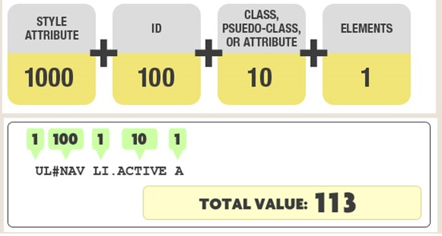

CSS优先级规则：
1. css选择规则的权值不同时，权值高的优先；

2. css选择规则的权值相同时，后定义的规则优先；

3. css属性后面加 !important 时，无条件绝对优先；

权重计算：
- 第一等级：代表 内联样式，如 style=""，权值为 1,0,0,0；

- 第二等级：代表 ID选择器，如 #id="", 权值为 0,1,0,0；

- 第三等级：代表 calss | 伪类 | 属性 选择器，如 .class | :hover,:link,:target | [type], 权值 0,0,1,0；

- 第四等级：代表 标签 | 伪元素 选择器，如 p | ::after, ::before, ::fist-inline, ::selection, 权值 0,0,0,1；

当两个权值进行比较的时候，是从高到低逐级将等级位上的权重值比较，而不是单纯得到总和

盒模型：
标准盒模型：content-box  width=content占有的宽度

IE盒模型：border-box width = content'width + border + padding
js获得高度的方法：
IE8: dom.currentStyle
主流方法：getComputedStyle


css常见定位方案：
- 普通流
- 浮动
- 绝对定位

BFC 即 Block Formatting Contexts (块级格式化上下文)
- html 根元素
- 浮动元素：float 除 none 以外的值
- 绝对定位元素：position (absolute、fixed)
- display 为 inline-block、table-cells、flex
- overflow 除了 visible 以外的值 (hidden、auto、scroll)

BFC的特性和应用：
1. 同一个 BFC 下外边距会发生折叠
   1. 如果想要避免外边距的重叠，可以将其放在不同的 BFC 容器中。

2. BFC 可以包含浮动的元素（清除浮动）  把脱离文档流的浮动元素包裹上。可以被撑起来

3. BFC 可以阻止元素被浮动元素覆盖
   1. 浮动元素虽然脱离文档流，但外围的盒子的文本会显示出来环绕作用

箭头函数和普通函数的区别：
- 没有this，不能使用new，使用call，apply对this没有影响
- 不绑定arguments
- 没有原型

区分数组和对象的方法  注意  一下的{}要用 const a = {}; a代替
```js
[] instanceof Array   //true
{} instanceof Array   //false

{}.constructor    //返回object
[].constructor    //返回Array

Object.prototype.toString.call([])   //["object Array"]
Object.prototype.toString.call({})   //["object Object"]

Array.isArray([])  //true
Array.isArray({})  //false
```

webpack 原理：
从入口文件开始，对所有依赖打包成对应的静态文件，loader和plugin
loader：让webpack可以处理非js文件，转换为webpack可以处理的有效模块
plugin：在某个生命周期中，插入自定义行为，完成相应工作

addEventListener 参数：
type：表示监听事件类型的字符串。
listener：必须是一个实现了 EventListener 接口的对象，或者是一个函数
options | useCapture：
- capture: 表示 listener 会在该类型的事件捕获阶段传播到该 EventTarget 时触发。
- once: 表示 listener 在添加之后最多只调用一次。如果是 true， listener 会在其被调用之后自动移除。
- passive: 表示 listener 永远不会调用 preventDefault()。如果 listener 仍然调用了这个函数，客户端将会忽略它并抛出一个控制台警告，可以避免浏览器检测这个我们是否有在touch事件的handler里调用preventDefault。如果你在事件绑定函数中调用了 preventDefault，那么页面就不应该滚动，如果你没有调用 preventDefault，页面就需要滚动。但是你到底调用了还是没有调用，浏览器不知道。只能先执行你的函数，等 200 毫秒后，绑定事件执行完了，浏览器才知道，“哦，原来你没有阻止默认行为，好的，我马上滚”。此时，页面开始滚。
  - 作用相当于提前告诉他，我就不阻止，不要搞花里胡哨的

HTTP：header不区分大小写

http状态码：
- 100 continue： post大数据的时候探测服务器是否正常
- 101 Switching Protocol                 
- 200 OK
- 206 Partial Content
  - 成功状态响应代码表示请求已成功，并且主体包含所请求的数据区间，该数据区间是在请求的 Range 首部指定的。断点续传可以用到

- 301 Moved Permanently
  - 说明请求的资源已经被移动到了由 Location 头部指定的url上，建议不应该修改http method和body
- HTTP 302 Found
  - 重定向状态码表明请求的资源被暂时的移动到了由Location 头部指定的 URL 上。规范要求浏览器在重定向时保证请求方法和请求主体不变
  - 搜索引擎不会对该资源的链接进行更新
- 303 See other
  - 通常作为 PUT 或 POST 操作的返回结果，它表示重定向链接指向的不是新上传的资源，而是另外一个页面，比如消息确认页面或上传进度页面。而请求重定向页面的方法要总是使用 GET。  
- 304 Not Modified 
  - 说明无需再次传输请求的内容，也就是说可以使用缓存的内容
- 307 Temporary Redirect
  - 临时重定向响应状态码，表示请求的资源暂时地被移动到了响应的 Location 首部所指向的 URL 上。
- 308 Permanent Redirect
  - 这意味着资源现在永久位于由 Location: HTTP Response 标头指定的另一个 URI，不能改变再次请求的方法和消息主体

客户端相应
- 400 bad request
  1. 语义有误，当前请求无法被服务器理解。除非进行修改，否则客户端不应该重复提交这个请求。
  2. 请求参数有误。
- 403 Forbidden
  - 服务器已经理解请求，但是拒绝执行它
- 404 Not Found
  - 被广泛应用于当服务器不想揭示到底为何请求被拒绝或者没有其他适合的响应可用的情况下。

服务端响应: 
- 500 Internal Server Error: 服务器遇到了不知道如何处理的情况。
- 503 Service Unavailable: 通常造成这种情况的原因是由于服务器停机维护或者已超载。注意在发送该响应的时候，应该同时发送一个对用户友好的页面来解释问题发生的原因。
- 504 Gateway Timeout: 当服务器作为网关，不能及时得到响应时返回此错误代码。

浏览器缓存：
强制缓存：第二次请求时直接被浏览器拦截
- expires：标识未来资源过期的时间
- cache control：max-age: 一段时间、no-cache、no-store

协商缓存：
http 1.0: 
第一次请求服务器通过modified-sice标识，第二次请求浏览器带上if-modified-since
如果时间不一致，返回新资源，更新modified-since，如果一致则返回304

两次正负更改，会导致依然需要请求

http1.1：
服务器通过 Etag 来设置响应头缓存标识，在第一次请求时返回；浏览器将两者缓存到本地缓存数据库
第二次请求：将 Etag 信息放到 If-None-Match 请求头去访问服务器，服务器通过对比决定是否返回304 or 200

浏览器跨域：
1. 同源的定义：协议、端口、host相同
2. 同源政策规定，AJAX请求只能发给同源的网址，否则就报错。

同源政策规定的行为：
- Cookie、LocalStorage 和 IndexDB 无法读取。
- DOM 无法获得。
- AJAX 请求不能发送。

规避策略：
- 将2、3级域名的cookies写到一级域名上：document.domain设置为一级域名

- 不同源的Iframe：
  - 将数据写到url#后面的部分即 fragment；子窗口通过监听hashchange得到通知
  - window.name：这个属性的最大特点是，无论是否同源，只要在同一个窗口里，前一个网页设置了这个属性，后一个网页可以读取它。

- HTML5：window.postMessage
  - window.postMessage方法，允许跨窗口通信，无论是否同源
  - 方法的第一个参数是具体的信息内容，第二个参数是接收消息的窗口的源（origin），即"协议 + 域名 + 端口"。也可以设为*，表示不限制域名，向所有窗口发送
  - message事件提供的event：source:发送消息的窗口；origin：消息发向的网址；data：内容

JSONP：网页通过添加一个`<script>`元素，向服务器请求JSON数据，这种做法不受同源政策限制；服务器收到请求后，将数据放在一个指定名字的回调函数里传回来
- 一个回调函数，一个script元素发送带有callback的请求，最后服务器把数据放在callback字段上

只是支持 GET 请求

websocket：不受同源控制，它有自己的origin字段

CORS：允许浏览器向跨源服务器发AJAX请求

简单请求：同时满足
HEAD、GET、POST
头信息不超出：
Accept、Accept-Language、Content-Language、Last-Event-ID
Content-Type：只限于三个值application/x-www-form-urlencoded、multipart/form-data、text/plain

1. 浏览器发出时：发现是简单->添加origin字段  服务器根据这个值决定是否同意
   1. 不在许可范围内：正常HTTP请求，浏览器发现没有包含Access-Control-Allow-Origin字段，就知道出错了，从而抛出一个错误被`XMLHttpRequest`的`onerror`捕获
   2. 在许可内：会多出几个`Access-Control-`开头的字段：
      1. Access-Control-Allow-Origin：要么是请求时Origin字段的值，要么是一个*，表示接受任意域名的请求
      2. Access-Control-Allow-Credentials：可选，布尔。表示是否允许发送Cookie
      3. Access-Control-Expose-Headers：想要在XMLHttpRequest对象拿到其他基本字段，必须在这里指定
   3. withCredentials属性：开启时，才能设置cookies和发送cookies
      1. 发送cookies的三个条件：withCredentials、Access-Control-Allow-Credentials、allow-origin字段不能为*

2. 非简单请求：DELETE、PUT、Content-type为application/json
   1. 自动发出一个"预检"请求：当前网页所在的域名是否在服务器的许可名单之中，以及可以使用哪些HTTP动词和头信息字段
      1. Options
      2. 除了origin外的头信息字段：
         1. Access-Control-Request-Method 标志方法
         2. Access-Control-Request-Headers 标志额外头字段
   2. 预检请求的回应
      1. Access-Control-Allow-(Origin | Methods | Headers)
      2. 拒绝方式同简单请求
   3. 其他的一些头信息字段：
      1. Access-Control-Allow-Methods 所有允许方法
      2. Access-Control-Allow-Headers所有支持的头信息字段
      3. Acess-Control-Allow-Credentials同简单
      4. Access-Control-Max-Age：预检请求的有效期，单位秒
3. 之后的非简单请求和正常的CORS请求一样 Access-Control-Allow-Origin是每次回应必有的


#### 如果用户出现打开网站后出现白屏，该如何排查问题
网络--资源挂了
本地打log--
浏览器的兼容性
sourceMap+捕捉错误  拿到调用栈等日志信息排查
查看请求和element的信息。可以大概得出网站加载到了本地代码的某个地方，继续排查

白屏时间过长
- 从network中查看，是不是cdn波动，还是某一个请求的文件特别大
- 如果是后者：则要用打包文件排查，是不是加载了首页不需要的js代码，还是首页发送了不必要的请求导致等待态过长
  - 能否通过懒加载减少js代码的加载
  - 能否通过树摇的方法降低打包体积
  - 通过webpack压缩一些资源的体积：html、css、img  Minify处理

XMLHttpRequest.readyState = unsent、open、headers_receive，loading，done

什么是DOM：
文档对象模型 (DOM) 是HTML和XML文档的编程接口，将web页面和脚本或程序语言连接起来。DOM 将文档解析为一个由节点和对象（包含属性和方法的对象）组成的结构集合。

css垂直居中：
flex
绝对定位
transform: translate(-50%,-50%)

flex：
align-items：交叉轴上对齐（在交叉轴上滑动，到达正确的位置）
justify-content：在主轴上对齐
flex-grow: 定义项目的放大比例，默认为0，0：有剩余空间也不放大
flex-shrink：定义项目的缩小比例，默认为1，即如果空间不足，该项目将缩小。
flex-basis：

事件委托：将元素的事件绑定在父级，然后通过
列表、列表函数频繁加减，事件不变

https：https://www.ruanyifeng.com/blog/2014/02/ssl_tls.html
TLS握手
客户端->服务端：
- 客户端发送消息 包含密码信息和随机字符串
服务端->客户端
  服务器响应，包含密码组合、数字证书以及随机字符串
客户端： 
- 根据根证书验证，并从证书中活区公钥，生成一个随机字符串，并用公钥加密
客户端->服务器：
- 将加密的字符串发送给服务器

客户端如何检测数字证书是合法的并是所要请求的公司的？
应用程序读取证书中的Issuer（发布机构）
在操作系统或浏览器内置的受信任的发布机构中去找该机构的证书
找到 or 用户确认：拿上级密钥进行数字摘要算法计算，对比结果和解密得到的指纹

服务器、客户端
- 通过双方使用相同的算法生成想用的密钥key，用于后面对话的对称加密

HTTP1.1：
- 缓存处理
- 带宽优化及网络连接的使用  断点续传 range  206
- 新增错误码、错误通知的优化 
- host头处理：增加Hostname
- 长连接：keep-alive：支持长连接和请求的流水线处理
一个TCP连接可以对应多个HTTP请求


HTTP 2.0
- 文本解析采用二进制格式
- 多路复用，一个request对应一个id
  - 引入二进制数据帧和流的概念，可以并行传输，帧对数据进行标识，到服务端再拼接
    - JS文件的合并：减少HTTP请求  没用了
- header压缩：使用encoder来减少需要传输的header大小，通讯双方各自缓存一份header fields表
- 服务端推送
可以同时发送多个请求

chrome允许对同一个Host简历6个TCP连接


DNS
递归查询：如果找不到就递归下去找，最后返回
迭代查询：如果找不到会返回一个能解答这个查询的DNS服务器

TCP和UDP传输

UDP传输一般不超过512字节

区域传送：
> DNS的规范规定了2种类型的DNS服务器，一个叫主DNS服务器，一个叫辅助DNS服务器
可靠性好  不限制量

UDP是啥：无连接，尽最大可能交付、没有拥塞控制、面向报文（不合并不拆分，只是添加UDP首部）、支持N对N的交互通信

TCP是啥：
面向连接、提供可靠交付、有流量控制、拥塞控制、提供全双工通道，面向字节流的点对点的连接方式

UDP：
16位源端口  |  16位目的端口
16位UDP长度 |  16位UDP校验和

TCP:   

序号、确认号、数据漂移
序列号的作用是  使得一个 TCP 接收端可丢弃重复的报文段，记录以杂乱次序到达的报文段。

TIME_WAIT状态：
服务端发送FIN信号后的等待状态。会等待2MSL。为了确保最后一个确认报文达到和让连接期间内所有报文都送达客户端


TCP短连接:短连接一般只会在 Client/Server 间传递一次读写操作。然后一般时client发起close操作
TCP长连接


粘包和拆包
要发送的数据大于 TCP 发送缓冲区剩余空间大小，将会发生拆包。
待发送数据大于 MSS（最大报文长度），TCP 在传输前将进行拆包。
要发送的数据小于 TCP 发送缓冲区的大小，TCP 将多次写入缓冲区的数据一次发送出去，将会发生粘包。
接收数据端的应用层没有及时读取接收缓冲区中的数据，将发生粘包。

解决方法：
- 消息定长：发送端将每个数据包封装为固定长度（不够的可以通过补 0 填充）
- 设置消息边界：服务端从网络流中按消息边界分离出消息内容。在包尾增加回车换行符进行分割，例如 FTP 协议。
- 将消息分为消息头和消息体：消息头中包含表示消息总长度

使用超时重传来实现可靠传输

TCP 滑动窗口
已发送已确认  已发送未确认  可发送未发送  不允许发送
     a             b            c          d

发送窗口内的字节都允许被发送
接收窗口内的字节都允许被接收
如果发送窗口左部的字节已经发送并且收到了确认，那么就将发送窗口向右滑动一定距离

已发送并交付   接收窗口    不允许接收
      a          b            c

流量控制：控制发送方发送速率，保证接收方来得及接收

接收方发送的确认报文中的窗口字段可以用来控制发送方窗口大小，从而影响发送方的发送速率。将窗口字段设置为 0，则发送方不能发送数据。

实际上，为了避免此问题的产生，发送端主机会时不时的发送一个叫做窗口探测的数据段：用来活区最新的窗口大小信息

拥塞控制：为了降低网络的拥塞程度：因为如果发生了拥塞，就会导致重传，重传会加剧拥塞
四个算法：
慢开始、拥塞避免、快重传、快恢复

发送方维护cwnd，拥塞窗口单位为报文段
慢开始：
cwnd=1，收到确认后，cwnd翻倍
当cwnd到达ssthresh 慢启动阈值 门限后，进入拥塞避免，每次cwnd加一

快重传和快恢复
前提：接收方每次接收到报文段都会对最后一个已收到的有许报文段进行确认。
所以当发送方收到三个重复确认，就可以知道下一个报文段丢失，立即执行快重传
并
执行快恢复：
ssthresh = cwnd/2 cwnd=ssthresh ，直接进入到拥塞避免 

cookies和localstorage
cookies是服务器端使用的，记录session的
而localstorage是客户端使用的
使用不当的时候，前者会导致带宽的浪费，后者会增加客户端的需求量

从技术方面: cookies limit：4096bytes localstorage是5M；localstorage不会自动过期

cookie：
Domain
path
SameSite
httponly
secure：只有在https才发送给服务器

instanceof typeof
instanceof 运算符用于检测构造函数的 prototype 属性是否出现在某个实例对象的原型链上。
typeof

创建自定义事件
```js
var event = new Event('build',{ 'detail': elem.dataset.time });

// Listen for the event.
elem.addEventListener('build', function ({detail}) { ... }, false);

// Dispatch the event.
elem.dispatchEvent(event);
```
闭包
闭包是指有权访问另一个函数作用域中的变量的函数

this的指向  将函数形式换成call的调用，就很容易找到this
ES6 

项目遇到过的难点：
- 花旗杯：  复用性强、层级高的组件书如何管理状态-》redux
- 无网络情况如何做网络检测？
- 实习：表单：1+1+数组；如果前两个一和数组看作是一个渲染的整体，那1和1的不相关操作就会影响数组，导致页面抖动
- 在 usememo 里面使用useState,状态在下一次渲染时才会改变（闭包问题）
- 表单库是如何做到，当只操作一个组件的时候，其他表单组件都不渲染，而且这时候表单容器是存放了各个表单足间的数据的：Ref + Observation

setState的奥妙
https://stackoverflow.com/questions/48563650/does-react-keep-the-order-for-state-updates/48610973#48610973
https://github.com/facebook/react/issues/11527#issuecomment-360199710

网页安全：
XSS：
定义：恶意攻击者往Web页面里插入恶意Script代码，当用户浏览该页之时，嵌入其中Web里面的Script代码会被执行，从而达到恶意攻击用户的目的（可获取用户的敏感信息如 Cookie、SessionID
- 非持久型XSS：攻击相对于访问者而言是一次性的
  - 具体表现：我们把我们的恶意脚本通过url的方式传递给了服务器，而 `(前端)` 服务器则只是不加处理的把脚本“反射”回访问者的浏览器而使访问者的浏览器执行相应的脚本
  - 攻击者构造初特殊的URL、包含恶意代码，服务器返回HTML中带有恶意代码
- 储存型XSS：恶意脚本被服务器存储到了数据库中，并在之后有可能回传给用户使用
- DOM型

防范方法：
- 转义：把插入的字符转义、并且仍能在页面展示出来
- 对于链接跳转，如a location.href等，检验or进之JavaScript:开头的和其他非法的scheme
- URL参数、post参数、不可信的referer等

CSRF
定义：
跨站请求伪造：攻击者诱导受害者进入第三方网站，在第三方网站中，向被攻击网站发送跨站请求。利用受害者在被攻击网站已经获取的注册凭证，绕过后台的用户验证，达到冒充用户对被攻击的网站执行某项操作的目的。

两种防御方式：
- 阻止不明外域的访问
  - 同源检测
  - Samesite Cookie：默认值是lax：允许cookies与顶级导航仪器发送，并将与第三方网站发起的GET请求一起发送
- 提交时要求附加本域才能获取的信息
  - CSRF Token
  - 双重Cookie验证

- CSRF自动防御策略：同源检测（Origin 和 Referer 验证）。
- CSRF主动防御措施：Token验证 或者 双重Cookie验证 以及配合Samesite Cookie。
- 保证页面的幂等性，后端接口不要在GET页面中做用户操作。

referer和origin


diff算法
- Web UI 中 DOM 节点跨层级的移动操作特别少，可以忽略不计
- 拥有相同类的两个组件将会生成相似的树形结构，拥有不同类的两个组件将会生成不同的树形结构。
- 对于同一层级的一组子节点，它们可以通过唯一 id 进行区分。


**hook解决了什么问题：**
- 组件之间复用状态逻辑很难：HOC render props会对原有的代码造成入侵性
- 复杂组件变得难以理解：componentDidMount 和 componentDidUpdate中 不相关的代码会被放在同一个
- 难以理解的 class；需要明确的this、还要区分函数组件和class组件的差异

Hook 使你在非 class 的情况下可以使用更多的 React 特性

- 不要在循环，条件或嵌套函数中调用 Hook
- 只在 React 函数中调用 Hook
因为hook使用调用顺序区分不同的state

CDN：
本地DNS服务器通过CNAME方式将最终域名请求重定向到CDN服务
CDN将当时最能够最快响应用户的CDN节点的IP地址提供给用户，使用户可以以最快的速度获得网站内容
步骤如下：
- 用户在浏览器输入要访问的网站域名，向本地DNS发起域名解析请求。
- 域名解析的请求被发往网站授权DNS服务器。
- 网站DNS服务器解析发现域名已经CNAME到了www.example.com.c.cdnhwc1.com。
- 请求被指向CDN服务。
- CDN对域名进行智能解析，将响应速度最快的CDN节点IP地址返回给本地DNS。
- 用户获取响应速度最快的CDN节点IP地址。
- 浏览器在得到速度最快节点的IP地址以后，向CDN节点发出访问请求。
- CDN节点将用户所需资源返回给用户

form 编码类型
application/x-www-form-urlencoded: 在发送前编码所有字符（默认）
multipart/form-data：在使用包含文件上传控件的表单时，必须使用该值。
text/plain：空格转换为 "+" 加号，但不对特殊字符编码。

async 和 defer script
async对于普通脚本，如果存在 async 属性，那么普通脚本会被并行请求，并尽快解析和执行。
defer: 这个布尔属性被设定用来通知浏览器该脚本将在文档完成解析后，触发 DOMContentLoaded 事件前执行。
不加：停止渲染  fetch  execute

如何实现Promise方法：
1. 不管状态如何都会执行
2. 不接受任何参数，也就是不依赖promise执行结果

Promise中的then总是晚于Promise中executor的执行的
 
Promise all方法：
- 用于将多个Promise实例，包装成一个新的Promise实例

压缩代码：
UglifyJS：分析JavaScript的代码语法树， 理解代码含义， 从而能做到诸如去掉无效代码，去掉日志输出代码，缩短变量名等优化
- sourceMap
- comments：是否保留注释
- beautify：可读性
- drop_console：

js模块化：
好处：可维护性、命名空间、可复用性

promise:
onresolvePromise的代码是支持thenable的方法
then的两个方法会被放在微任务队列上

finally方法：接受一个callback，不填入形参，无论如何都会运行到这个方法。这个方法运行之后还能调用then

v-dom的作用
有几方面的问题：
- 可维护性：框架带来了声明式的方式给你来描述你的目的：也就是维护性不错，不需要手动优化时，还能保证性能
- 不管你的数据变化多大，每次重绘的性能都可以被接受，因为与DOM相关的操作只有：必要的 DOM 更新 O(DOM change)
- Virtual DOM：为了提升小量数据更新时的性能，也需要针对性的优化，比如 shouldComponentUpdate 或是 immutable data

v-dom真正的价值：
-  为函数式的 UI 编程方式打开了大门  UI=fn(state)  render纯函数
-  可以渲染到 DOM 以外的 backend，比如 ReactNative。

怎么学习前端
从基础的html和css、js开始，然后涉猎react框架，管理状态的一些方案：redux
实习期间：
实习的初衷：能够得到更多代码项目的练习

学习方法：
- 将每一个用到的前端库尽量以抽象的思维将他们理解个80%
- 时不时逛逛github，看看一些前沿的前端blog，同事、导师、leader
  - 尽量将这些思想、第三方库用到自己的工作上  写了很多表单  总结了一番
- 尽量抓住每一个问题，记录+解决    热更
- 每一个需求迭代都写一些简单的总结（必要的时候

实现const：两层语义
- block作用域：挂载到一个容器中，需要判断其
- 不可变：proxy

AST有什么用

关键渲染路径

var const let的区别

觉得自己没学到位的前端领域：
- 和编译相关的：
  - 静态类型安全的TS
  - webpack tree shaking 和 babel插件
- nodejs
  - ssr
- 函数式编程
  - 拓宽视野
- Go Node：拓宽思维

代码类型提示
自动生成代码理解后端返回的json结构

canvas：js绘图动态生成，svg xml描述绘图
svg适合动态交互  绘图容易编辑
canvas 性能高 像素点绘图  ，元素无法复用

现阶段缺乏什么能力
缺乏对新技术的好奇
缺乏对想法进行验证的动手能力 | 逻辑推理的缜密性


你有什么技能和优势

什么是react：
一个组件的渲染函数就是一个基于 state 和 props 的纯函数，state 是自己的，props 是外面来的，任何东西变了就重新渲染一遍

反问：
目前immweb除了一些团队的业务的持续支持，有什么长远的技术规划吗

HTTPS验证证书的过程：
- 首先浏览器读取证书中的证书所有者、有效期等信息进行一一校验

- 浏览器开始查找操作系统中已内置的受信任的证书发布机构CA，与服务器发来的证书中的颁发者CA比对，用于校验证书是否为合法机构颁发
  - 如果找不到，浏览器就会报错，说明服务器发来的证书是不可信任的。
  - 如果找到，那么浏览器就会从操作系统中取出 颁发者CA 的公钥，然后对服务器发来的证书里面的签名进行解密
- 浏览器使用相同的hash算法计算出服务器发来的证书的hash值，将这个计算的hash值与证书中签名做对比
- 如果一致，则证明服务器发来的证书合法，此时浏览器就可以读取证书中的公钥，用于后续的加密

graphQL:
- 前端决定后端返回的数据长什么样
- 解决了restful api在复杂 多变的情况下做的不好的地方
  - 多开一个请求  浪费
  - 从以前的请求组合  又拓扑关系  用起来不爽

前端优化方式
避免内联变量的使用
合理使用条件渲染，保持v-dom的一致性  key
节流防抖处理ajax请求
合理使用缓存
webpack自动将某个大小以下图片转为base64格式

react server component
- server.
- library
- 无交互能力  但是可以传可被序列化的props jsx 
- share component
- rsc：可以写sql语句。。
  - client组件创建的jsx，可以同步到server组件上。。？

- 0 bundle size
- access the backend directly
- automatic client code splitting
- use as much or as little as you like
- server mental model, modern ux
- next.js 

- share component library  rsc可以从文件系统||fetch方法取拿到数据，都是用一样的代码
- react IO library
- 像动态引用一般的动态下载组件

在字节接触了啥东西
做了webview组件
- 了解了一下jsbridge原理
- 开发
- cssm

玄武
- 接触了懒加载
- 使用了antd Echart G6
- 组内的sso，源码调试
- 动态菜单配置
- 捣鼓过热更的原理

表单：
- monorepo  link
- observation ref

接触过
- 懒加载、SSR、babel-auto-plugin

PWA:
赋予页面应用和原生应用的特性
- 离线工作、可安装、易于同步、可发送推送消息

为什么当初不选择腾讯：
- 面试体验：字节考察得比较全面，面试完也给了我一个大作业进行相关技术栈的考察
- 包三餐 听说字节新人上手开发的周期短  想要更多的开发经验


为什么不选择头条：
- 毕竟腾讯是TOP2  流量大  开发流程、和一些规范应该会比字节完善、更想来体验一下
- 对实习生的培养机制并不完善，看点文档就几乎开始上手了，字节的实习生和正式工差别不大，自己当时也体验到了不少的东西，可以看看外面有没有机会
  
为什么选择前端：
- 兴趣所然，大学写过安卓Java 简单的spring-boot，C#实现简单的爬虫这些，还是觉得写js的时候最能调动起自己的好奇心和激情

装饰器模式：
动态的给一个对象添加一些额外的职责，生出一个超类
适配器模式：
使用一种称适配器的类将A转为B，两者非交集

TCP缺陷：
TCP就是通过这种小速率探测网络拥堵、指数增加发送速度、检测到丢包、发送速率减半、直到不再检测到丢包、线性增长发送速率、检测到丢包、再指数减小发送速率…

TCP流控算法的关键，是基于丢包，有否丢包是唯一的判断依据，是加油门还是踩刹车。
但他无法分辨是什么原因造成的丢包
1. 拥堵 2. 线路质量差CRC校验失败、信号干扰  3. IP包乱序

有没有跟准确测出实时带宽的算法

SYN floor：
服务器将会维持一个庞大的等待列表，不停地重试发送SYN+ACK报文，同时占用着大量的资源无法释放，被攻击服务器的SYN_RECV队列被恶意的数据包占满，不再接受新的SYN请求，合法用户无法完成三次握手建立起TCP连接

服务器回复时带一个cookie（根据syn计算）值，同时不立即分配资源，在客户端发送回cookie时才分配链接资源

```js
console.log('1');
async function async1() {
    console.log('2');
    await async2();
    console.log('3');
}
async function async2() {
    console.log('4');
}

process.nextTick(function() {
    console.log('5');
})

setTimeout(function() {
    console.log('6');
    process.nextTick(function() {
        console.log('7');
    })
    new Promise(function(resolve) {
        console.log('8');
        resolve();
    }).then(function() {
        console.log('9')
    })
})

async1();

new Promise(function(resolve) {
    console.log('10');
    resolve();
}).then(function() {
    console.log('11');
});
console.log('12');
```
1     2   4  10   12  5  3  11  6 8  7 9
// 5  3  11

1    10   12     5     2    4    11    3   6   8   7  9


# TODO promise
# webpack
# 页面渲染过程
# 项目亮点